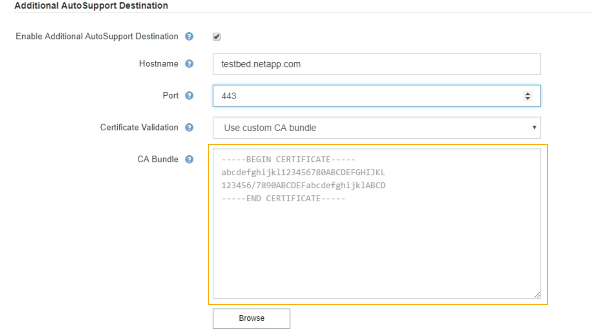

= Adición de un destino AutoSupport adicional
:allow-uri-read: 
:icons: font
:imagesdir: ../media/

[role="lead"]
Cuando se habilita AutoSupport, se envían mensajes de estado y estado al soporte de NetApp. Puede especificar un destino adicional para todos los mensajes de AutoSupport.

.Lo que necesitará
* Debe iniciar sesión en Grid Manager mediante un explorador compatible.
* Debe tener el permiso acceso raíz u otra configuración de cuadrícula.

.Acerca de esta tarea
Para comprobar o cambiar el protocolo utilizado para enviar mensajes AutoSupport, consulte las instrucciones de especificación de un protocolo AutoSupport.

NOTE: No se puede utilizar el protocolo SMTP para enviar mensajes de AutoSupport a un destino adicional.

link:specifying-protocol-for-autosupport-messages.html["Especificar el protocolo para los mensajes de AutoSupport"]

.Pasos
. Seleccione *Soporte* > *Herramientas* > *AutoSupport*.
+
Aparece la página AutoSupport con la ficha *Configuración* seleccionada.

. Seleccione *Activar destino AutoSupport adicional*.
+
Aparecerán los campos destino AutoSupport adicional.

+
image::../media/autosupport_additional_destinations.png[AutoSupport añadiendo destinos adicionales]

. Introduzca el nombre de host o la dirección IP del servidor de un servidor de destino AutoSupport adicional.
+

NOTE: Puede introducir solo un destino adicional.

. Introduzca el puerto utilizado para conectarse a un servidor de destino AutoSupport adicional (el puerto predeterminado es el 80 para HTTP o el puerto 443 para HTTPS).
. Para enviar los mensajes de AutoSupport con validación de certificados, seleccione *usar paquete de CA personalizado* en el menú desplegable *validación de certificados*. A continuación, realice una de las siguientes acciones:
+
** Utilice una herramienta de edición para copiar y pegar todo el contenido de cada uno de los archivos de certificados de CA codificados con PEM en el campo *paquete de CA*, concatenado en el orden de la cadena de certificados. Debe incluir `----BEGIN CERTIFICATE----` y.. `----END CERTIFICATE----` en su selección.
+

** Seleccione *examinar*, desplácese hasta el archivo que contiene los certificados y, a continuación, seleccione *Abrir* para cargar el archivo. La validación de certificados garantiza la seguridad de la transmisión de mensajes de AutoSupport.

. Para enviar sus mensajes AutoSupport sin validación de certificados, seleccione *no verificar certificado* en el menú desplegable *validación de certificados*.
+
Seleccione esta opción sólo cuando tenga un buen motivo para no utilizar la validación de certificados, como cuando haya un problema temporal con un certificado.

+
Aparece un mensaje de precaución: "No está utilizando un certificado TLS para garantizar la conexión al destino AutoSupport adicional".

. Seleccione *Guardar*.
+
Todos los futuros mensajes de AutoSupport semanales, activados por un evento y activados por el usuario se enviarán al destino adicional.

