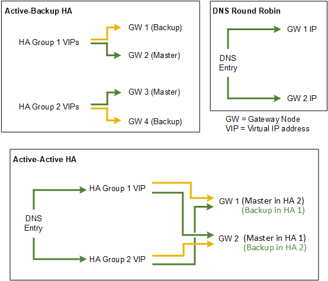

= Opciones de configuración para grupos de alta disponibilidad
:allow-uri-read: 
:icons: font
:imagesdir: ../media/

[role="lead"]
Los diagramas siguientes proporcionan ejemplos de diferentes formas de configurar grupos de alta disponibilidad. Cada opción tiene ventajas y desventajas.

Al crear varios grupos de alta disponibilidad solapados como se muestra en el ejemplo de alta disponibilidad activo-activo, el rendimiento total se escala con el número de nodos y grupos de alta disponibilidad. Con tres o más nodos y tres o más grupos de alta disponibilidad, también tiene la capacidad de continuar con las operaciones utilizando cualquiera de los VIP incluso durante los procedimientos de mantenimiento, lo que requiere que desconecte un nodo.

La tabla resume las ventajas de cada configuración de alta disponibilidad que se muestra en el diagrama.

[cols="1a,1a,1a"]
|===
| Configuración | Ventajas | Desventajas 

 a| 
Alta disponibilidad de Active-Backup
 a| 
* Gestionada por StorageGRID sin dependencias externas.
* Rápida recuperación tras fallos.

 a| 
* Solo un nodo de un grupo de alta disponibilidad está activo. Al menos un nodo por grupo de alta disponibilidad estará inactivo.

 a| 
Operación por turnos DNS
 a| 
* Mayor rendimiento total.
* Sin hosts inactivos.

 a| 
* Conmutación al respaldo lenta, que puede depender del comportamiento del cliente.
* Requiere la configuración del hardware fuera de StorageGRID.
* Necesita una comprobación del estado implementada por el cliente.

 a| 
Activa-activa
 a| 
* El tráfico se distribuye entre varios grupos de alta disponibilidad.
* Alto rendimiento de agregado escalable con el número de grupos de alta disponibilidad.
* Rápida recuperación tras fallos.

 a| 
* Más complejo de configurar.
* Requiere la configuración del hardware fuera de StorageGRID.
* Necesita una comprobación del estado implementada por el cliente.

|===