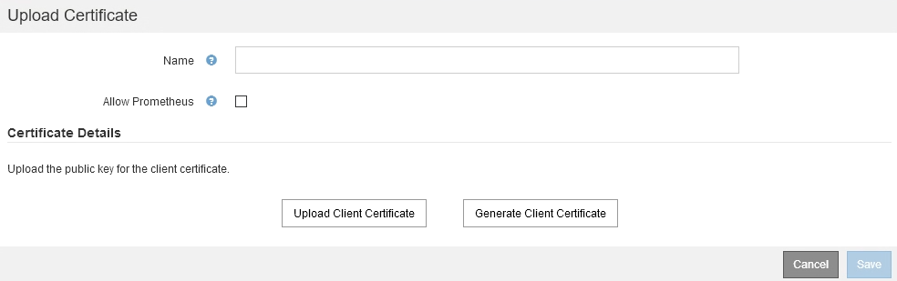
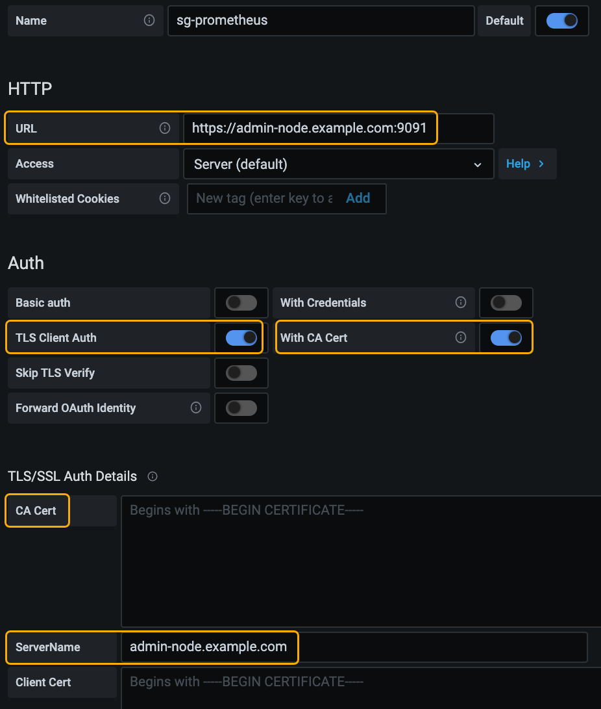

= Configurar certificados de cliente de administrador
:allow-uri-read: 
:icons: font
:imagesdir: ../media/

[role="lead"]
Puede utilizar certificados de cliente para permitir que clientes externos autorizados accedan a la base de datos Prometheus de StorageGRID. Los certificados de cliente proporcionan una forma segura de utilizar herramientas externas para supervisar StorageGRID.

Si necesita acceder a StorageGRID mediante una herramienta de supervisión externa, debe cargar o generar un certificado de cliente mediante el Gestor de cuadrícula y copiar la información de certificado a la herramienta externa.

== Añadiendo certificados de cliente de administrador

Para agregar un certificado de cliente, puede proporcionar su propio certificado o generar uno mediante el Gestor de cuadrícula.

.Lo que necesitará
* Debe tener el permiso acceso raíz.
* Debe iniciar sesión en Grid Manager mediante un explorador compatible.
* Debe conocer la dirección IP o el nombre de dominio del nodo de administrador.
* Debe haber configurado el certificado de servidor de interfaz de gestión de StorageGRID y tener el bundle de CA correspondiente
* Si desea cargar su propio certificado, la clave pública y la clave privada del certificado deben estar disponibles en el equipo local.

.Pasos
. En Grid Manager, seleccione *Configuración* > *Control de acceso* > *certificados de cliente*.
+
Aparece la página certificados de cliente.

+
image::../media/certificates_page_admin_client.png[Página certificados: Clientes de administración]

. Seleccione *Agregar*.
+
Aparece la página cargar certificado.

+

. Escriba un nombre entre 1 y 32 caracteres para el certificado.
. Para acceder a las métricas de Prometheus mediante la herramienta de supervisión externa, active la casilla de verificación *permitir Prometheus* .
. Cargar o generar un certificado:
+
.. Para cargar un certificado, vaya <<upload_cert,aquí>>.
.. Para generar un certificado, vaya <<generate_cert,aquí>>.

. [[upload_cert]]para cargar un certificado:
+
.. Seleccione *cargar certificado de cliente*.
.. Busque la clave pública del certificado.
+
Después de cargar la clave pública para el certificado, se rellenan los campos *metadatos de certificado* y *PEM de certificado*.

+
image::../media/certificate_admin_upload_cert_file.png[Certificado - Admin - cargar archivo de certificado]

.. Seleccione *Copiar certificado en el portapapeles* y pegue el certificado en la herramienta de supervisión externa.
.. Utilice una herramienta de edición para copiar y pegar la clave privada en su herramienta de supervisión externa.
.. Seleccione *Guardar* para guardar el certificado en Grid Manager.

. [[Generate_cert]]para generar un certificado:
+
.. Seleccione *generar certificado de cliente*.
.. Introduzca el nombre de dominio o la dirección IP del nodo de administración.
.. Opcionalmente, introduzca un asunto X.509, también denominado Nombre distintivo (DN), para identificar al administrador que posee el certificado.
.. De manera opcional, seleccione el número de días en los que el certificado es válido. El valor predeterminado es 730 días.
.. Seleccione *generar*.
+
Se rellenan los campos *metadatos de certificado*, *PEM de certificado* y *clave privada de certificado*.

+
image::../media/certificate_admin_upload_generated.png[Certificado - Admin - carga generada]

.. Seleccione *Copiar certificado en el portapapeles* y pegue el certificado en la herramienta de supervisión externa.
.. Seleccione *Copiar clave privada en el portapapeles* y pegue la clave en su herramienta de monitorización externa.
+

IMPORTANT: No podrá ver la clave privada después de cerrar el cuadro de diálogo. Copie la llave en una ubicación segura.

.. Seleccione *Guardar* para guardar el certificado en Grid Manager.

. Configure los siguientes ajustes en su herramienta de supervisión externa, como Grafana.
+
En la siguiente captura de pantalla se muestra un ejemplo de Grafana:

+

+
.. *Nombre*: Escriba un nombre para la conexión.
+
StorageGRID no requiere esta información, pero se debe proporcionar un nombre para probar la conexión.

.. *URL*: Introduzca el nombre de dominio o la dirección IP del nodo de administración. Especifique HTTPS y el puerto 9091.
+
Por ejemplo: `+https://admin-node.example.com:9091+`

.. Activar *autorización de cliente TLS* y *con CA Cert*.
.. Copie y pegue el certificado de servidor de interfaz de administración o el paquete de CA en**CA Cert** en Detalles de autenticación TLS/SSL.
.. *ServerName*: Introduzca el nombre de dominio del nodo Admin.
+
Servername debe coincidir con el nombre de dominio tal y como aparece en el certificado de servidor de la interfaz de gestión.

.. Guarde y pruebe el certificado y la clave privada que copió desde StorageGRID o un archivo local.
+
Ahora puede acceder a la métrica Prometheus desde StorageGRID con su herramienta de supervisión externa.

+
Para obtener información acerca de las métricas, consulte las instrucciones para supervisar y solucionar problemas de StorageGRID.

.Información relacionada
link:using-storagegrid-security-certificates.html["Usar certificados de seguridad StorageGRID"]

link:configuring-custom-server-certificate-for-grid-manager-tenant-manager.html["Configuración de un certificado de servidor personalizado para el administrador de grid y el administrador de inquilinos"]

link:../monitor/index.html["Solución de problemas de  monitor"]

== Editar certificados de cliente de administrador

Un certificado se puede editar para cambiar su nombre, habilitar o deshabilitar el acceso a Prometheus, o cargar un nuevo certificado cuando el actual haya caducado.

.Lo que necesitará
* Debe tener el permiso acceso raíz.
* Debe iniciar sesión en Grid Manager mediante un explorador compatible.
* Debe conocer la dirección IP o el nombre de dominio del nodo de administrador.
* Si desea cargar un nuevo certificado y una clave privada, deben estar disponibles en el equipo local.

.Pasos
. Seleccione *Configuración* > *Control de acceso* > *certificados de cliente*.
+
Aparece la página certificados de cliente. Se muestra una lista de los certificados existentes.

+
Las fechas de vencimiento del certificado se muestran en la tabla. Si un certificado caducará pronto o ya ha caducado, aparecerá un mensaje en la tabla y se activará una alerta.

+
image::../media/certificate_admin_list.png[Certificado - Administración - Lista]

. Seleccione el botón de opción situado a la izquierda del certificado que desea editar.
. Seleccione *Editar*.
+
Se muestra el cuadro de diálogo Editar certificado.

+
image::../media/certificate_admin_edit.png[Certificate - Admin - Editar]

. Realice los cambios que desee en el certificado.
. Seleccione *Guardar* para guardar el certificado en Grid Manager.
. Si cargó un nuevo certificado:
+
.. Seleccione *Copiar certificado en el portapapeles* para pegar el certificado en la herramienta de supervisión externa.
.. Utilice una herramienta de edición para copiar y pegar la nueva clave privada en su herramienta de supervisión externa.
.. Guarde y pruebe el certificado y la clave privada en la herramienta de supervisión externa.

. Si generó un nuevo certificado:
+
.. Seleccione *Copiar certificado en el portapapeles* para pegar el certificado en la herramienta de supervisión externa.
.. Seleccione *Copiar clave privada en el portapapeles* para pegar el certificado en la herramienta de supervisión externa.
+

IMPORTANT: No podrá ver ni copiar la clave privada después de cerrar el cuadro de diálogo. Copie la llave en una ubicación segura.

.. Guarde y pruebe el certificado y la clave privada en la herramienta de supervisión externa.

== Quitar certificados de cliente de administrador

Si ya no necesita un certificado, es posible eliminarlo.

.Lo que necesitará
* Debe tener el permiso acceso raíz.
* Debe iniciar sesión en Grid Manager mediante un explorador compatible.

.Pasos
. Seleccione *Configuración* > *Control de acceso* > *certificados de cliente*.
+
Aparece la página certificados de cliente. Se muestra una lista de los certificados existentes.

+
image::../media/certificate_admin_list.png[Certificado - Administración - Lista]

. Seleccione el botón de opción situado a la izquierda del certificado que desea eliminar.
. Seleccione *Quitar*.
+
Se muestra un cuadro de diálogo de confirmación.

+
image::../media/certificate_confirm_delete.png[Certificado: Confirme la eliminación]

. Seleccione *OK*.
+
El certificado se eliminará.

