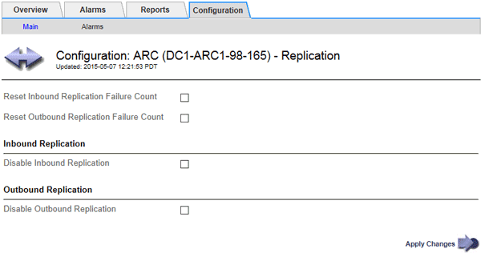

= Configurar la replicación de nodos de archivado
:allow-uri-read: 
:icons: font
:imagesdir: ../media/

[role="lead"]
Puede configurar la configuración de replicación para un nodo de archivado y desactivar la replicación entrante y saliente, o restablecer los recuentos de fallos que se van a realizar el seguimiento de las alarmas asociadas.

.Lo que necesitará
* Debe iniciar sesión en Grid Manager mediante un explorador compatible.
* Debe tener permisos de acceso específicos.

.Pasos
. Seleccione *Soporte* > *Herramientas* > *Topología de cuadrícula*.
. Seleccione *_Archive Node_* > *ARC* > *Replication*.
. Seleccione *Configuración* > *Principal*.
+

. Modifique los siguientes ajustes, según sea necesario:
+
** *Restablecer recuento de fallos de replicación entrante*: Seleccione para restablecer el contador en caso de fallos de replicación entrante. Esto se puede utilizar para borrar la alarma RIRF (replicaciones entrantes -- fallidas).
** *Reset Outbound Replication Failure Count*: Seleccione para restablecer el contador de fallos de replicación saliente. Esto se puede utilizar para borrar la alarma RORF (réplicas de salida -- fallida).
** *Desactivar replicación entrante*: Seleccione esta opción para desactivar la replicación entrante como parte de un procedimiento de mantenimiento o prueba. Dejar borrado durante el funcionamiento normal.
+
Cuando la replicación entrante está deshabilitada, los datos de objeto se pueden recuperar desde el servicio ARC para su replicación a otras ubicaciones del sistema StorageGRID, pero los objetos no se pueden replicar en este servicio ARC desde otras ubicaciones del sistema. El servicio ARC es de sólo lectura‐.

** *Desactivar la replicación saliente*: Active la casilla de verificación para desactivar la replicación saliente (incluidas las solicitudes de contenido para las recuperaciones HTTP) como parte de un procedimiento de mantenimiento o prueba. Deje sin marcar durante el funcionamiento normal.
+
Cuando la replicación saliente está deshabilitada, los datos de objeto se pueden copiar en este servicio ARC para cumplir con las reglas de ILM, pero los datos de objeto no se pueden recuperar del servicio ARC para copiarlos en otras ubicaciones del sistema StorageGRID. El servicio ARC es de sólo escritura‐.

. Haga clic en *aplicar cambios*.

