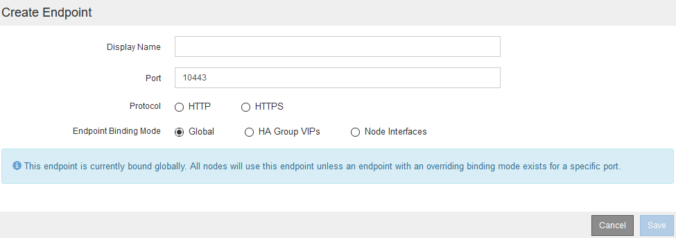

= Configuración de los extremos del equilibrador de carga
:allow-uri-read: 
:icons: font
:imagesdir: ../media/

[role="lead"]
Puede crear, editar y eliminar puntos finales del equilibrador de carga.

== Creación de puntos finales del equilibrador de carga

Cada extremo de equilibrio de carga especifica un puerto, un protocolo de red (HTTP o HTTPS) y un tipo de servicio (S3 o Swift). Si se crea un extremo de HTTPS, se debe cargar o generar un certificado de servidor.

.Lo que necesitará
* Debe tener el permiso acceso raíz.
* Debe iniciar sesión en Grid Manager mediante un explorador compatible.
* Si ha reasignado previamente puertos que pretende utilizar para el servicio Load Balancer, debe haber eliminado las reasignaciones.
+

IMPORTANT: Si ha reasignado algún puerto, no puede utilizar los mismos puertos para configurar los extremos de equilibrador de carga. Puede crear puntos finales mediante puertos reasignados, pero esos puntos finales se volverán a asignar a los puertos y servicios de CLB originales, no al servicio Load Balancer. Siga los pasos de las instrucciones de recuperación y mantenimiento para eliminar las reasignaciones de puertos.

+

NOTE: El servicio CLB está obsoleto.

.Pasos
. Seleccione *Configuración* > *Configuración de red* > *parámetros de equilibrio de carga*.
+
Aparece la página Load Balancer Endpoints.

+
image::../media/load_balancer_endpoints.png[puntos finales del equilibrador de carga]

. Seleccione *Agregar punto final*.
+
Se muestra el cuadro de diálogo Create Endpoint.

+
image::../media/load_balancer_endpoint_create_http.png[Crear extremo LB]

. Introduzca un nombre para mostrar para el extremo, que aparecerá en la lista de la página Load Balancer Endpoints.
. Introduzca un número de puerto o deje el número de puerto rellenado previamente como está.
+
Si introduce el número de puerto 80 o 443, el extremo se configura únicamente en los nodos de puerta de enlace, ya que estos puertos están reservados en los nodos de administración.

+

NOTE: Los puertos utilizados por otros servicios de red no están permitidos. Consulte las directrices de red para obtener una lista de los puertos utilizados para las comunicaciones internas y externas.

. Seleccione *HTTP* o *HTTPS* para especificar el protocolo de red para este extremo.
. Seleccione un modo de enlace de extremo.
+
** *Global* (predeterminado): El punto final es accesible en todos los nodos Gateway y Admin en el número de puerto especificado.
+

** *VIPS de grupo de alta disponibilidad*: Sólo se puede acceder al terminal a través de las direcciones IP virtuales definidas para los grupos de alta disponibilidad seleccionados. Los extremos definidos en este modo pueden reutilizar el mismo número de puerto, siempre que los grupos de alta disponibilidad definidos por dichos extremos no se superpongan entre sí.
+
Seleccione los grupos de alta disponibilidad con las direcciones IP virtuales donde desee que aparezca el extremo.

+
image::../media/load_balancer_endpoint_ha_group_vips_binding_mode.png[Endpoint ha Group modo de enlace de VIPS]

** *Interfaces de nodo*: Sólo se puede acceder al extremo en los nodos designados y en las interfaces de red. Los extremos definidos en este modo pueden reutilizar el mismo número de puerto siempre que estas interfaces no se superpongan entre sí.
+
Seleccione las interfaces de nodo en las que desea que aparezca el extremo.

+
image::../media/load_balancer_endpoint_node_interfaces_binding_mode.png[Modo de enlace de interfaces del nodo de extremo]

. Seleccione *Guardar*.
+
Se muestra el cuadro de diálogo Edit Endpoint.

. Seleccione *S3* o *Swift* para especificar el tipo de tráfico que servirá este extremo.
+
image::../media/load_balancer_endpoint_client_options.png[Cliente de equilibrador de carga]

. Si ha seleccionado *HTTP*, seleccione *Guardar*.
+
Se crea el extremo no seguro. En la tabla de la página Load Balancer Endpoints se muestra el nombre para mostrar, el número de puerto, el protocolo y el ID de extremo del extremo.

. Si ha seleccionado *HTTPS* y desea cargar un certificado, seleccione *cargar certificado*.
+
image::../media/load_balancer_endpoint_upload_cert.png[Cargue Cert]

+
.. Busque el certificado de servidor y la clave privada de certificado.
+
Para habilitar que los clientes S3 se conecten mediante un nombre de dominio de extremo de API S3, use un certificado comodín o de varios dominios que coincida con todos los nombres de dominio que el cliente podría usar para conectarse al grid. Por ejemplo, el certificado de servidor puede utilizar el nombre de dominio `*._example_.com`.

+
link:configuring-s3-api-endpoint-domain-names.html["Configurar nombres de dominio de extremo de API de S3"]

.. Opcionalmente, busque un paquete de CA.
.. Seleccione *Guardar*.
+
Aparece los datos de certificado codificados con PEM para el extremo.

. Si ha seleccionado *HTTPS* y desea generar un certificado, seleccione *generar certificado*.
+
image::../media/load_balancer_endpoint_generate_cert.png[Genere Cert]

+
.. Introduzca un nombre de dominio o una dirección IP.
+
Puede usar caracteres comodín para representar los nombres de dominio completos de todos los nodos de administración y de puerta de enlace que ejecutan el servicio Load Balancer. Por ejemplo: `*.sgws.foo.com` utiliza el comodín * que se va a representar `gn1.sgws.foo.com` y.. `gn2.sgws.foo.com`.

+
link:configuring-s3-api-endpoint-domain-names.html["Configurar nombres de dominio de extremo de API de S3"]

.. Seleccione image:../media/icon_plus_sign_black_on_white.gif["Signo más"] Para agregar otros nombres de dominio o direcciones IP.
+
Si está usando grupos de alta disponibilidad (ha), añada los nombres de dominio y las direcciones IP de las IP virtuales de alta disponibilidad.

.. Opcionalmente, introduzca un sujeto X.509, también denominado Nombre distintivo (DN), para identificar quién posee el certificado.
.. De manera opcional, seleccione el número de días en los que el certificado es válido. El valor predeterminado es 730 días.
.. Seleccione *generar*.
+
Se muestran los metadatos del certificado y los datos de certificado codificados con PEM para el extremo.

. Haga clic en *Guardar*.
+
Se crea el extremo. En la tabla de la página Load Balancer Endpoints se muestra el nombre para mostrar, el número de puerto, el protocolo y el ID de extremo del extremo.

.Información relacionada
link:../maintain/index.html["Mantener  recuperar"]

link:../network/index.html["Directrices de red"]

link:managing-high-availability-groups.html["Gestionar grupos de alta disponibilidad"]

link:managing-untrusted-client-networks.html["Administración de redes de clientes que no son de confianza"]

== Edición de puntos finales del equilibrador de carga

Para un extremo no seguro (HTTP), puede cambiar el tipo de servicio de extremo entre S3 y Swift. En el caso de un extremo protegido (HTTPS), puede editar el tipo de servicio de extremo y ver o cambiar el certificado de seguridad.

.Lo que necesitará
* Debe tener el permiso acceso raíz.
* Debe iniciar sesión en Grid Manager mediante un explorador compatible.

.Pasos
. Seleccione *Configuración* > *Configuración de red* > *parámetros de equilibrio de carga*.
+
Aparece la página Load Balancer Endpoints. Los extremos existentes se muestran en la tabla.

+
Los extremos con certificados que caducarán pronto se identifican en la tabla.

+
image::../media/load_balancer_endpoint_edit_or_remove.png[Editar punto final]

. Seleccione el extremo que desea editar.
. Haga clic en *Editar punto final*.
+
Se muestra el cuadro de diálogo Edit Endpoint.

+
En el caso de un extremo no seguro (HTTP), sólo aparece la sección Configuración del servicio de extremo del cuadro de diálogo. En el caso de un extremo protegido (HTTPS), aparecen las secciones Configuración de Endpoint Service y certificados del cuadro de diálogo, como se muestra en el siguiente ejemplo.

+
image::../media/load_balancer_endpoint_edit.png[Editar el extremo del equilibrador de carga]

. Realice los cambios deseados en el extremo.
+
En el caso de un extremo no seguro (HTTP), puede:

+
** Cambie el tipo de servicio de extremo entre S3 y Swift.
** Cambie el modo de enlace de punto final. Para un extremo protegido (HTTPS), puede:
** Cambie el tipo de servicio de extremo entre S3 y Swift.
** Cambie el modo de enlace de punto final.
** Vea el certificado de seguridad.
** Cargue o genere un nuevo certificado de seguridad cuando el certificado actual haya caducado o esté a punto de caducar.
+
Seleccione una pestaña para mostrar información detallada sobre el certificado de servidor StorageGRID predeterminado o un certificado firmado de CA que se cargó.

+

NOTE: Para cambiar el protocolo de un extremo existente, por ejemplo de HTTP a HTTPS, debe crear un extremo nuevo. Siga las instrucciones para crear puntos finales del equilibrador de carga y seleccione el protocolo deseado.

. Haga clic en *Guardar*.

.Información relacionada
<<Creación de puntos finales del equilibrador de carga>>

== Retirada de los extremos del equilibrador de carga

Si ya no necesita un extremo de equilibrador de carga, puede eliminarlo.

.Lo que necesitará
* Debe tener el permiso acceso raíz.
* Debe iniciar sesión en Grid Manager mediante un explorador compatible.

.Pasos
. Seleccione *Configuración* > *Configuración de red* > *parámetros de equilibrio de carga*.
+
Aparece la página Load Balancer Endpoints. Los extremos existentes se muestran en la tabla.

+
image::../media/load_balancer_endpoint_edit_or_remove.png[Editar punto final]

. Seleccione el botón de opción situado a la izquierda del extremo que desea eliminar.
. Haga clic en *Quitar punto final*.
+
Se muestra un cuadro de diálogo de confirmación.

+
image::../media/load_balancer_endpoint_confirm_removal.png[Confirme la eliminación del extremo]

. Haga clic en *Aceptar*.
+
El punto final se elimina.

