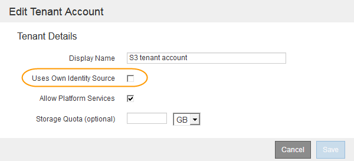

= Confirmación de que los usuarios federados pueden iniciar sesión
:allow-uri-read: 
:icons: font
:imagesdir: ../media/

[role="lead"]
Antes de habilitar el inicio de sesión único (SSO), debe confirmar que al menos un usuario federado puede iniciar sesión en Grid Manager y en el Gestor de inquilinos para cualquier cuenta de inquilino existente.

.Lo que necesitará
* Debe iniciar sesión en Grid Manager mediante un explorador compatible.
* Debe tener permisos de acceso específicos.
* Está utilizando Active Directory como origen de identidad federado y AD FS como proveedor de identidades.
+
link:requirements-for-sso.html["Requisitos para usar el inicio de sesión único"]

.Pasos
. Si hay cuentas de inquilino existentes, confirme que ninguno de los inquilinos utiliza su propio origen de identidad.
+

IMPORTANT: Al habilitar SSO, el origen de identidad configurado en el Administrador de inquilinos se anula mediante el origen de identidades configurado en Grid Manager. Los usuarios que pertenezcan al origen de identidad del arrendatario ya no podrán iniciar sesión a menos que tengan una cuenta con el origen de identidad de Grid Manager.

+
.. Inicie sesión en el Administrador de arrendatarios para cada cuenta de arrendatario.
.. Seleccione *Control de acceso* > *Federación de identidades*.
.. Confirme que la casilla de verificación *Activar Federación de identidades* no está activada.
.. Si es así, confirme que los grupos federados que podrían estar en uso para esta cuenta de arrendatario ya no son necesarios, anule la selección de la casilla de verificación y haga clic en *Guardar*.

. Confirme que un usuario federado puede acceder a Grid Manager:
+
.. En Grid Manager, seleccione *Configuración* > *Control de acceso* > *grupos de administración*.
.. Asegúrese de que al menos un grupo federado se ha importado del origen de identidad de Active Directory y de que se le ha asignado el permiso acceso raíz.
.. Cierre la sesión.
.. Confirme que puede volver a iniciar sesión en Grid Manager como usuario en el grupo federado.

. Si hay cuentas de inquilino existentes, confirme que un usuario federado con permiso de acceso raíz puede iniciar sesión:
+
.. En Grid Manager, seleccione *arrendatarios*.
.. Seleccione la cuenta de arrendatario y haga clic en *Editar cuenta*.
.. Si la casilla de verificación *Usos own Identity Source* está activada, desmarque la casilla y haga clic en *Guardar*.
+

+
Aparece la página Cuentas de arrendatario.

.. Seleccione la cuenta de arrendatario, haga clic en *Iniciar sesión* e inicie sesión en la cuenta de arrendatario como usuario raíz local.
.. En el Administrador de arrendatarios, haga clic en *Control de acceso* > *grupos*.
.. Asegúrese de que al menos un grupo federado de Grid Manager ha sido asignado el permiso acceso raíz para este arrendatario.
.. Cierre la sesión.
.. Confirme que puede volver a iniciar sesión en el inquilino como usuario en el grupo federado.

.Información relacionada
link:requirements-for-sso.html["Requisitos para usar el inicio de sesión único"]

link:managing-admin-groups.html["Gestión de los grupos de administración"]

link:../tenant/index.html["Usar una cuenta de inquilino"]
