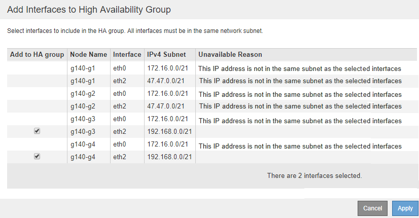

= Edición de un grupo de alta disponibilidad
:allow-uri-read: 
:icons: font
:imagesdir: ../media/

[role="lead"]
Puede editar un grupo de alta disponibilidad para cambiar su nombre y descripción, agregar o quitar interfaces, o agregar o actualizar una dirección IP virtual.

.Lo que necesitará
* Debe iniciar sesión en Grid Manager mediante un explorador compatible.
* Debe tener el permiso acceso raíz.

.Acerca de esta tarea
Entre algunos de los motivos para editar un grupo de alta disponibilidad se encuentran los siguientes:

* Agregar una interfaz a un grupo existente. La dirección IP de la interfaz debe estar dentro de la misma subred que otras interfaces ya asignadas al grupo.
* Quitar una interfaz de un grupo de alta disponibilidad. Por ejemplo, no puede iniciar un procedimiento de retirada de sitio o nodo si se utiliza la interfaz de un nodo para la red de cuadrícula o la red de cliente en un grupo ha.

.Pasos
. Seleccione *Configuración* > *Configuración de red* > *grupos de alta disponibilidad*.
+
Aparece la página grupos de alta disponibilidad.

+
image::../media/ha_groups_page_with_two_groups.png[Página HA Groups con dos grupos]

. Seleccione el grupo ha que desea editar y haga clic en *Editar*.
+
Se muestra el cuadro de diálogo Editar grupo de alta disponibilidad.

. Si lo desea, actualice el nombre o la descripción del grupo.
. Opcionalmente, haga clic en *Seleccionar interfaces* para cambiar las interfaces del grupo ha.
+
Se muestra el cuadro de diálogo Add interfaces to High Availability Group.

+

+
Una interfaz no aparece en la lista si DHCP asigna su dirección IP.

. Active o anule la selección de las casillas de verificación para agregar o quitar interfaces.
+
Tenga en cuenta las siguientes directrices para seleccionar interfaces:

+
** Debe seleccionar al menos una interfaz.
** Si selecciona más de una interfaz, todas las interfaces deben estar en la red de cuadrícula (eth0) o en la red de cliente (eth2).
** Todas las interfaces deben estar en la misma subred o en subredes con un prefijo común.
+
Las direcciones IP se restringirán a la subred más pequeña (la que tenga el prefijo más grande).

** Si selecciona interfaces en diferentes tipos de nodos y se produce una conmutación al nodo de respaldo, solo estarán disponibles en las IP virtuales los servicios comunes a los nodos seleccionados.
+
*** Seleccione dos o más nodos de administrador para la protección de alta disponibilidad de Grid Manager o del inquilino Manager.
*** Seleccione dos o más nodos de administrador, nodos de puerta de enlace o ambos para la protección de alta disponibilidad del servicio Load Balancer.
*** Seleccione dos o más nodos de puerta de enlace para la protección de alta disponibilidad del servicio CLB.
+

NOTE: El servicio CLB está obsoleto.

. Haga clic en *aplicar*.
+
Las interfaces seleccionadas se muestran en la sección interfaces de la página. De forma predeterminada, la primera interfaz de la lista se selecciona como patrón preferido.

+
image::../media/ha_group_edit_group.png[Grupo HA Edit Group]

. Si desea que una interfaz diferente sea el Master preferido, seleccione esa interfaz en la columna *Master* preferido.
+
El principal preferido es la interfaz activa a menos que se produzca un fallo que haga que las direcciones VIP se reasignan a una interfaz de copia de seguridad.

+

NOTE: Si el grupo ha proporciona acceso a Grid Manager, debe seleccionar una interfaz en el nodo de administración principal para que sea el maestro preferido. Algunos procedimientos de mantenimiento solo se pueden realizar desde el nodo de administración principal.

. De manera opcional, actualice las direcciones IP virtuales del grupo de alta disponibilidad.
+
Debe proporcionar al menos una dirección IPv4. De manera opcional, es posible especificar direcciones IPv4 e IPv6 adicionales.

+
Las direcciones IPv4 deben estar en la subred IPv4 compartida por todas las interfaces miembros.

. Haga clic en *Guardar*.
+
El grupo de alta disponibilidad se ha actualizado.

