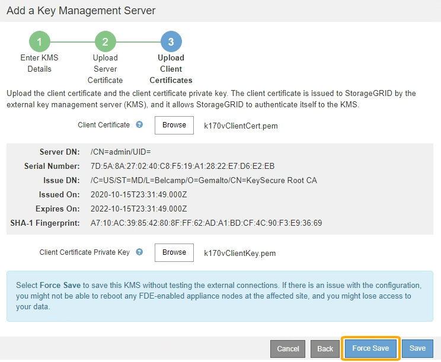

= Paso 3: Cargar certificados de cliente
:allow-uri-read: 
:icons: font
:imagesdir: ../media/

[role="lead"]
En el paso 3 (cargar certificados de cliente) del asistente Agregar un servidor de gestión de claves, carga el certificado de cliente y la clave privada del certificado de cliente. El certificado de cliente permite que StorageGRID se autentique en el KMS.

.Pasos
. Desde *Paso 3 (cargar certificados de cliente)*, vaya a la ubicación del certificado de cliente.
+
image::../media/kms_step_3_upload_client_certificate.png[KMS Paso 3 cargar certificado de cliente]

. Cargue el archivo de certificado de cliente.
+
Aparecen los metadatos del certificado de cliente.

. Busque la ubicación de la clave privada del certificado de cliente.
. Cargue el archivo de clave privada.
+
Aparecen los metadatos del certificado de cliente y la clave privada del certificado de cliente.

+
image::../media/kms_step_3_client_certificate_metadata.png[METADATOS DEL certificado de cliente del paso 3 DE KMS]

. Seleccione *Guardar*.
+
Se prueban las conexiones entre el servidor de gestión de claves y los nodos del dispositivo. Si todas las conexiones son válidas y se encuentra la clave correcta en el KMS, el servidor de gestión de claves nuevo se añade a la tabla de la página del servidor de gestión de claves.

+

NOTE: Inmediatamente después de añadir un KMS, el estado del certificado en la página servidor de gestión de claves aparece como Desconocido. StorageGRID puede tardar hasta 30 minutos en obtener el estado real de cada certificado. Debe actualizar el navegador web para ver el estado actual.

. Si aparece un mensaje de error al seleccionar *Guardar*, revise los detalles del mensaje y seleccione *Aceptar*.
+
Por ejemplo, puede recibir un error 422: Entidad no procesable si se produjo un error en una prueba de conexión.

. Si necesita guardar la configuración actual sin probar la conexión externa, seleccione *Force Save*.
+

+

IMPORTANT: Al seleccionar *Force Save*, se guarda la configuración de KMS, pero no se prueba la conexión externa de cada dispositivo a ese KMS. Si hay un problema con la configuración, es posible que no pueda reiniciar los nodos de los dispositivos que tienen habilitado el cifrado de nodos en el sitio afectado. Es posible que pierda acceso a los datos hasta que se resuelvan los problemas.

. Revise la advertencia de confirmación y seleccione *Aceptar* si está seguro de que desea forzar el guardado de la configuración.
+
image::../media/kms_force_save_warning.png[Advertencia de ahorro de fuerza DE KMS]

+
La configuración de KMS se guarda pero la conexión con el KMS no se prueba.

