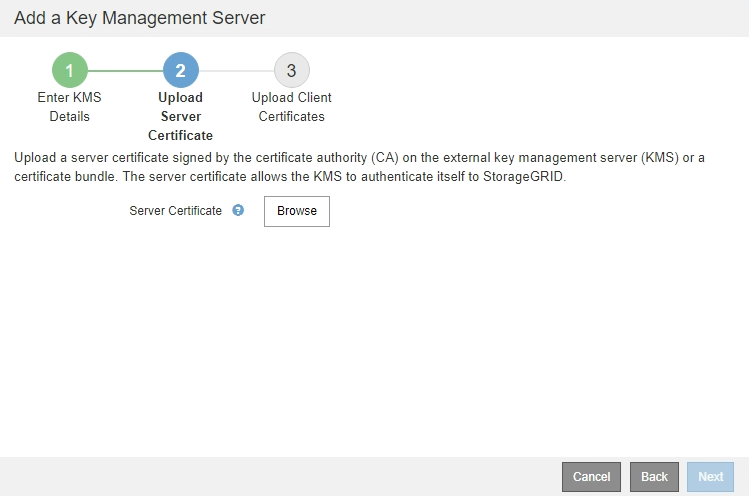

= Paso 2: Cargar certificado de servidor
:allow-uri-read: 
:icons: font
:imagesdir: ../media/

[role="lead"]
En el paso 2 (cargar certificado de servidor) del asistente Agregar un servidor de gestión de claves, carga el certificado de servidor (o el paquete de certificados) para el KMS. El certificado de servidor permite que el KMS externo se autentique en StorageGRID.

.Pasos
. Desde *Paso 2 (cargar certificado de servidor)*, vaya a la ubicación del certificado de servidor o del paquete de certificados guardados.
+

. Cargue el archivo de certificado.
+
Se muestran los metadatos del certificado del servidor.

+
image::../media/kms_step_2_server_certificate_metadata.png[Metadatos de certificado de servidor]

+

NOTE: Si cargó un paquete de certificados, los metadatos de cada certificado aparecen en la pestaña correspondiente.

. Seleccione *Siguiente*.
+
Aparece el paso 3 (cargar certificados de cliente) del asistente Agregar un servidor de gestión de claves.

