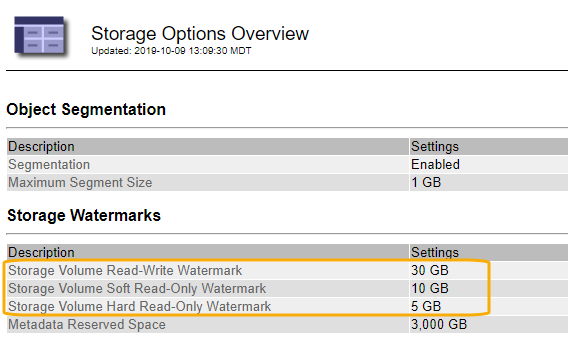
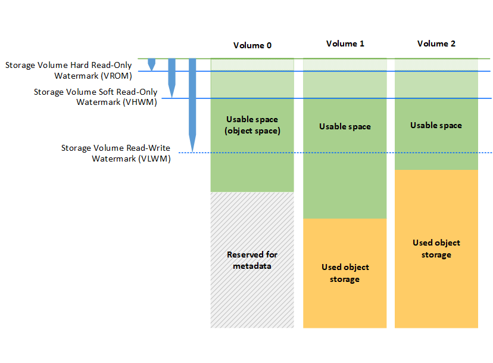

= Qué son las marcas de agua del volumen de almacenamiento
:allow-uri-read: 
:icons: font
:imagesdir: ../media/

[role="lead"]
StorageGRID utiliza marcas de agua de volumen de almacenamiento para permitir supervisar la cantidad de espacio útil disponible en los nodos de almacenamiento. Si la cantidad de espacio disponible en un nodo es menor que la configuración de Marca de agua configurada, se activa la alarma Estado de almacenamiento (SSTS) para poder determinar si necesita agregar nodos de almacenamiento.

Para ver la configuración actual de las marcas de agua del volumen de almacenamiento, seleccione *Configuración* > *Opciones de almacenamiento* > *Descripción general*.

La siguiente figura representa un nodo de almacenamiento con tres volúmenes y muestra la posición relativa de las tres marcas de agua de volumen de almacenamiento. En cada nodo de almacenamiento, StorageGRID reserva espacio en el volumen 0 para los metadatos de objetos; cualquier espacio restante en ese volumen se usa para los datos de objetos. Todos los demás volúmenes se utilizan exclusivamente para datos de objetos, lo que incluye copias replicadas y fragmentos codificados para borrado.

Las marcas de agua del volumen de almacenamiento son valores predeterminados en todo el sistema que indican la cantidad mínima de espacio libre requerida en cada volumen del nodo de almacenamiento para evitar que StorageGRID cambie el comportamiento de lectura/escritura del nodo o active una alarma. Tenga en cuenta que todos los volúmenes deben alcanzar la Marca de agua antes de que StorageGRID actúe. Si algunos volúmenes tienen más de la cantidad mínima requerida de espacio libre, la alarma no se activa y el comportamiento de lectura y escritura del nodo no cambia.

== Marca de agua de sólo lectura suave del volumen de almacenamiento (VHWM)

La Marca de agua de sólo lectura suave del volumen de almacenamiento es la primera Marca de agua que indica que el espacio utilizable de un nodo para los datos de objeto se está llenando. Esta Marca de agua representa la cantidad de espacio libre que debe existir en cada volumen de un nodo de almacenamiento para evitar que el nodo entre en «el modo de sólo lectura». El modo de solo lectura suave significa que el nodo de almacenamiento anuncia servicios de solo lectura al resto del sistema StorageGRID, pero completa todas las solicitudes de escritura pendientes.

Si la cantidad de espacio libre en cada volumen es menor que el valor de esta Marca de agua, la alarma Estado de almacenamiento (SST) se activa en el nivel de aviso y el nodo de almacenamiento pasa al modo de sólo lectura suave.

Por ejemplo, supongamos que la Marca de agua de sólo lectura suave del volumen de almacenamiento se establece en 10 GB, que es su valor predeterminado. Si queda menos de 10 GB de espacio libre en cada volumen en el nodo de almacenamiento, la alarma SSTS se activa en el nivel de aviso y el nodo de almacenamiento pasa al modo de solo lectura suave.

== Marca de agua de solo lectura (VROM) de volumen de almacenamiento

La Marca de agua de sólo lectura dura del volumen de almacenamiento es la siguiente Marca de agua para indicar que el espacio utilizable de un nodo para los datos de objeto se está llenando. Esta Marca de agua representa la cantidad de espacio libre que debe existir en cada volumen de un nodo de almacenamiento para evitar que el nodo entre en el modo "'modo de sólo lectura'". El modo de solo lectura estricta significa que el nodo de almacenamiento es de solo lectura y ya no acepta solicitudes de escritura.

Si la cantidad de espacio libre en cada volumen de un nodo de almacenamiento es menor que la configuración de esta Marca de agua, la alarma Estado de almacenamiento (SST) se activa en el nivel principal y el nodo de almacenamiento pasa al modo de sólo lectura.

Por ejemplo, supongamos que la Marca de agua de sólo lectura del disco duro del volumen de almacenamiento está establecida en 5 GB, que es su valor predeterminado. Si queda menos de 5 GB de espacio libre en cada volumen de almacenamiento en el nodo de almacenamiento, la alarma DE SSTS se activa en el nivel principal y el nodo de almacenamiento pasa al modo de solo lectura fija.

El valor de la Marca de agua de sólo lectura rígida del volumen de almacenamiento debe ser menor que el valor de la Marca de agua de sólo lectura suave del volumen de almacenamiento.

== Marca de agua de lectura y escritura de volumen de almacenamiento (VLWM)

La Marca de agua de lectura-escritura del volumen de almacenamiento solo se aplica a los nodos de almacenamiento que hayan cambiado al modo de solo lectura. Esta Marca de agua determina cuándo se permite que el nodo de almacenamiento vuelva a ser de lectura y escritura.

Por ejemplo, supongamos que un nodo de almacenamiento ha pasado al modo de solo lectura estricta. Si la Marca de agua de lectura y escritura del volumen de almacenamiento se establece en 30 GB (predeterminado), el espacio libre en cada volumen de almacenamiento del nodo de almacenamiento debe aumentar de 5 GB a 30 GB antes de que el nodo pueda volver a ser de lectura y escritura.

El valor de la Marca de agua de lectura y escritura de volumen de almacenamiento debe ser mayor que el valor de la Marca de agua de solo lectura suave de volumen de almacenamiento.

.Información relacionada
link:managing-full-storage-nodes.html["Gestión de nodos de almacenamiento completos"]
