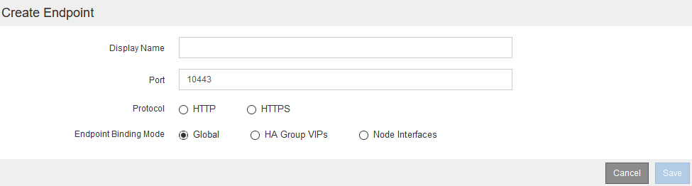

= Creación de un extremo de equilibrador de carga para FabricPool
:allow-uri-read: 
:icons: font
:imagesdir: ../media/

[role="lead"]
Al configurar StorageGRID para su uso con FabricPool, debe configurar un extremo de equilibrador de carga y cargar el certificado de extremo de equilibrador de carga, que se utiliza para proteger la conexión entre ONTAP y StorageGRID.

.Lo que necesitará
* Debe iniciar sesión en Grid Manager mediante un explorador compatible.
* Debe tener el permiso acceso raíz.
* Tiene los siguientes archivos:
+
** Certificado de servidor: El archivo de certificado de servidor personalizado.
** Clave privada del certificado de servidor: El archivo de claves privadas del certificado de servidor personalizado.
** Paquete DE CA: Un único archivo que contiene los certificados de cada entidad emisora de certificados (CA) intermedia. El archivo debe contener cada uno de los archivos de certificado de CA codificados con PEM, concatenados en el orden de la cadena de certificados.

.Acerca de esta tarea
Para obtener más detalles sobre esta tarea, consulte link:../admin/configuring-load-balancer-endpoints.html["Configuración de los extremos del equilibrador de carga"].

.Pasos
. Seleccione *Configuración* > *Configuración de red* > *parámetros de equilibrio de carga*.
+

. Seleccione *Agregar punto final*.
. Introduzca la siguiente información.
+
[cols="1a,1a"]
|===
| Campo | Descripción 

 a| 
Nombre para mostrar
 a| 
Nombre descriptivo para el extremo

 a| 
Puerto
 a| 
El puerto StorageGRID que desea usar para el equilibrio de carga. De forma predeterminada, este campo es 10433, pero puede introducir cualquier puerto externo no utilizado. Si introduce 80 o 443, el extremo se configura únicamente en los nodos de puerta de enlace, ya que estos puertos están reservados en los nodos de administración.

*Nota:* los puertos utilizados por otros servicios de red no están permitidos. Consulte la lista de puertos utilizados para las comunicaciones internas y externas:

link:../network/network-port-reference.html["Referencia de puerto de red"]

Debe proporcionar este mismo número de puerto a ONTAP al asociar StorageGRID como un nivel de cloud de FabricPool.

 a| 
Protocolo
 a| 
Debe ser *HTTPS*.

 a| 
Modo de enlace de extremo
 a| 
Utilice el ajuste *Global* (recomendado) o restrinja la accesibilidad de este punto final a uno de los siguientes puntos:

** Direcciones IP virtuales (VIP) de alta disponibilidad específica. Utilice esta selección solo si necesita niveles mucho más altos de aislamiento de las cargas de trabajo.
** Interfaces de red específicas de nodos específicos.

|===
. Seleccione *Guardar*.
+
Se muestra el cuadro de diálogo Edit Endpoint.

. Para *Tipo de servicio de extremo*, seleccione *S3*.
. Seleccione *cargar certificado* (recomendado) y, a continuación, busque el certificado de servidor, la clave privada de certificado y el paquete de CA.
+
image::../media/load_balancer_endpoint_upload_cert.png[Cargue Cert]

. Seleccione *Guardar*.

