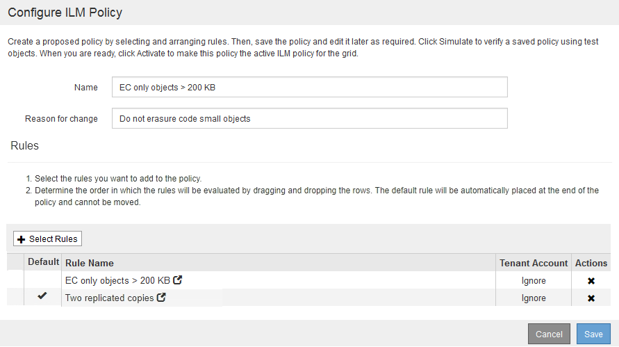

= Ejemplo 2: Reglas de ILM y política para el filtrado de tamaño de objetos de EC
:allow-uri-read: 
:icons: font
:imagesdir: ../media/

[role="lead"]
Puede usar las siguientes reglas y políticas de ejemplo como puntos de inicio para definir una política de ILM que filtra por tamaño de objeto para cumplir los requisitos de EC recomendados.

CAUTION: Las siguientes reglas y políticas de ILM son solo ejemplos. Existen varias formas de configurar las reglas de ILM. Antes de activar una nueva directiva, simule la política propuesta para confirmar que funcionará con el fin de proteger el contenido de las pérdidas.

== Regla de ILM 1, por ejemplo 2: Utilice EC para todos los objetos de más de 200 KB

En este ejemplo, el borrado de regla ILM codifica todos los objetos con más de 200 KB (0.20 MB).

[cols="1a,2a"]
|===
| Definición de regla | Valor de ejemplo 

 a| 
Nombre de regla
 a| 
Sólo objetos de EC > 200 KB

 a| 
Tiempo de referencia
 a| 
Tiempo de ingesta

 a| 
Filtrado avanzado para el tamaño del objeto
 a| 
Tamaño de objeto (MB) mayor que 0.20

 a| 
Colocación del contenido
 a| 
Cree una copia codificada con borrado al 2+1 mediante tres ubicaciones

|===
image:../media/policy_2_rule_1_ec_objects_adv_filtering.gif["Regla de ILM 1, por ejemplo 2: Utilice EC para todos los objetos de más de 200 KB"]

Las instrucciones de colocación especifican que se debe crear una copia con código de borrado al 2+1 utilizando los tres sitios.

image::../media/policy_2_rule_1_ec_objects_placements.png[Regla de ILM 1, por ejemplo 2: Utilice EC para todos los objetos de más de 200 KB]

== Regla de ILM 2 por ejemplo 2: Dos copias replicadas

Esta regla de ILM de ejemplo crea dos copias replicadas y no filtra por el tamaño del objeto. Esta regla es la segunda regla de la política. Dado que la regla 1 de ILM filtra todos los objetos de más de 200 KB, la regla 2 de ILM, por ejemplo 2, solo se aplica a objetos de 200 KB o menos.

[cols="1a,2a"]
|===
| Definición de regla | Valor de ejemplo 

 a| 
Nombre de regla
 a| 
Dos copias replicadas

 a| 
Tiempo de referencia
 a| 
Tiempo de ingesta

 a| 
Filtrado avanzado para el tamaño del objeto
 a| 
Ninguno

 a| 
Colocación del contenido
 a| 
Cree dos copias replicadas y guárdelas en dos centros de datos, DC1 y DC2

|===
image:../media/ilm_rule_2_example_2_two_replicated_copies.png["Ejemplo de regla de ILM 2 por ejemplo 2 - dos copias replicadas"]

== Ejemplo 2 de política de ILM: Use EC para objetos de más de 200 KB

En esta política de ejemplo, los objetos de más de 200 KB cuentan con código de borrado. Se realizan dos copias replicadas de los demás objetos.

Este ejemplo de política de ILM incluye las siguientes reglas de ILM:

* Código de borrado de todos los objetos de más de 200 KB.
* Si un objeto no coincide con la primera regla de ILM, utilice la regla predeterminada de ILM para crear dos copias replicadas de ese objeto. Puesto que los objetos mayores de 200 KB se han filtrado mediante la regla 1, la regla 2 sólo se aplica a objetos de 200 KB o menos.
+

