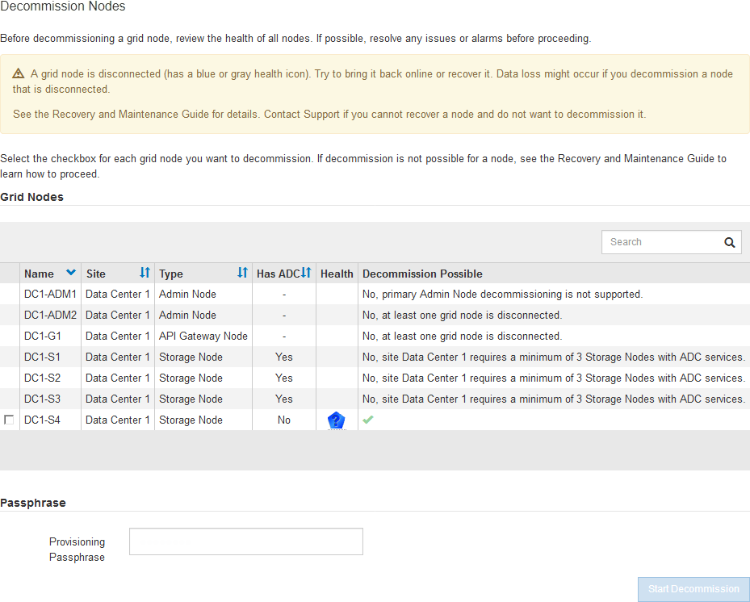
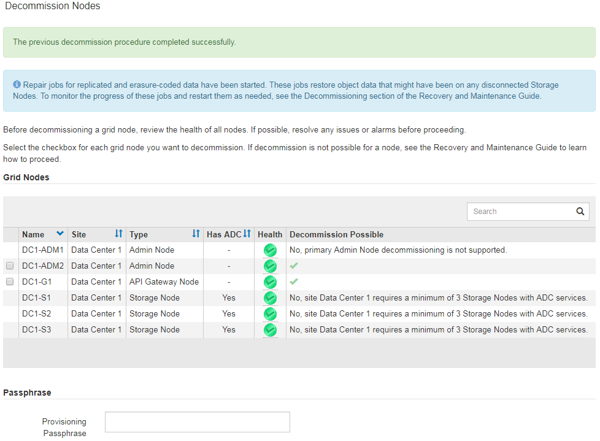

= Decomisionado de nodos grid desconectados
:allow-uri-read: 
:icons: font
:imagesdir: ../media/

[role="lead"]
Es posible que deba retirar un nodo que no esté conectado actualmente a la cuadrícula (uno cuyo estado sea desconocido o administrativamente inactivo).

.Lo que necesitará
* Comprende los requisitos y las consideraciones que hay que tener en cuenta al decomisionar nodos de grid.
+
link:considerations-for-decommissioning-grid-nodes.html["Consideraciones sobre el decomisionado de los nodos de cuadrícula"]

* Ha obtenido todos los requisitos previos.
* Se ha asegurado de que no hay ningún trabajo de reparación de datos activo.
+
link:checking-data-repair-jobs.html["Comprobación de trabajos de reparación de datos"]

* Ha confirmado que la recuperación del nodo de almacenamiento no está en curso en ningún lugar de la cuadrícula. Si es así, debe esperar a que se complete cualquier recompilación de Cassandra como parte de la recuperación. A continuación, podrá continuar con el desmantelamiento.
* Se ha asegurado de que no se ejecutarán otros procedimientos de mantenimiento mientras el procedimiento de retirada del nodo se esté ejecutando, a menos que el procedimiento de retirada del nodo se detenga.
* La columna *DECOMmission possible* para el nodo desconectado o los nodos que desea retirar incluye una Marca de verificación verde.
* Debe tener la clave de acceso de aprovisionamiento.

Puede identificar los nodos desconectados buscando iconos desconocidos (azules) o administrativamente abajo (gris) en la columna *Estado*. En el ejemplo, el nodo de almacenamiento denominado DC1-S4 está desconectado; todos los demás nodos están conectados.

Antes de retirar el servicio de un nodo desconectado, tenga en cuenta lo siguiente:

* Este procedimiento está pensado principalmente para quitar un solo nodo desconectado. Si la cuadrícula contiene varios nodos desconectados, el software requiere que los retire al mismo tiempo, lo que aumenta la posibilidad de obtener resultados inesperados.
+

IMPORTANT: Tenga mucho cuidado al retirar más de un nodo de grid desconectado a la vez, especialmente si selecciona varios nodos de almacenamiento desconectados.

* Si no se puede quitar un nodo desconectado (por ejemplo, un nodo de almacenamiento necesario para el quórum de ADC), no se puede quitar ningún otro nodo desconectado.

Antes de retirar un *nodo de almacenamiento* desconectado, tenga en cuenta lo siguiente

* Nunca debe decomisionar un nodo de almacenamiento desconectado a menos que esté seguro de que no se puede conectar ni recuperar.
+

IMPORTANT: Si cree que los datos de objeto todavía se pueden recuperar del nodo, no realice este procedimiento. En su lugar, póngase en contacto con el soporte técnico para determinar si es posible la recuperación del nodo.

* Si decomisiona más de un nodo de almacenamiento desconectado, se podrían perder datos. Es posible que el sistema no pueda reconstruir los datos si no hay suficientes copias de objetos, fragmentos codificados con borrado o metadatos de objetos disponibles.
+

IMPORTANT: Si tiene más de un nodo de almacenamiento desconectado que no se puede recuperar, póngase en contacto con el soporte técnico para determinar el mejor curso de acción.

* Al retirar un nodo de almacenamiento desconectado, StorageGRID inicia trabajos de reparación de datos al final del proceso de decomisionado. Estos trabajos intentan reconstruir los datos de objeto y los metadatos que se almacenaron en el nodo desconectado.
* Al retirar un nodo de almacenamiento desconectado, el procedimiento de retirada se completa con relativa rapidez. Sin embargo, los trabajos de reparación de datos pueden tardar días o semanas en ejecutarse y no se supervisan mediante el procedimiento de retirada. Debe supervisar manualmente estos trabajos y reiniciarlos según sea necesario. Consulte las instrucciones sobre cómo supervisar la reparación de datos.
+
link:checking-data-repair-jobs.html["Comprobación de trabajos de reparación de datos"]

* Si decomisiona un nodo de almacenamiento desconectado que contiene la única copia de un objeto, se perderá el objeto. Las tareas de reparación de datos solo pueden reconstruir y recuperar objetos si al menos una copia replicada o hay suficientes fragmentos codificados de borrado en los nodos de almacenamiento conectados actualmente.

Antes de retirar un nodo *Admin* o *Gateway Node* desconectado, tenga en cuenta lo siguiente:

* Cuando retire un nodo de administrador desconectado, perderá los registros de auditoría de ese nodo; sin embargo, estos registros también deben existir en el nodo de administración principal.
* Puede retirar un nodo de puerta de enlace de forma segura mientras está desconectado.

.Pasos
. Intente volver a conectar los nodos de grid desconectados o para recuperarlos.
+
Consulte los procedimientos de recuperación para obtener instrucciones.

. Si no puede recuperar un nodo de cuadrícula desconectado y desea decomisionar mientras está desconectado, seleccione la casilla de comprobación de ese nodo.
+

NOTE: Si la cuadrícula contiene varios nodos desconectados, el software requiere que los retire al mismo tiempo, lo que aumenta la posibilidad de obtener resultados inesperados.

+

IMPORTANT: Tenga mucho cuidado al seleccionar la retirada de más de un nodo de cuadrícula desconectado a la vez, especialmente si selecciona varios nodos de almacenamiento desconectados. Si tiene más de un nodo de almacenamiento desconectado que no se puede recuperar, póngase en contacto con el soporte técnico para determinar el mejor curso de acción.

. Introduzca la clave de acceso de aprovisionamiento.
+
El botón *Iniciar misión* está activado.

. Haga clic en *Iniciar misión*.
+
Aparece una advertencia que indica que ha seleccionado un nodo desconectado y que los datos del objeto se perderán si el nodo tiene la única copia de un objeto.

+
image::../media/decommission_warning.gif[captura de pantalla del mensaje de advertencia de retirada]

. Revise la lista de nodos y haga clic en *Aceptar*.
+
Se inicia el procedimiento de retirada y se muestra el progreso de cada nodo. Durante el procedimiento, se genera un nuevo paquete de recuperación que contiene el cambio de configuración de la cuadrícula.

+
image::../media/decommission_nodes_procedure_in_progress_disconnected.png[captura de pantalla de decomisionado de nodos en curso]

. Tan pronto como el nuevo paquete de recuperación esté disponible, haga clic en el enlace o seleccione *Mantenimiento* *sistema* *paquete de recuperación* para acceder a la página paquete de recuperación. A continuación, descargue la `.zip` archivo.
+
Consulte las instrucciones para descargar el paquete de recuperación.

+

NOTE: Descargue el Lo antes posible. del paquete de recuperación para asegurarse de que puede recuperar la red si hay algún problema durante el procedimiento de retirada de servicio.

+

IMPORTANT: El archivo del paquete de recuperación debe estar protegido porque contiene claves de cifrado y contraseñas que se pueden usar para obtener datos del sistema StorageGRID.

. Supervise periódicamente la página de retirada para garantizar que todos los nodos seleccionados se han retirado correctamente.
+
La retirada de los nodos de almacenamiento puede llevar días o semanas. Una vez completadas todas las tareas, la lista de selección de nodos se volverá a mostrar con un mensaje de éxito. Si se da de baja un nodo de almacenamiento desconectado, se muestra un mensaje de información que indica que se han iniciado los trabajos de reparación.

+

. Una vez que los nodos se han apagado automáticamente como parte del procedimiento de retirada, quite las máquinas virtuales restantes u otros recursos asociados al nodo retirada del servicio.
+

IMPORTANT: No ejecute este paso hasta que los nodos se hayan apagado automáticamente.

. Si va a decomisionar un nodo de almacenamiento, supervise el estado de los trabajos de reparación de datos que se inician automáticamente durante el proceso de decomisionado.
+
.. Seleccione *Soporte* > *Herramientas* > *Topología de cuadrícula*.
.. Seleccione *implementación de StorageGRID* en la parte superior del árbol de topología de cuadrícula.
.. En la pestaña Descripción general, busque la sección actividad de ILM.
.. Utilice una combinación de los siguientes atributos para determinar, como sea posible, si las reparaciones replicadas se han completado.
+

NOTE: Es posible que existan incoherencias de Cassandra y que no se realice un seguimiento de las reparaciones fallidas.

+
*** *Reparaciones intentadas (XRPA)*: Utilice este atributo para realizar un seguimiento del progreso de las reparaciones replicadas. Este atributo aumenta cada vez que un nodo de almacenamiento intenta reparar un objeto de alto riesgo. Cuando este atributo no aumenta durante un período más largo que el período de exploración actual (proporcionado por el atributo *período de exploración -- estimado*), significa que el análisis de ILM no encontró objetos de alto riesgo que necesitan ser reparados en ningún nodo.
+

NOTE: Los objetos de alto riesgo son objetos que corren el riesgo de perderse por completo. Esto no incluye objetos que no cumplan con su configuración de ILM.

*** *Período de exploración -- estimado (XSCM)*: Utilice este atributo para estimar cuándo se aplicará un cambio de directiva a objetos ingeridos previamente. Si el atributo *reparos intentados* no aumenta durante un período más largo que el período de adquisición actual, es probable que se realicen reparaciones replicadas. Tenga en cuenta que el período de adquisición puede cambiar. El atributo *período de exploración -- estimado (XSCM)* se aplica a toda la cuadrícula y es el máximo de todos los periodos de exploración de nodos. Puede consultar el historial de atributos *período de exploración -- Estimated* de la cuadrícula para determinar un intervalo de tiempo adecuado.

.. Utilice los siguientes comandos para realizar un seguimiento o reiniciar las reparaciones:
+
*** Utilice la `repair-data show-ec-repair-status` comando para realizar un seguimiento de las reparaciones de datos codificados de borrado.
*** Utilice la `repair-data start-ec-node-repair` con el `--repair-id` opción de reiniciar una reparación fallida. Consulte las instrucciones para comprobar los trabajos de reparación de datos.

. Seguir realizando el seguimiento del estado de las reparaciones de datos de EC hasta que todos los trabajos de reparación se hayan completado correctamente.
+
Tan pronto como se hayan retirado los nodos desconectados y se hayan completado todos los trabajos de reparación de datos, puede retirar todos los nodos de red conectados según sea necesario.

Complete estos pasos una vez completado el procedimiento de retirada:

* Asegúrese de que las unidades del nodo de cuadrícula que se decomisionan se limpian. Utilice una herramienta o servicio de limpieza de datos disponible en el mercado para eliminar los datos de las unidades de forma permanente y segura.
* Si decomisionó un nodo del dispositivo y los datos del dispositivo estaban protegidos mediante el cifrado de nodos, utilice el instalador del dispositivo StorageGRID para borrar la configuración del servidor de gestión de claves (Clear KMS). Debe borrar la configuración de KMS si desea agregar el dispositivo a otra cuadrícula.
+
link:../sg100-1000/index.html["SG100  servicios de aplicaciones SG1000"]

+
link:../sg5600/index.html["Dispositivos de almacenamiento SG5600"]

+
link:../sg5700/index.html["Dispositivos de almacenamiento SG5700"]

+
link:../sg6000/index.html["Dispositivos de almacenamiento SG6000"]

.Información relacionada
link:grid-node-recovery-procedures.html["Procedimientos de recuperación de nodos de grid"]

link:downloading-recovery-package.html["Descarga del paquete de recuperación"]

link:checking-data-repair-jobs.html["Comprobación de trabajos de reparación de datos"]
