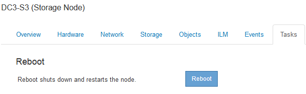

= Reiniciar un nodo de cuadrícula desde Grid Manager
:allow-uri-read: 
:icons: font
:imagesdir: ../media/

[role="lead"]
Reiniciar un nodo de cuadrícula desde Grid Manager emite el `reboot` en el nodo de destino.

.Lo que necesitará
* Debe iniciar sesión en Grid Manager mediante un explorador compatible.
* Debe tener los permisos de mantenimiento o acceso raíz.
* Debe tener la clave de acceso de aprovisionamiento.

.Pasos
. Seleccione *Nodes*.
. Seleccione el nodo de cuadrícula que desea reiniciar.
. Seleccione la ficha *tareas*.
+

. Haga clic en *Reiniciar*.
+
Se muestra un cuadro de diálogo de confirmación.

+
image::../media/reboot_node_confirmation.gif[Cuadro de diálogo de confirmación para reiniciar nodo de cuadrícula]

+

NOTE: Si va a reiniciar el nodo de administración principal, el cuadro de diálogo de confirmación le recuerda que la conexión del explorador con el Administrador de grid se perderá temporalmente cuando se detengan los servicios.

. Introduzca la contraseña de aprovisionamiento y haga clic en *Aceptar*.
. Espere a que se reinicie el nodo.
+
El apagado de los servicios puede llevar cierto tiempo.

+
Cuando se reinicia el nodo, el icono gris (administrativamente abajo) aparece en el lado izquierdo de la página Nodes. Cuando todos los servicios se han iniciado de nuevo, el icono vuelve a cambiar a su color original.

