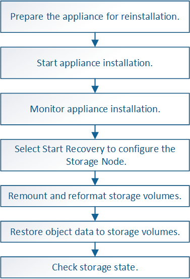

= Recuperar un nodo de almacenamiento de un dispositivo StorageGRID
:allow-uri-read: 
:icons: font
:imagesdir: ../media/

[role="lead"]
El procedimiento para recuperar un nodo de almacenamiento en dispositivos StorageGRID con fallos es el mismo tanto si se está recuperando de la pérdida de la unidad del sistema como de la pérdida de volúmenes de almacenamiento únicamente.

.Acerca de esta tarea
Debe preparar el dispositivo y reinstalar el software, configurar el nodo para volver a unirse a la cuadrícula, volver a formatear el almacenamiento y restaurar los datos de los objetos.

CAUTION: Si más de un nodo de almacenamiento presenta errores (o está sin conexión), póngase en contacto con el soporte técnico. No realice el siguiente procedimiento de recuperación. Podrían perderse datos.

CAUTION: Si este es el segundo fallo del nodo de almacenamiento en menos de 15 días después de un fallo o una recuperación en el nodo de almacenamiento, póngase en contacto con el soporte técnico. La reconstrucción de Cassandra en dos o más nodos de almacenamiento en 15 días puede provocar la pérdida de datos.

NOTE: Si se produce un error en más de un nodo de almacenamiento de un sitio, es posible que se requiera un procedimiento de recuperación del sitio. Póngase en contacto con el soporte técnico.

link:how-site-recovery-is-performed-by-technical-support.html["Cómo realiza la recuperación del sitio el soporte técnico"]

IMPORTANT: Si las reglas de ILM se configuran para almacenar una sola copia replicada y existe una en un volumen de almacenamiento donde se produjo un error, no podrá recuperar el objeto.

NOTE: Si encuentra una alarma de Servicios: Estado - Cassandra (SVST) durante la recuperación, consulte las instrucciones de supervisión y solución de problemas para recuperar la alarma reconstruyendo Cassandra. Una vez reconstruida Cassandra, las alarmas se deberían borrar. Si las alarmas no se borran, póngase en contacto con el soporte técnico.

NOTE: Para obtener información sobre procedimientos de mantenimiento del hardware, como instrucciones para reemplazar un controlador o reinstalar SANtricity OS, consulte las instrucciones de instalación y mantenimiento del dispositivo de almacenamiento.

.Información relacionada
link:../monitor/index.html["Solución de problemas de  monitor"]

link:../sg6000/index.html["Dispositivos de almacenamiento SG6000"]

link:../sg5700/index.html["Dispositivos de almacenamiento SG5700"]

link:../sg5600/index.html["Dispositivos de almacenamiento SG5600"]

.Pasos
* link:preparing-appliance-storage-node-for-reinstallation.html["Preparación de un nodo de almacenamiento del dispositivo para su reinstalación"]
* link:starting-storagegrid-appliance-installation.html["Iniciar la instalación del dispositivo StorageGRID"]
* link:monitoring-storagegrid-appliance-installation-sn.html["Supervisar la instalación del dispositivo StorageGRID"]
* link:selecting-start-recovery-to-configure-appliance-storage-node.html["Seleccione Start Recovery para configurar un nodo de almacenamiento del dispositivo"]
* link:remounting-and-reformatting-appliance-storage-volumes.html["Montaje y formateo de volúmenes de almacenamiento de dispositivos ("pasos anuales")"]
* link:restoring-object-data-to-storage-volume-for-appliance.html["Restaurar datos de objeto en un volumen de almacenamiento para un dispositivo"]
* link:checking-storage-state-after-recovering-sga.html["Comprobar el estado del almacenamiento después de recuperar un nodo de almacenamiento de dispositivo"]

