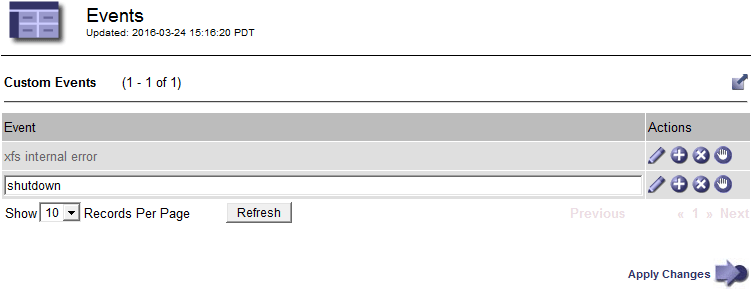

= Creación de eventos de syslog personalizados
:allow-uri-read: 
:icons: font
:imagesdir: ../media/

[role="lead"]
Los eventos personalizados permiten realizar el seguimiento de todos los eventos de usuario del kernel, del daemon, de los errores y de nivel crítico que se hayan registrado en el servidor de syslog. Un evento personalizado puede ser útil para supervisar la aparición de mensajes de registro del sistema (y por lo tanto, eventos de seguridad de la red y fallos de hardware).

.Acerca de esta tarea
Considere la posibilidad de crear eventos personalizados para supervisar problemas recurrentes. Las siguientes consideraciones se aplican a eventos personalizados.

* Después de crear un evento personalizado, se supervisa cada incidencia de él. Puede ver un valor de recuento acumulativo para todos los eventos personalizados en la página *Nodes* > *_grid node_* > *Events*.
* Para crear un evento personalizado basado en palabras clave de `/var/log/messages` o. `/var/log/syslog` los registros de dichos archivos deben ser:
+
** Generado por el núcleo
** Generado por daemon o programa de usuario en el nivel de error o crítico

*Nota:* no todas las entradas del `/var/log/messages` o. `/var/log/syslog` los archivos se emparejarán a menos que cumplan los requisitos indicados anteriormente.

.Pasos
. Seleccione *Configuración* > *Supervisión* > *Eventos*.
. Haga clic en *Editar* image:../media/icon_nms_edit.gif["icono de lápiz"] (O *Insertar* image:../media/icon_nms_insert.gif["icono de más"] si no es el primer evento).
. Escriba una cadena de evento personalizada, por ejemplo, shutdown
+

. Haga clic en *aplicar cambios*.
. Seleccione *Nodes*. A continuación, seleccione *_grid node_* > *Events*.
. Busque la entrada Eventos personalizados en la tabla Eventos y supervise el valor de *Count*.
+
Si aumenta el número, se activará un evento personalizado que supervise en ese nodo de grid.

+
image::../media/custom_events_count.gif[SSM > Eventos > página Descripción general]

