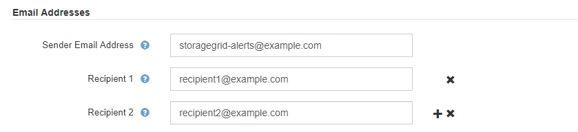

= Gestión de alertas
:allow-uri-read: 
:icons: font
:imagesdir: ../media/

[role="lead"]
Las alertas le permiten supervisar diversos eventos y condiciones dentro de su sistema StorageGRID. Puede gestionar alertas creando alertas personalizadas, editando o deshabilitando las alertas predeterminadas, configurando notificaciones por correo electrónico para alertas y silenciando las notificaciones de alertas.

.Información relacionada
link:viewing-current-alerts.html["Ver las alertas actuales"]

link:viewing-resolved-alerts.html["Ver alertas resueltas"]

link:viewing-specific-alert.html["Ver una alerta específica"]

link:alerts-reference.html["Referencia de alertas"]

== ¿Qué alertas son

El sistema de alertas proporciona una interfaz fácil de usar para detectar, evaluar y resolver los problemas que pueden ocurrir durante el funcionamiento de StorageGRID.

* El sistema de alertas se centra en los problemas que pueden llevar a la práctica en el sistema. A diferencia de algunas alarmas del sistema heredado, se activan alertas para eventos que requieren su atención inmediata, no para eventos que pueden ignorarse de forma segura.
* La página Alertas actuales proporciona una interfaz sencilla para ver los problemas actuales. Puede ordenar el listado por alertas individuales y grupos de alertas. Por ejemplo, podría ordenar todas las alertas por nodo/sitio para ver qué alertas afectan a un nodo concreto. O bien, se pueden ordenar las alertas de un grupo por tiempo activadas para encontrar la instancia más reciente de una alerta específica.
* La página Resolved Alerts proporciona información similar a la de la página Current Alerts, pero permite buscar y ver un historial de las alertas que se han resuelto, incluida la hora en la que se activó la alerta y la fecha en que se resolvió.
* Se agrupan varias alertas del mismo tipo en un correo electrónico para reducir el número de notificaciones. Además, en la página Alertas se muestran varias alertas del mismo tipo como un grupo. Puede expandir y contraer grupos de alertas para mostrar u ocultar las alertas individuales. Por ejemplo, si varios nodos notifican la alerta *no se puede comunicar con el nodo* aproximadamente a la vez, sólo se envía un correo electrónico y la alerta se muestra como un grupo en la página Alertas.
* Las alertas utilizan nombres y descripciones intuitivos que le ayudan a entender rápidamente el problema. Las notificaciones de alerta incluyen detalles sobre el nodo y el sitio afectado, la gravedad de alerta, la hora en la que se activó la regla de alerta y el valor actual de las métricas relacionadas con la alerta.
* Las notificaciones por correo electrónico de alertas y los listados de alertas de las páginas actuales de Alertas y Alertas resueltas ofrecen acciones recomendadas para resolver una alerta. Estas acciones recomendadas suelen incluir enlaces directos al centro de documentación de StorageGRID para facilitar la búsqueda y el acceso a procedimientos más detallados para la solución de problemas.
* Si necesita suprimir temporalmente las notificaciones de una alerta en uno o más niveles de gravedad, puede silenciar fácilmente una regla de alerta específica durante una duración especificada y para todo el grid, un solo sitio o un solo nodo. También puede silenciar todas las reglas de alerta, por ejemplo, durante un procedimiento de mantenimiento planificado, como una actualización de software.
* Puede editar las reglas de alerta predeterminadas si es necesario. Puede deshabilitar una regla de alerta por completo o cambiar sus condiciones de activación y duración.
* Puede crear reglas de alerta personalizadas para tener en cuenta las condiciones específicas que son relevantes para su situación y para proporcionar sus propias acciones recomendadas. Para definir las condiciones de una alerta personalizada, debe crear expresiones mediante las métricas Prometheus disponibles en la sección Metrics de la API de gestión de grid.

== Gestión de reglas de alerta

Las reglas de alerta definen las condiciones que activan alertas específicas. StorageGRID incluye un conjunto de reglas de alerta predeterminadas, que se pueden utilizar tal cual o modificar, o bien se pueden crear reglas de alerta personalizadas.

=== Ver reglas de alerta

Puede ver la lista de todas las reglas de alerta predeterminadas y personalizadas para saber qué condiciones desencadenarán cada alerta y ver si hay alguna alerta desactivada.

.Lo que necesitará
* Debe iniciar sesión en Grid Manager mediante un explorador compatible.
* Debe tener los permisos Administrar alertas o acceso raíz.

.Pasos
. Seleccione *Alertas* > *Reglas de alerta*.
+
Aparecerá la página Reglas de alerta.

+
image::../media/alert_rules_page.png[Página Reglas de alerta]

. Revise la información en la tabla de reglas de alertas:
+
|===
| Encabezado de columna | Descripción 

 a| 
Nombre
 a| 
El nombre único y la descripción de la regla de alerta. Las reglas de alerta personalizadas se enumeran primero, seguidas de reglas de alerta predeterminadas. El nombre de la regla de alerta es el asunto de las notificaciones por correo electrónico.

 a| 
Condiciones
 a| 
Expresiones Prometheus que determinan cuándo se activa esta alerta. Puede activarse una alerta en uno o más de los siguientes niveles de gravedad, pero no es necesario utilizar una condición para cada gravedad.

** *Crítico* image:../media/icon_alert_red_critical.png["Alerta de icono Rojo crítico"]: Existe una condición anormal que ha detenido las operaciones normales de un nodo StorageGRID o servicio. Debe abordar el problema subyacente de inmediato. Se pueden producir interrupciones del servicio y pérdida de datos si no se resuelve el problema.
** *Mayor* image:../media/icon_alert_orange_major.png["Alerta de icono naranja principal"]: Existe una condición anormal que afecta a las operaciones actuales o se acerca al umbral de una alerta crítica. Debe investigar las alertas principales y solucionar cualquier problema subyacente para garantizar que esta condición no detenga el funcionamiento normal de un nodo o servicio de StorageGRID.
** *Menor* image:../media/icon_alert_yellow_miinor.png["Alerta de icono menor amarilla"]: El sistema funciona normalmente, pero existe una condición anormal que podría afectar la capacidad de funcionamiento del sistema si continúa. Deberá supervisar y resolver las alertas menores que no se despicen por sí mismas para asegurarse de que no provoquen un problema más grave.

 a| 
Tipo
 a| 
Tipo de regla de alerta:

** *Valor predeterminado*: Regla de alerta proporcionada con el sistema. Puede deshabilitar una regla de alerta predeterminada o editar las condiciones y la duración de una regla de alerta predeterminada. No se puede eliminar una regla de alerta predeterminada.
** *Predeterminado**: Regla de alerta predeterminada que incluye una condición o duración editada. Según sea necesario, puede revertir fácilmente una condición modificada al valor predeterminado original.
** *Personalizado*: Regla de alerta que ha creado. Puede deshabilitar, editar y eliminar reglas de alerta personalizadas.

 a| 
Estado
 a| 
Si esta regla de alerta está activada o desactivada. Las condiciones para las reglas de alerta desactivadas no se evalúan, por lo que no se activan alertas.

|===

.Información relacionada
link:alerts-reference.html["Referencia de alertas"]

=== Crear reglas de alerta personalizadas

Puede crear reglas de alerta personalizadas para definir sus propias condiciones para activar alertas.

.Lo que necesitará
* Debe iniciar sesión en Grid Manager mediante un explorador compatible.
* Debe tener los permisos Administrar alertas o acceso raíz.

.Acerca de esta tarea
StorageGRID no valida alertas personalizadas. Si decide crear reglas de alerta personalizadas, siga estas directrices generales:

* Observe las condiciones de las reglas de alerta predeterminadas y utilícela como ejemplos para sus reglas de alerta personalizadas.
* Si define más de una condición para una regla de alerta, utilice la misma expresión para todas las condiciones. A continuación, cambie el valor del umbral para cada condición.
* Compruebe con cuidado cada condición en busca de errores tipográficos y lógicos.
* Utilice sólo las métricas enumeradas en la API de gestión de grid.
* Cuando pruebe una expresión utilizando la API de gestión de grid, tenga en cuenta que una respuesta «correcta» podría ser simplemente un cuerpo de respuesta vacío (no se ha activado ninguna alerta). Para ver si la alerta está activada realmente, puede configurar temporalmente un umbral en el valor que espera que sea TRUE actualmente.
+
Por ejemplo, para probar la expresión `node_memory_MemTotal_bytes < 24000000000`, primera ejecución `node_memory_MemTotal_bytes >= 0` y asegúrese de obtener los resultados esperados (todos los nodos devuelven un valor). A continuación, vuelva a cambiar el operador y el umbral a los valores previstos y vuelva a ejecutarlo. Ningún resultado indica que no hay alertas actuales para esta expresión.

* No asuma que una alerta personalizada funciona a menos que haya validado que la alerta se activa cuando se espera.

.Pasos
. Seleccione *Alertas* > *Reglas de alerta*.
+
Aparecerá la página Reglas de alerta.

. Seleccione *Crear regla personalizada*.
+
Aparece el cuadro de diálogo Crear regla personalizada.

+
image::../media/alerts_create_custom_rule.png[Alertas > Crear regla personalizada]

. Active o anule la selección de la casilla de verificación *Activado* para determinar si esta regla de alerta está activada actualmente.
+
Si una regla de alerta está deshabilitada, sus expresiones no se evalúan y no se activan alertas.

. Introduzca la siguiente información:
+
|===
| Campo | Descripción 

 a| 
Nombre exclusivo
 a| 
Nombre único para esta regla. El nombre de la regla de alerta se muestra en la página Alertas y también es el asunto de las notificaciones por correo electrónico. Los nombres de las reglas de alerta pueden tener entre 1 y 64 caracteres.

 a| 
Descripción
 a| 
Una descripción del problema que se está produciendo. La descripción es el mensaje de alerta que se muestra en la página Alertas y en las notificaciones por correo electrónico. Las descripciones de las reglas de alerta pueden tener entre 1 y 128 caracteres.

 a| 
Acciones recomendadas
 a| 
De manera opcional, las acciones recomendadas que se deben realizar cuando se activa esta alerta. Introduzca las acciones recomendadas como texto sin formato (sin códigos de formato). Las acciones recomendadas para las reglas de alerta pueden tener entre 0 y 1,024 caracteres.

|===
. En la sección Condiciones, introduzca una expresión Prometheus para uno o más niveles de gravedad de alerta.
+
Una expresión básica suele ser de la forma:

+
[listing]
----
[metric] [operator] [value]
----
+
Las expresiones pueden ser de cualquier longitud, pero aparecen en una sola línea en la interfaz de usuario. Se requiere al menos una expresión.

+
Para ver las métricas disponibles y probar expresiones Prometheus, haga clic en el icono de ayuda image:../media/icon_nms_question.gif["icono de signo de interrogación"] Y siga el enlace a la sección Metrics de la API de Grid Management.

+
Para obtener más información sobre el uso de la API de gestión de grid, consulte las instrucciones para administrar StorageGRID. Para obtener más información sobre la sintaxis de las consultas Prometheus, consulte la documentación de Prometheus.

+
Esta expresión provoca que se active una alerta si la cantidad de RAM instalada para un nodo es inferior a 24,000,000,000 bytes (24 GB).

+
[listing]
----
node_memory_MemTotal_bytes < 24000000000
----
. En el campo *duración*, introduzca la cantidad de tiempo que una condición debe permanecer en vigor continuamente antes de que se active la alerta y seleccione una unidad de tiempo.
+
Para activar una alerta inmediatamente cuando una condición se convierte en verdadera, introduzca *0*. Aumente este valor para evitar que las condiciones temporales activen las alertas.

+
El valor predeterminado es 5 minutos.

. Haga clic en *Guardar*.
+
El cuadro de diálogo se cierra y la nueva regla de alerta personalizada aparece en la tabla Reglas de alerta.

.Información relacionada
link:../admin/index.html["Administre StorageGRID"]

link:commonly-used-prometheus-metrics.html["Métricas de Prometheus que se usan habitualmente"]

https://["Prometheus: Aspectos básicos de las consultas"]

=== Editar una regla de alerta

Puede editar una regla de alerta para cambiar las condiciones de activación, para una regla de alerta personalizada, también puede actualizar el nombre de la regla, la descripción y las acciones recomendadas.

.Lo que necesitará
* Debe iniciar sesión en Grid Manager mediante un explorador compatible.
* Debe tener los permisos Administrar alertas o acceso raíz.

.Acerca de esta tarea
Al editar una regla de alerta predeterminada, puede cambiar las condiciones de las alertas menores, principales y críticas, así como la duración. Al editar una regla de alerta personalizada, también puede editar el nombre de la regla, la descripción y las acciones recomendadas.

IMPORTANT: Tenga cuidado al decidir editar una regla de alerta. Si cambia los valores de activación, es posible que no detecte un problema subyacente hasta que no se complete una operación crucial.

.Pasos
. Seleccione *Alertas* > *Reglas de alerta*.
+
Aparecerá la página Reglas de alerta.

. Seleccione el botón de opción de la regla de alerta que desee editar.
. Seleccione *Editar regla*.
+
Se muestra el cuadro de diálogo Editar regla. En este ejemplo se muestra una regla de alerta predeterminada: Los campos Nombre único, Descripción y acciones recomendadas están desactivados y no se pueden editar.

+
image::../media/alert_rules_edit_rule.png[Alertas > Editar regla]

. Active o anule la selección de la casilla de verificación *Activado* para determinar si esta regla de alerta está activada actualmente.
+
Si una regla de alerta está deshabilitada, sus expresiones no se evalúan y no se activan alertas.

+

NOTE: Si deshabilita la regla de alerta para una alerta actual, deberá esperar unos minutos para que la alerta ya no aparezca como alerta activa.

+

IMPORTANT: En general, no se recomienda deshabilitar una regla de alerta predeterminada. Si una regla de alerta está deshabilitada, es posible que no se detecte un problema subyacente hasta que no se complete una operación crucial.

. En el caso de reglas de alerta personalizadas, actualice la siguiente información según sea necesario.
+

NOTE: Esta información no se puede editar para las reglas de alerta predeterminadas.

+
|===
| Campo | Descripción 

 a| 
Nombre exclusivo
 a| 
Nombre único para esta regla. El nombre de la regla de alerta se muestra en la página Alertas y también es el asunto de las notificaciones por correo electrónico. Los nombres de las reglas de alerta pueden tener entre 1 y 64 caracteres.

 a| 
Descripción
 a| 
Una descripción del problema que se está produciendo. La descripción es el mensaje de alerta que se muestra en la página Alertas y en las notificaciones por correo electrónico. Las descripciones de las reglas de alerta pueden tener entre 1 y 128 caracteres.

 a| 
Acciones recomendadas
 a| 
De manera opcional, las acciones recomendadas que se deben realizar cuando se activa esta alerta. Introduzca las acciones recomendadas como texto sin formato (sin códigos de formato). Las acciones recomendadas para las reglas de alerta pueden tener entre 0 y 1,024 caracteres.

|===
. En la sección Condiciones, introduzca o actualice la expresión Prometheus de uno o más niveles de gravedad de alerta.
+

NOTE: Si desea restaurar una condición para una regla de alerta predeterminada editada a su valor original, haga clic en los tres puntos a la derecha de la condición modificada.

+
image::../media/alert_rules_edit_revert_to_default.png[Reglas de alerta: Revertir una condición editada al valor predeterminado]

+

NOTE: Si actualiza las condiciones para una alerta actual, es posible que los cambios no se implementen hasta que se resuelva la condición anterior. La próxima vez que se cumpla una de las condiciones de la regla, la alerta reflejará los valores actualizados.

+
Una expresión básica suele ser de la forma:

+
[listing]
----
[metric] [operator] [value]
----
+
Las expresiones pueden ser de cualquier longitud, pero aparecen en una sola línea en la interfaz de usuario. Se requiere al menos una expresión.

+
Para ver las métricas disponibles y probar expresiones Prometheus, haga clic en el icono de ayuda image:../media/icon_nms_question.gif["icono de signo de interrogación"] Y siga el enlace a la sección Metrics de la API de Grid Management.

+
Para obtener más información sobre el uso de la API de gestión de grid, consulte las instrucciones para administrar StorageGRID. Para obtener más información sobre la sintaxis de las consultas Prometheus, consulte la documentación de Prometheus.

+
Esta expresión provoca que se active una alerta si la cantidad de RAM instalada para un nodo es inferior a 24,000,000,000 bytes (24 GB).

+
[listing]
----
node_memory_MemTotal_bytes < 24000000000
----
. En el campo *duración*, introduzca la cantidad de tiempo que una condición debe permanecer en vigor continuamente antes de que se active la alerta y seleccione la unidad de tiempo.
+
Para activar una alerta inmediatamente cuando una condición se convierte en verdadera, introduzca *0*. Aumente este valor para evitar que las condiciones temporales activen las alertas.

+
El valor predeterminado es 5 minutos.

. Haga clic en *Guardar*.
+
Si ha editado una regla de alerta predeterminada, aparecerá *valor predeterminado** en la columna Tipo. Si ha desactivado una regla de alerta predeterminada o personalizada, *Desactivada* aparece en la columna *Estado*.

.Información relacionada
link:../admin/index.html["Administre StorageGRID"]

link:commonly-used-prometheus-metrics.html["Métricas de Prometheus que se usan habitualmente"]

https://["Prometheus: Aspectos básicos de las consultas"]

=== Deshabilitar una regla de alerta

Puede cambiar el estado activado/desactivado para una regla de alerta predeterminada o personalizada.

.Lo que necesitará
* Debe iniciar sesión en Grid Manager mediante un explorador compatible.
* Debe tener los permisos Administrar alertas o acceso raíz.

.Acerca de esta tarea
Cuando una regla de alerta está deshabilitada, sus expresiones no se evalúan y no se activan alertas.

IMPORTANT: En general, no se recomienda deshabilitar una regla de alerta predeterminada. Si una regla de alerta está deshabilitada, es posible que no se detecte un problema subyacente hasta que no se complete una operación crucial.

.Pasos
. Seleccione *Alertas* > *Reglas de alerta*.
+
Aparecerá la página Reglas de alerta.

. Seleccione el botón de opción de la regla de alerta que desee desactivar o activar.
. Seleccione *Editar regla*.
+
Se muestra el cuadro de diálogo Editar regla.

. Active o anule la selección de la casilla de verificación *Activado* para determinar si esta regla de alerta está activada actualmente.
+
Si una regla de alerta está deshabilitada, sus expresiones no se evalúan y no se activan alertas.

+

NOTE: Si deshabilita la regla de alerta para una alerta actual, debe esperar unos minutos para que la alerta ya no se muestre como una alerta activa.

. Haga clic en *Guardar*.
+
*Desactivado* aparece en la columna *Estado*.

=== Quitar una regla de alerta personalizada

Puede eliminar una regla de alerta personalizada si ya no desea utilizarla.

.Lo que necesitará
* Debe iniciar sesión en Grid Manager mediante un explorador compatible.
* Debe tener los permisos Administrar alertas o acceso raíz.

.Pasos
. Seleccione *Alertas* > *Reglas de alerta*.
+
Aparecerá la página Reglas de alerta.

. Seleccione el botón de opción de la regla de alerta personalizada que desee eliminar.
+
No se puede eliminar una regla de alerta predeterminada.

. Haga clic en *Eliminar regla personalizada*.
+
Se muestra un cuadro de diálogo de confirmación.

. Haga clic en *Aceptar* para eliminar la regla de alerta.
+
Las instancias activas de la alerta se resolverán en un plazo de 10 minutos.

== Gestión de notificaciones de alerta

Cuando se activa una alerta, StorageGRID puede enviar notificaciones por correo electrónico y notificaciones (capturas) de protocolo simple de gestión de redes (SNMP).

=== Configurar notificaciones SNMP para las alertas

Si desea que StorageGRID envíe notificaciones SNMP cuando se produzca una alerta, debe habilitar el agente SNMP de StorageGRID y configurar uno o más destinos de capturas.

.Acerca de esta tarea
Puede utilizar la opción *Configuración* > *Supervisión* > *Agente SNMP* en el Administrador de grid o los puntos finales SNMP de la API de administración de grid para activar y configurar el agente SNMP de StorageGRID. El agente SNMP admite las tres versiones del protocolo SNMP.

Para obtener más información sobre cómo configurar el agente SNMP, consulte la sección para utilizar la supervisión de SNMP.

Después de configurar el agente SNMP de StorageGRID, se pueden enviar dos tipos de notificaciones condicionadas por eventos:

* Los solapamientos son notificaciones enviadas por el agente SNMP que no requieren confirmación por parte del sistema de administración. Los traps sirven para notificar al sistema de gestión que algo ha sucedido dentro de StorageGRID, por ejemplo, que se activa una alerta. Las tres versiones de SNMP admiten capturas
* Las informes son similares a las capturas, pero requieren el reconocimiento del sistema de gestión. Si el agente SNMP no recibe un acuse de recibo en un periodo de tiempo determinado, vuelve a enviar el informe hasta que se reciba un acuse de recibo o se haya alcanzado el valor de reintento máximo. Las informa son compatibles con SNMPv2c y SNMPv3.

Las notificaciones Trap e inform se envían cuando se activa una alerta predeterminada o personalizada en cualquier nivel de gravedad. Para suprimir las notificaciones SNMP de una alerta, debe configurar un silencio para la alerta. Las notificaciones de alerta se envían mediante el nodo de administrador que esté configurado para que sea el remitente preferido. De manera predeterminada, se selecciona el nodo de administración principal. Para obtener más detalles, consulte las instrucciones para administrar StorageGRID.

NOTE: Las notificaciones Trap e inform también se envían cuando determinadas alarmas (sistema heredado) se activan en niveles de gravedad especificados o superiores; sin embargo, las notificaciones SNMP no se envían para cada alarma o para cada gravedad de alarma.

.Información relacionada
link:using-snmp-monitoring.html["Uso de la supervisión de SNMP"]

link:managing-alerts.html["Silenciar notificaciones de alerta"]

link:../admin/index.html["Administre StorageGRID"]

link:alarms-that-generate-snmp-notifications.html["Alarmas que generan notificaciones SNMP (sistema heredado)"]

=== Configurar notificaciones por correo electrónico para alertas

Si desea que se envíen notificaciones por correo electrónico cuando se produzcan alertas, debe proporcionar información acerca del servidor SMTP. También debe introducir direcciones de correo electrónico para los destinatarios de las notificaciones de alerta.

.Lo que necesitará
* Debe iniciar sesión en Grid Manager mediante un explorador compatible.
* Debe tener los permisos Administrar alertas o acceso raíz.

.Lo que necesitará
Dado que las alarmas y las alertas son sistemas independientes, la configuración de correo electrónico que se utiliza para las notificaciones de alerta no se utiliza para las notificaciones de alarma ni los mensajes de AutoSupport. Sin embargo, puede utilizar el mismo servidor de correo electrónico para todas las notificaciones.

Si la implementación de StorageGRID incluye varios nodos de administrador, puede seleccionar qué nodo de administrador debe ser el remitente preferido de notificaciones de alerta. También se utiliza el mismo «"remitente preferido» para las notificaciones de alarma y los mensajes de AutoSupport. De manera predeterminada, se selecciona el nodo de administración principal. Para obtener más detalles, consulte las instrucciones para administrar StorageGRID.

.Pasos
. Seleccione *Alertas* > *Configuración de correo electrónico*.
+
Aparece la página Configuración de correo electrónico.

+
image::../media/alerts_email_setup_disabled.png[Configuración de correo electrónico de alertas deshabilitada]

. Active la casilla de verificación *Activar notificaciones por correo electrónico* para indicar que desea enviar correos electrónicos de notificación cuando las alertas alcancen umbrales configurados.
+
Aparecen las secciones servidor de correo electrónico (SMTP), Seguridad de la capa de transporte (TLS), direcciones de correo electrónico y Filtros.

. En la sección servidor de correo electrónico (SMTP), introduzca la información que necesita StorageGRID para acceder al servidor SMTP.
+
Si el servidor SMTP requiere autenticación, debe introducir tanto un nombre de usuario como una contraseña. También debe usar TLS y proporcionar un certificado de CA.

+
|===
| Campo | Introduzca 

 a| 
Servidor de correo
 a| 
El nombre de dominio completo (FQDN) o la dirección IP del servidor SMTP.

 a| 
Puerto
 a| 
El puerto utilizado para acceder al servidor SMTP. Debe estar entre 1 y 65535.

 a| 
Nombre de usuario (opcional)
 a| 
Si el servidor SMTP requiere autenticación, introduzca el nombre de usuario con el que desea autenticarse.

 a| 
Contraseña (opcional)
 a| 
Si el servidor SMTP requiere autenticación, introduzca la contraseña con la que desea autenticarse.

|===
+
image:../media/alerts_email_smtp_server.png["Alertas servidor SMTP por correo electrónico"]

. En la sección direcciones de correo electrónico, introduzca las direcciones de correo electrónico del remitente y de cada destinatario.
+
.. En *Dirección de correo electrónico del remitente*, especifique una dirección de correo electrónico válida que se utilizará como dirección de para las notificaciones de alerta.
+
Por ejemplo: `storagegrid-alerts@example.com`

.. En la sección Recipients, introduzca una dirección de correo electrónico para cada lista de correo electrónico o persona que debería recibir un correo electrónico cuando se produzca una alerta.
+
Se hace clic en el icono de más image:../media/icon_plus_sign_black_on_white.gif["icono de más"] para agregar destinatarios.

+

. En la sección Seguridad de la capa de transporte (TLS), active la casilla de verificación *requerir TLS* si se requiere Seguridad de la capa de transporte (TLS) para las comunicaciones con el servidor SMTP.
+
.. En el campo *Certificado CA*, proporcione el certificado de CA que se utilizará para verificar la identificación del servidor SMTP.
+
Puede copiar y pegar el contenido en este campo, o haga clic en *examinar* y seleccione el archivo.

+
Debe proporcionar un solo archivo que contenga los certificados de cada entidad de certificación (CA) intermedia. El archivo debe contener cada uno de los archivos de certificado de CA codificados con PEM, concatenados en el orden de la cadena de certificados.

.. Active la casilla de verificación *Enviar certificado de cliente* si el servidor de correo electrónico SMTP requiere que los remitentes de correo electrónico proporcionen certificados de cliente para la autenticación.
.. En el campo *Certificado de cliente*, proporcione el certificado de cliente codificado con PEM para enviar al servidor SMTP.
+
Puede copiar y pegar el contenido en este campo, o haga clic en *examinar* y seleccione el archivo.

.. En el campo *clave privada*, introduzca la clave privada del certificado de cliente en codificación PEM sin cifrar.
+
Puede copiar y pegar el contenido en este campo, o haga clic en *examinar* y seleccione el archivo.

+

NOTE: Si necesita editar la configuración de correo electrónico, haga clic en el icono del lápiz para actualizar este campo.

+
image::../media/alerts_email_tls.png[Alertas TLS por correo electrónico]

. En la sección Filtros, seleccione qué niveles de gravedad de alerta deberían producir notificaciones por correo electrónico, a menos que se haya silenciado la regla de una alerta específica.
+
|===
| Gravedad | Descripción 

 a| 
Menor, mayor, crítico
 a| 
Se envía una notificación por correo electrónico cuando se cumple la condición menor, mayor o crítica de una regla de alerta.

 a| 
Principal, crítico
 a| 
Se envía una notificación por correo electrónico cuando se cumple la condición principal o crítica de una regla de alerta. Las notificaciones no se envían para alertas menores.

 a| 
Solo crítico
 a| 
Solo se envía una notificación por correo electrónico cuando se cumple la condición crítica de una regla de alerta. No se envían notificaciones para alertas menores o importantes.

|===
+
image:../media/alerts_email_filters.png["Filtros de correo electrónico de alertas"]

. Cuando esté listo para probar la configuración de correo electrónico, siga estos pasos:
+
.. Haga clic en *Enviar correo electrónico de prueba*.
+
Aparece un mensaje de confirmación que indica que se ha enviado un correo electrónico de prueba.

.. Active las casillas de todos los destinatarios de correo electrónico y confirme que se ha recibido un mensaje de correo electrónico de prueba.
+

NOTE: Si el correo electrónico no se recibe en unos minutos o si se activa la alerta *error de notificación por correo electrónico*, compruebe la configuración e inténtelo de nuevo.

.. Inicie sesión en cualquier otro nodo de administración y envíe un correo electrónico de prueba para verificar la conectividad desde todos los sitios.
+

NOTE: Cuando prueba las notificaciones de alerta, debe iniciar sesión en cada nodo de administrador para verificar la conectividad. Esto contrasta con la prueba de notificaciones de alarma y mensajes de AutoSupport, donde todos los nodos del administrador envían el correo electrónico de prueba.

. Haga clic en *Guardar*.
+
El envío de un mensaje de correo electrónico de prueba no guarda la configuración. Debe hacer clic en *Guardar*.

+
Se guardará la configuración del correo electrónico.

.Información relacionada
link:managing-alerts.html["Solución de problemas de notificaciones por correo electrónico de alertas"]

link:../maintain/index.html["Mantener  recuperar"]

=== Información incluida en las notificaciones por correo electrónico de alertas

Una vez configurado el servidor de correo electrónico SMTP, las notificaciones por correo electrónico se envían a los destinatarios designados cuando se activa una alerta, a menos que la regla de alerta se suprima con un silencio.

Las notificaciones por correo electrónico incluyen la siguiente información:

image::../media/alerts_email_notification.png[Notificación por correo electrónico de alertas]

[cols="1a,5a"]
|===
|  | Descripción 

 a| 
1
 a| 
El nombre de la alerta, seguido del número de instancias activas de esta alerta.

 a| 
2
 a| 
La descripción de la alerta.

 a| 
3
 a| 
Todas las acciones recomendadas para la alerta.

 a| 
4
 a| 
Detalles sobre cada instancia activa de la alerta, incluido el nodo y el sitio afectados, la gravedad de la alerta, la hora UTC en la que se activó la regla de alerta y el nombre del trabajo y el servicio afectados.

 a| 
5
 a| 
El nombre de host del nodo de administrador que envió la notificación.

|===
.Información relacionada
link:managing-alerts.html["Silenciar notificaciones de alerta"]

=== Cómo alertas de grupos StorageGRID en las notificaciones por correo electrónico

Para evitar que se envíe un número excesivo de notificaciones por correo electrónico cuando se activan alertas, StorageGRID intenta agrupar varias alertas en la misma notificación.

Consulte la tabla siguiente para ver ejemplos de cómo StorageGRID agrupa varias alertas en notificaciones por correo electrónico.

|===
| Comportamiento | Ejemplo 

 a| 
Cada notificación de alerta sólo se aplica a las alertas con el mismo nombre. Si al mismo tiempo se activan dos alertas con nombres diferentes, se envían dos notificaciones por correo electrónico.
 a| 
* La alerta A se activa en dos nodos al mismo tiempo. Sólo se envía una notificación.
* La alerta A se activa en el nodo 1 y la alerta B se activa en el nodo 2 al mismo tiempo. Se envían dos notificaciones: Una para cada alerta.

 a| 
Para una alerta específica de un nodo específico, si los umbrales se alcanzan para más de una gravedad, solo se envía una notificación para la alerta más grave.
 a| 
* Se activa la alerta A y se alcanzan los umbrales menores, principales y críticos. Se envía una notificación para la alerta crucial.

 a| 
La primera vez que se activa una alerta, StorageGRID espera 2 minutos antes de enviar una notificación. Si se activan otras alertas con el mismo nombre durante ese tiempo, StorageGRID agrupa todas las alertas en la notificación inicial.​
 a| 
. La alerta A se activa en el nodo 1 a las 08:00. No se envía ninguna notificación.
. La alerta A se activa en el nodo 2 a las 08:01. No se envía ninguna notificación.
. A las 08:02, se envía una notificación para informar de ambas instancias de la alerta.

 a| 
Si se activa otra alerta con el mismo nombre, StorageGRID espera 10 minutos antes de enviar una nueva notificación. La nueva notificación informa de todas las alertas activas (alertas actuales que no se han silenciado), aunque se hayan notificado previamente.
 a| 
. La alerta A se activa en el nodo 1 a las 08:00. Se envía una notificación a las 08:02.
. La alerta A se activa en el nodo 2 a las 08:05. Una segunda notificación se envía a las 08:15 (10 minutos más tarde). Se informa de ambos nodos.

 a| 
Si existen varias alertas actuales con el mismo nombre y se resuelve una de esas alertas, no se envía una nueva notificación si la alerta se vuelve a producir en el nodo para el que se solucionó la alerta.
 a| 
. La alerta A se activa para el nodo 1. Se envía una notificación.
. La alerta A se activa para el nodo 2. Se envía una segunda notificación.
. La alerta A se ha resuelto para el nodo 2, pero sigue estando activa para el nodo 1.
. La alerta A se vuelve a activar para el nodo 2. No se envía ninguna notificación nueva porque la alerta sigue activa para el nodo 1.

 a| 
StorageGRID continúa enviando notificaciones por correo electrónico una vez cada 7 días hasta que se resuelven todas las instancias de la alerta o se silencia la regla de alerta.
 a| 
. La alerta A se activa para el nodo 1 el 8 de marzo. Se envía una notificación.
. La alerta A no se resuelve o se silencia. Las notificaciones adicionales se envían el 15 de marzo, el 22 de marzo, el 29 de marzo, etc.

|===

=== Solución de problemas de notificaciones por correo electrónico de alertas

Si se activa la alerta *error de notificación por correo electrónico* o no puede recibir la notificación por correo electrónico de alerta de prueba, siga estos pasos para resolver el problema.

.Lo que necesitará
* Debe iniciar sesión en Grid Manager mediante un explorador compatible.
* Debe tener los permisos Administrar alertas o acceso raíz.

.Pasos
. Compruebe la configuración.
+
.. Seleccione *Alertas* > *Configuración de correo electrónico*.
.. Compruebe que la configuración del servidor de correo electrónico (SMTP) es correcta.
.. Compruebe que ha especificado direcciones de correo electrónico válidas para los destinatarios.

. Compruebe el filtro de spam y asegúrese de que el correo electrónico no se ha enviado a una carpeta basura.
. Solicite al administrador de correo electrónico que confirme que los correos electrónicos de la dirección del remitente no están bloqueados.
. Recoja un archivo de registro del nodo de administración y póngase en contacto con el soporte técnico.
+
El soporte técnico puede utilizar la información de los registros para determinar el problema. Por ejemplo, el archivo prometheus.log podría mostrar un error al conectarse al servidor especificado.

.Información relacionada
link:collecting-log-files-and-system-data.html["Recogida de archivos de registro y datos del sistema"]

== Silenciar notificaciones de alerta

Opcionalmente, puede configurar silencios para suprimir temporalmente las notificaciones de alerta.

.Lo que necesitará
* Debe iniciar sesión en Grid Manager mediante un explorador compatible.
* Debe tener los permisos Administrar alertas o acceso raíz.

.Acerca de esta tarea
Puede silenciar las reglas de alerta en todo el grid, un sitio único o un nodo individual, así como en una o más gravedades. Cada silencio suprime todas las notificaciones para una sola regla de alerta o para todas las reglas de alerta.

Si ha habilitado el agente SNMP, las silencios también suprimen las capturas SNMP e informan.

IMPORTANT: Tenga cuidado al decidir silenciar una regla de alerta. Si silencia una alerta, es posible que no detecte un problema subyacente hasta que impida que se complete una operación crítica.

NOTE: Puesto que las alarmas y alertas son sistemas independientes, no puede utilizar esta función para suprimir las notificaciones de alarma.

.Pasos
. Seleccione *Alertas* > *silencios*.
+
Aparece la página silencios.

+
image::../media/alerts_silences_page.png[Alertas > página silencios]

. Seleccione *Crear*.
+
Aparece el cuadro de diálogo Crear silencio.

+
image::../media/alerts_create_silence.png[Alertas > Crear silencio]

. Seleccione o introduzca la siguiente información:
+
[cols="1a,3a"]
|===
| Campo | Descripción 

 a| 
Regla de alerta
 a| 
Nombre de la regla de alerta que se desea silenciar. Puede seleccionar cualquier regla de alerta predeterminada o personalizada, incluso si la regla de alerta está desactivada.

*Nota:* Seleccione *todas las reglas* si desea silenciar todas las reglas de alerta utilizando los criterios especificados en este cuadro de diálogo.

 a| 
Descripción
 a| 
Opcionalmente, una descripción del silencio. Por ejemplo, describa el propósito de este silencio.

 a| 
Duración
 a| 
Cuánto tiempo desea que este silencio permanezca en vigor, en minutos, horas o días. Un silencio puede estar en vigor de 5 minutos a 1,825 días (5 años).

*Nota:* no debe silenciar una regla de alerta por un período prolongado de tiempo. Si se silencia una regla de alerta, es posible que no detecte un problema subyacente hasta que impida que se complete una operación crítica. Sin embargo, es posible que tenga que utilizar un silencio extendido si una alerta se activa mediante una configuración intencional específica, como puede ser el caso de las alertas * Services Appliance LINK down* y las alertas *Storage Appliance LINK down*.

 a| 
Gravedad
 a| 
Qué gravedad o gravedad de alerta se deben silenciar. Si la alerta se activa en una de las gravedades seleccionadas, no se enviarán notificaciones.

 a| 
Nodos
 a| 
A qué nodo o nodos desea que se aplique este silencio. Puede suprimir una regla de alerta o todas las reglas de toda la cuadrícula, un único sitio o un solo nodo. Si selecciona toda la cuadrícula, el silencio se aplica a todos los sitios y a todos los nodos. Si selecciona un sitio, el silencio sólo se aplica a los nodos de ese sitio.

*Nota:* no puede seleccionar más de un nodo o más de un sitio para cada silencio. Debe crear silencios adicionales si desea suprimir la misma regla de alerta en más de un nodo o más de un sitio a la vez.

|===
. Haga clic en *Guardar*.
. Si desea modificar o finalizar un silencio antes de que caduque, puede editarlo o eliminarlo.
+
[cols="1a,3a"]
|===
| Opción | Descripción 

 a| 
Edite un silencio
 a| 
.. Seleccione *Alertas* > *silencios*.
.. En la tabla, seleccione el botón de opción para el silencio que desea editar.
.. Haga clic en *Editar*.
.. Cambie la descripción, la cantidad de tiempo restante, las gravedades seleccionadas o el nodo afectado.
.. Haga clic en *Guardar*.

 a| 
Elimine un silencio
 a| 
.. Seleccione *Alertas* > *silencios*.
.. En la tabla, seleccione el botón de radio para el silencio que desea eliminar.
.. Haga clic en *Quitar*.
.. Haga clic en *Aceptar* para confirmar que desea eliminar este silencio.
+
*Nota*: Las notificaciones se enviarán ahora cuando se active esta alerta (a menos que se suprima por otro silencio). Si esta alerta se encuentra activada actualmente, es posible que transcurran unos minutos hasta que se envíen notificaciones de correo electrónico o SNMP, y que la página Alertas deba actualizar.

|===

.Información relacionada
link:configuring-snmp-agent.html["Configuración del agente SNMP"]
