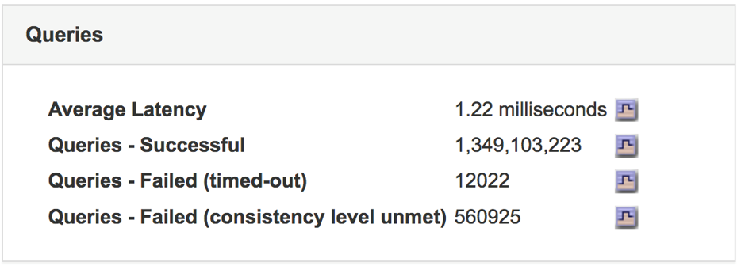
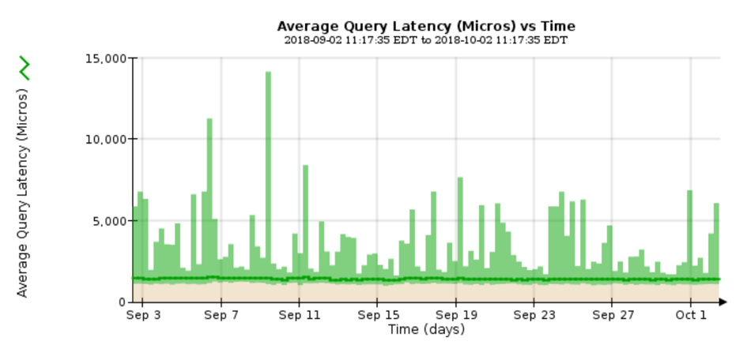

= Supervisión de la latencia de las consultas
:allow-uri-read: 
:icons: font
:imagesdir: ../media/

[role="lead"]
Las acciones del cliente, como almacenar, recuperar o eliminar objetos, crean consultas en la base de datos distribuida de metadatos de objetos de la cuadrícula. Debe supervisar las tendencias de la latencia de consulta para asegurarse de que los recursos de la cuadrícula son adecuados para la carga actual.

.Lo que necesitará
Debe iniciar sesión en Grid Manager mediante un explorador compatible.

.Acerca de esta tarea
Los aumentos temporales en la latencia de las consultas son normales y pueden deberse a un aumento repentino en las solicitudes de procesamiento. Las consultas fallidas también son normales y pueden deberse a problemas transitorios de la red o a nodos que no están disponibles temporalmente. Sin embargo, si el tiempo promedio para realizar una consulta aumenta, el rendimiento general de la cuadrícula disminuye.

Si observa que la latencia de las consultas aumenta con el tiempo, debe considerar la posibilidad de añadir nodos de almacenamiento adicionales en un procedimiento de ampliación para satisfacer cargas de trabajo futuras.

La alerta *Alta latencia para consultas de metadatos* se activa si el tiempo medio para consultas es demasiado largo.

.Pasos
. Seleccione *Nodes* > *_Storage Node_* > *Objects*.
. Desplácese hasta la tabla consultas y vea el valor de latencia media.
+

. Haga clic en el icono del gráfico image:../media/icon_chart_new.gif["Icono de gráfico"] para crear un gráfico del valor a lo largo del tiempo.
+

+
El gráfico de ejemplo muestra los picos en la latencia de consultas durante un funcionamiento normal de la cuadrícula.

.Información relacionada
link:../expand/index.html["Amplíe su grid"]
