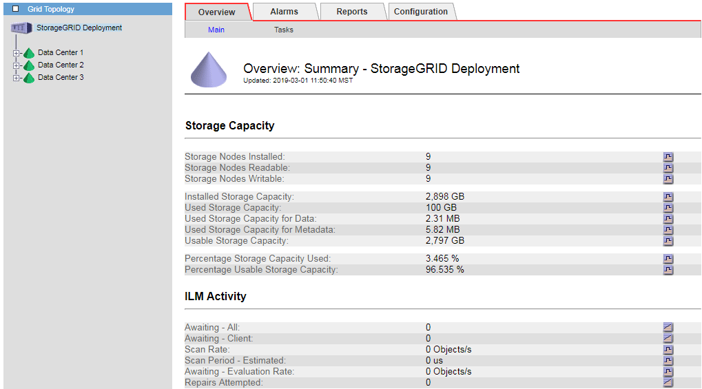

= Supervisar la capacidad de almacenamiento de todo el grid
:allow-uri-read: 
:icons: font
:imagesdir: ../media/

[role="lead"]
Debe supervisar la capacidad de almacenamiento general de su grid para garantizar que el espacio libre adecuado permanece para los datos de objetos y los metadatos de objetos. Comprender los cambios en la capacidad de almacenamiento a lo largo del tiempo puede ayudarle a añadir nodos de almacenamiento o volúmenes de almacenamiento antes de consumir la capacidad de almacenamiento utilizable del grid.

.Lo que necesitará
Debe iniciar sesión en Grid Manager mediante un explorador compatible.

.Acerca de esta tarea
La consola de Grid Manager permite evaluar rápidamente cuánto almacenamiento hay disponible para todo el grid y para cada centro de datos. La página nodos proporciona valores más detallados para los datos de objetos y los metadatos de objetos.

.Pasos
. Evaluar cuánto almacenamiento hay disponible para todo el grid y para cada centro de datos.
+
.. Seleccione *Panel*.
.. En el panel almacenamiento disponible, anote el resumen general de la capacidad de almacenamiento libre y utilizada.
+

NOTE: El resumen no incluye medios de archivado.

+
image::../media/grid_manager_dashboard_cropped.png[Consola de Grid Manager]

.. Coloque el cursor sobre las secciones de capacidad libre o utilizada del gráfico para ver exactamente cuánto espacio está libre o utilizado.
+
image::../media/storage_capacity_used.gif[Gráfico de capacidad libre o utilizada de la consola]

.. En el caso de grids multisitio, revise el gráfico de cada centro de datos.
.. Haga clic en el icono del gráfico image:../media/icon_chart_new.gif["Icono de gráfico"] en el gráfico general o de un centro de datos individual para ver un gráfico donde se muestra el uso de la capacidad a lo largo del tiempo.
+
Gráfico que muestra el porcentaje de capacidad de almacenamiento utilizada (%) frente a Hora aparece.

. Determine cuánto almacenamiento se ha usado y cuánto almacenamiento queda disponible para los datos de objetos y los metadatos de objetos.
+
.. Seleccione *Nodes*.
.. Seleccione *_grid_* > *almacenamiento*.
+
image::../media/nodes_deployment_storage_tab.png[Pestaña Nodes Deployment Storage]

.. Pase el cursor sobre los gráficos Storage used - Object Data y Storage used - Object Metadata para ver cuánto almacenamiento de objetos y almacenamiento de metadatos de objetos está disponible para todo el grid, y cuánto se ha usado con el tiempo.
+

NOTE: Los valores totales de un sitio o de la cuadrícula no incluyen los nodos sin especificar métricas durante al menos cinco minutos, como los nodos sin conexión.

. Tal y como indique el soporte técnico, obtenga información adicional sobre la capacidad de almacenamiento de su grid.
+
.. Seleccione *Soporte* > *Herramientas* > *Topología de cuadrícula*.
.. Seleccione *_grid_* > *Descripción general* > *Principal*.
+

. Planifique realizar una ampliación para añadir nodos de almacenamiento o volúmenes de almacenamiento antes de consumir la capacidad de almacenamiento utilizable del grid.
+
Al planificar los plazos de una expansión, tenga en cuenta cuánto tiempo se necesitará para adquirir e instalar almacenamiento adicional.

+

NOTE: Si su política de ILM utiliza la codificación de borrado, quizás prefiera ampliar cuando los nodos de almacenamiento existentes estén aproximadamente un 70 % llenos para reducir el número de nodos que debe añadirse.

+
Si desea obtener más información sobre la planificación de una expansión del almacenamiento, consulte las instrucciones para ampliar StorageGRID.

.Información relacionada
link:../expand/index.html["Amplíe su grid"]
