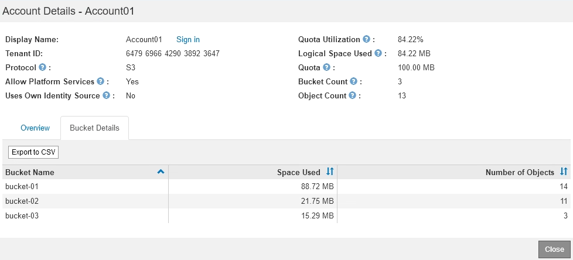

= Supervisión de la actividad de los inquilinos
:allow-uri-read: 
:icons: font
:imagesdir: ../media/

[role="lead"]
Toda la actividad del cliente está asociada a una cuenta de inquilino. Puede usar el administrador de grid para supervisar el uso del almacenamiento de un cliente o el tráfico de red, o bien puede usar el registro de auditorías o los paneles de Grafana para recopilar información más detallada sobre cómo están usando StorageGRID los clientes.

.Lo que necesitará
* Debe iniciar sesión en Grid Manager mediante un explorador compatible.
* Debe tener el permiso acceso raíz o de administrador.

.Acerca de esta tarea

IMPORTANT: Los valores de espacio utilizado son estimaciones. Estas estimaciones se ven afectadas por el tiempo de los ingests, la conectividad de red y el estado del nodo.

.Pasos
. Seleccione *arrendatarios* para revisar la cantidad de almacenamiento que utilizan todos los inquilinos.
+
El espacio utilizado, la utilización de cuotas, la cuota y el recuento de objetos se enumeran para cada inquilino. Si no se establece una cuota para un arrendatario, el campo de utilización de cuota contiene un guión (--) y el campo de cuota indica "'Unlimited'".

+
image::../media/tenant_accounts_page.png[Página Cuentas de inquilino]

+
Si el sistema incluye más de 20 elementos, puede especificar cuántas filas se muestran en cada página a la vez. Utilice el cuadro de búsqueda para buscar una cuenta de inquilino por nombre para mostrar o ID de inquilino.

+
Puede iniciar sesión en una cuenta de inquilino seleccionando el vínculo de la columna *Iniciar sesión* de la tabla.

. Opcionalmente, seleccione *Exportar a CSV* para ver y exportar un archivo .csv que contenga los valores de uso para todos los arrendatarios.
+
Se le solicitará que abra o guarde el `.csv` archivo.

+
El contenido de un archivo .csv tiene el siguiente ejemplo:

+
image::../media/tenant_accounts_example_csv.png[Ejemplo de cuentas de inquilino .csv]

+
Puede abrir el archivo .csv en una aplicación de hoja de cálculo o utilizarlo en automatización.

. Para ver los detalles de un arrendatario específico, incluidos los gráficos de uso, seleccione la cuenta de arrendatario en la página Cuentas de arrendatario y, a continuación, seleccione *Ver detalles*.
+
Se muestra la página Account Details, donde se proporciona información de resumen, un gráfico que representa la cantidad de cuota utilizada y restante, y un gráfico que representa la cantidad de datos de objeto en bloques (S3) o contenedores (Swift).

+
image::../media/tenant_usage_modal.png[Uso de arrendatario modal]

+
** *Cuota*
+
Si se estableció una cuota para este arrendatario, el gráfico *cupo* muestra la cantidad de esa cuota que este arrendatario ha utilizado y cuánto todavía está disponible. Si no se ha establecido ninguna cuota, el arrendatario tiene una cuota ilimitada y se muestra un mensaje informativo. Si el inquilino ha superado la cuota de almacenamiento en más de un 1% y en al menos 1 GB, el gráfico muestra la cuota total y el exceso.

+
Puede colocar el cursor sobre el segmento espacio utilizado para ver el número de objetos almacenados y el total de bytes utilizados. Puede colocar el cursor sobre el segmento espacio libre para ver cuántos bytes de cuota de almacenamiento están disponibles.

+

IMPORTANT: La utilización de cuotas se basa en estimaciones internas y puede superarse en algunos casos. Por ejemplo, StorageGRID comprueba la cuota cuando un inquilino comienza a cargar objetos y rechaza nuevas búsquedas si el inquilino ha superado la cuota. Sin embargo, StorageGRID no tiene en cuenta el tamaño de la carga actual al determinar si se ha superado la cuota. Si se eliminan objetos, es posible que se impida temporalmente que un arrendatario cargue nuevos objetos hasta que se vuelva a calcular la utilización de cuota. El cálculo de la utilización de cuotas puede tardar 10 minutos o más.

+

NOTE: La utilización de cuota de un inquilino indica la cantidad total de datos de objeto que el inquilino ha cargado a StorageGRID (tamaño lógico). El uso de cuotas no representa el espacio utilizado para almacenar copias de dichos objetos y sus metadatos (tamaño físico).

+

NOTE: Puede activar la alerta * uso de cuota de inquilino alto* para determinar si los inquilinos están consumiendo sus cuotas. Si está habilitada, esta alerta se activa cuando un inquilino ha utilizado el 90% de su cuota. Para obtener más información, consulte la referencia de alertas.

** * Espacio utilizado*
+
El gráfico *espacio utilizado por los cucharones* (S3) o *espacio utilizado por los contenedores* (Swift) muestra los depósitos más grandes para el cliente. El espacio utilizado es la cantidad total de datos de objetos del bloque. Este valor no representa el espacio de almacenamiento necesario para las copias de ILM y los metadatos de objetos.

+
Si el inquilino tiene más de nueve bloques o contenedores, se combinan en un segmento denominado otro. Algunos segmentos de gráfico pueden ser demasiado pequeños para incluir una etiqueta. Puede colocar el cursor sobre cualquiera de los segmentos para ver la etiqueta y obtener más información, incluido el número de objetos almacenados y el total de bytes para cada segmento o contenedor.

+
image::../media/tenant_dashboard_storage_usage_segment_other.png[Segmento de uso del almacenamiento: Otros]

. Seleccione *Detalles de bloque* (S3) o *Detalles de contenedor* (Swift) para ver una lista de los objetos espaciados utilizados y el número de objetos para cada contenedor o contenedor del arrendatario.
+

. Opcionalmente, seleccione *Exportar a CSV* para ver y exportar un archivo .csv que contenga los valores de uso para cada contenedor o bloque.
+
Se le pedirá que abra o guarde el archivo .csv.

+
El contenido del archivo .csv de un inquilino S3 tiene el siguiente ejemplo:

+
image::../media/tenant_bucket_details_csv.png[Ejemplo de CSV de detalles de bloque de inquilinos]

+
Puede abrir el archivo .csv en una aplicación de hoja de cálculo o utilizarlo en automatización.

. Si se han establecido directivas de clasificación de tráfico para un inquilino, revise el tráfico de red para ese arrendatario.
+
.. Seleccione *Configuración* > *Configuración de red* > *Clasificación de tráfico*.
+
Aparece la página Directivas de clasificación del tráfico y las directivas existentes se muestran en la tabla.

+
image::../media/traffic_classification_policies_main_screen_w_examples.png[Ejemplo de directiva de tráfico para gráfico]

.. Revise la lista de políticas para identificar las que se aplican a un arrendatario específico.
.. Para ver las métricas asociadas a una directiva, seleccione el botón de opción situado a la izquierda de la directiva y, a continuación, haga clic en *métricas*.
.. Analice los gráficos para determinar con qué frecuencia la política limita el tráfico y si necesita ajustar la política.
+
Para crear, editar o eliminar directivas de clasificación del tráfico, consulte las instrucciones para administrar StorageGRID.

. De manera opcional, use el registro de auditoría para una supervisión más granular de las actividades de un inquilino.
+
Por ejemplo, puede supervisar los siguientes tipos de información:

+
** Operaciones específicas del cliente, como PUT, GET o DELETE
** Tamaños de objeto
** La regla de ILM se aplica a los objetos
** La IP de origen de las solicitudes del cliente

+
Los registros de auditoría se escriben en archivos de texto que se pueden analizar con la herramienta de análisis de registros que elija. Esto le permite comprender mejor las actividades de los clientes o implementar modelos sofisticados de pago por uso y facturación. Consulte las instrucciones para comprender los mensajes de auditoría para obtener más información.

. De manera opcional, utilice las métricas de Prometheus para generar informes sobre la actividad de inquilinos:
+
** En Grid Manager, seleccione *Soporte* > *Herramientas* > *métricas*. Puede usar consolas existentes, como S3 Overview, para revisar las actividades del cliente.
+

IMPORTANT: Las herramientas disponibles en la página Metrics están destinadas principalmente al soporte técnico. Algunas funciones y elementos de menú de estas herramientas no son intencionalmente funcionales.

** Seleccione *Ayuda* > *Documentación de API*. Puede utilizar las métricas de la sección Métricas de la API de gestión de grid para crear reglas de alerta y paneles personalizados para la actividad de inquilinos.

.Información relacionada
link:alerts-reference.html["Referencia de alertas"]

link:../audit/index.html["Revisar los registros de auditoría"]

link:../admin/index.html["Administre StorageGRID"]

link:reviewing-support-metrics.html["Revisión de las métricas de soporte"]
