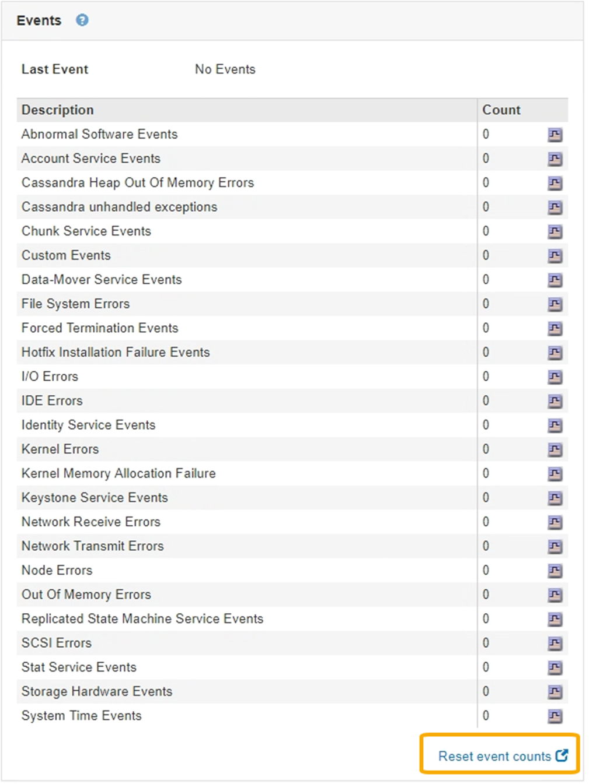

= Restableciendo el número de eventos
:allow-uri-read: 
:icons: font
:imagesdir: ../media/

[role="lead"]
Después de resolver los eventos del sistema, es posible restablecer el número de eventos a cero.

.Lo que necesitará
* Debe iniciar sesión en Grid Manager mediante un explorador compatible.
* Debe tener el permiso Grid Topology Page Configuration.

.Pasos
. Seleccione *Nodes* > *_Grid Node_* > *Eventos*.
. Asegúrese de que se ha resuelto cualquier evento con un recuento superior a 0.
. Haga clic en *Restablecer recuentos de eventos*.
+

