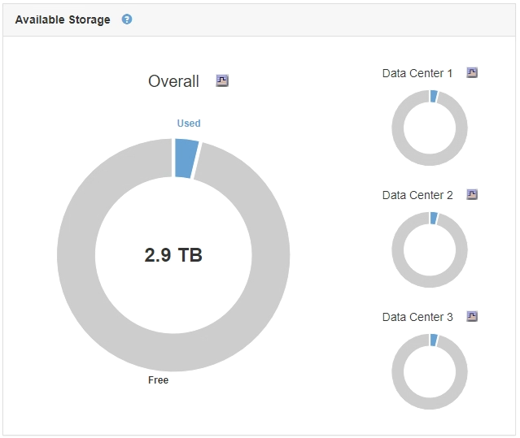
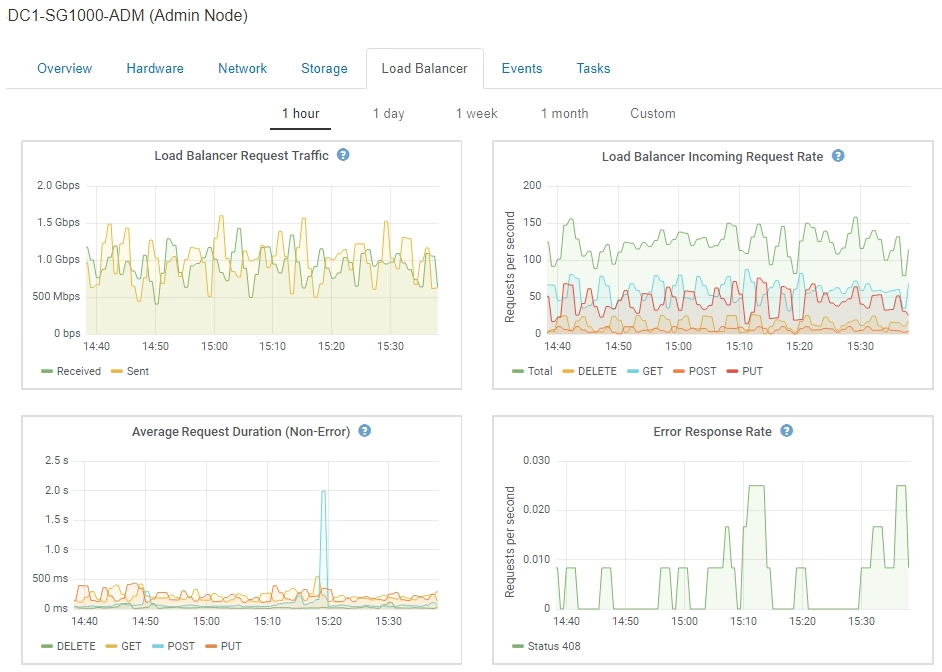

= Tipos de gráficos
:allow-uri-read: 
:icons: font
:imagesdir: ../media/

[role="lead"]
Los gráficos y los gráficos resumen los valores de métricas y atributos de StorageGRID específicos.

El Panel de Grid Manager incluye gráficos circulares (anillos) para resumir el almacenamiento disponible para la cuadrícula y cada sitio.

El panel de uso del almacenamiento de la consola de tenant Manager muestra lo siguiente:

* Una lista de los bloques más grandes (S3) o los contenedores (Swift) para el inquilino
* Un gráfico de barras que representa los tamaños relativos de los cubos o contenedores más grandes
* La cantidad total de espacio utilizado y, si se establece una cuota, la cantidad y el porcentaje de espacio restante

image::../media/tenant_dashboard_with_buckets.png[Consola de inquilino]

Además, los gráficos que muestran cómo cambian las métricas y los atributos de StorageGRID con el tiempo están disponibles en la página Nodes y en la página *Support* > *Tools* > *Topología de cuadrícula*.

Existen cuatro tipos de gráficos:

* * Gráficos Grafana*: Se muestran en la página Nodes, los gráficos Grafana se utilizan para trazar los valores de las métricas Prometheus a lo largo del tiempo. Por ejemplo, la ficha *Nodes* > *Load Balancer* de un nodo Admin incluye cuatro gráficos Grafana.
+

+

NOTE: Los gráficos Grafana también se incluyen en los paneles preconstruidos disponibles en la página *Support* > *Tools* > *Metrics*.

* *Gráficos de líneas*: Disponible en la página Nodes y en la página *Support* > *Tools* > *Grid Topology* (haga clic en el icono del gráfico) image:../media/icon_chart_new.gif["Gráfico de iconos (nuevo)"] Después de un valor de datos), los gráficos de líneas se utilizan para trazar los valores de los atributos StorageGRID que tienen un valor de unidad (como el desplazamiento de frecuencia NTP, en ppm). Los cambios en el valor se representan en intervalos de datos regulares (bins) a lo largo del tiempo.
+
image::../media/line_graph.gif[Gráfico de líneas]

* *Gráficos de área*: Disponible en la página Nodes y en la página *Support* > *Tools* > *Grid Topology* (haga clic en el icono del gráfico) image:../media/icon_chart_new.gif["Gráfico de iconos (nuevo)"] después de un valor de datos), los gráficos de área se utilizan para trazar cantidades de atributos volumétricos, como recuentos de objetos o valores de carga de servicio. Los gráficos de área son similares a los gráficos de líneas, pero incluyen un sombreado marrón claro debajo de la línea. Los cambios en el valor se representan en intervalos de datos regulares (bins) a lo largo del tiempo.
+
image::../media/area_graph.gif[Gráfico de área]

* Algunos gráficos están marcados con un tipo diferente de icono de gráfico image:../media/icon_chart_new_for_11_5.png["Icono de gráfico - Nuevo para 11.5"] y tienen un formato diferente:
+
image::../media/charts_lost_object_detected.png[Se ha detectado un objeto perdido de gráficos]

* *Gráfico de estado*: Disponible en la página *Soporte* > *Herramientas* > *Topología de cuadrícula* (haga clic en el icono del gráfico image:../media/icon_chart_new.gif["Gráfico de iconos (nuevo)"] después de un valor de datos), los gráficos de estado se utilizan para trazar valores de atributos que representan estados distintos, como un estado de servicio que puede estar en línea, en espera o sin conexión. Los gráficos de estado son similares a los gráficos de líneas, pero la transición es discontinua; es decir, el valor salta de un valor de estado a otro.
+
image::../media/state_graph.gif[Gráfico de Estados]

.Información relacionada
link:viewing-nodes-page.html["Ver la página Nodes"]

link:viewing-grid-topology-tree.html["Visualización del árbol de topología de cuadrícula"]

link:reviewing-support-metrics.html["Revisión de las métricas de soporte"]
