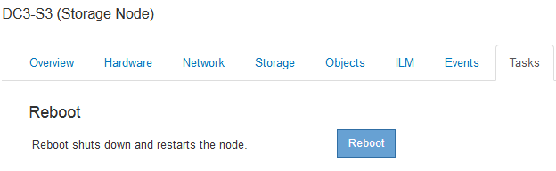

= Uso de la ficha tarea para reiniciar un nodo de cuadrícula
:allow-uri-read: 
:icons: font
:imagesdir: ../media/

[role="lead"]
La ficha tarea le permite reiniciar el nodo seleccionado. La ficha tarea se muestra para todos los nodos.

.Lo que necesitará
* Debe iniciar sesión en Grid Manager mediante un explorador compatible.
* Debe tener los permisos de mantenimiento o acceso raíz.
* Debe tener la clave de acceso de aprovisionamiento.

.Acerca de esta tarea
Puede utilizar la ficha tarea para reiniciar un nodo. En el caso de los nodos del dispositivo, también puede utilizar la ficha tarea para colocar el dispositivo en modo de mantenimiento.

image::../media/maintenance_mode.png[Botón modo de mantenimiento del aparato]

* Al reiniciar un nodo de cuadrícula desde la pestaña tarea se emite el comando de reinicio en el nodo de destino. Cuando reinicia un nodo, el nodo se apaga y se reinicia. Todos los servicios se reinician automáticamente.
+
Si planea reiniciar un nodo de almacenamiento, tenga en cuenta lo siguiente:

+
** Si una regla de ILM especifica un comportamiento de procesamiento del COMMIT doble o la regla especifica un equilibrio y no es posible crear de inmediato todas las copias necesarias, StorageGRID confirma de inmediato cualquier objeto recién ingerido en dos nodos de almacenamiento en el mismo sitio y evalúa ILM más adelante. Si desea reiniciar dos o más nodos de almacenamiento en un sitio determinado, es posible que no pueda acceder a estos objetos durante el reinicio.
** Para garantizar que puede acceder a todos los objetos mientras se reinicia un nodo de almacenamiento, deje de procesar objetos en un sitio durante aproximadamente una hora antes de reiniciar el nodo.

* Es posible que deba colocar un dispositivo StorageGRID en modo de mantenimiento para realizar determinados procedimientos, como cambiar la configuración del enlace o sustituir una controladora de almacenamiento. Para obtener instrucciones, consulte las instrucciones de instalación y mantenimiento del hardware del dispositivo.
+

NOTE: Si un dispositivo se pone en modo de mantenimiento, puede que el dispositivo no esté disponible para el acceso remoto.

.Pasos
. Seleccione *Nodes*.
. Seleccione el nodo de cuadrícula que desea reiniciar.
. Seleccione la ficha *tareas*.
+

. Haga clic en *Reiniciar*.
+
Se muestra un cuadro de diálogo de confirmación.

+
image::../media/reboot_node_confirmation.gif[Cuadro de diálogo de confirmación para reiniciar nodo de cuadrícula]

+

NOTE: Si va a reiniciar el nodo de administración principal, el cuadro de diálogo de confirmación le recuerda que la conexión del explorador con el Administrador de grid se perderá temporalmente cuando se detengan los servicios.

. Introduzca la contraseña de aprovisionamiento y haga clic en *Aceptar*.
. Espere a que se reinicie el nodo.
+
El apagado de los servicios puede llevar cierto tiempo.

+
Cuando se reinicia el nodo, el icono gris (administrativamente abajo) aparece en el lado izquierdo de la página Nodes. Cuando todos los servicios se han iniciado de nuevo, el icono vuelve a cambiar a su color original.

.Información relacionada
link:../sg6000/index.html["Dispositivos de almacenamiento SG6000"]

link:../sg5700/index.html["Dispositivos de almacenamiento SG5700"]

link:../sg5600/index.html["Dispositivos de almacenamiento SG5600"]

link:../sg100-1000/index.html["SG100  servicios de aplicaciones SG1000"]
