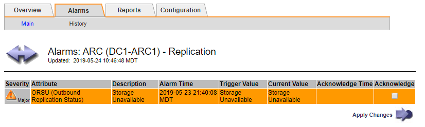

= Visualización de alarmas heredadas
:allow-uri-read: 
:icons: font
:imagesdir: ../media/

[role="lead"]
Las alarmas (sistema heredado) se activan cuando los atributos del sistema alcanzan los valores de umbral de alarma. Puede ver las alarmas activas en ese momento desde el Panel o la página Alarmas actuales.

.Lo que necesitará
* Debe iniciar sesión en Grid Manager mediante un explorador compatible.

.Acerca de esta tarea
Si una o más de las alarmas heredadas están activas actualmente, el panel Estado del panel de control incluye un enlace *alarmas heredadas*. El número entre paréntesis indica cuántas alarmas están activas actualmente.

image::../media/dashboard_health_panel_legacy_alarms.png[Alarmas actuales del panel de estado del panel de control]

El recuento de *alarmas heredadas* del panel se incrementa siempre que se activa una alarma heredada. Este recuento aumenta incluso si ha desactivado las notificaciones de correo electrónico de alarma. Normalmente, puede ignorar este número (ya que las alertas proporcionan una mejor vista del sistema) o puede ver las alarmas que están activas en ese momento.

NOTE: Aunque el sistema de alarma heredado sigue siendo compatible, el sistema de alerta ofrece importantes ventajas y es más fácil de usar.

.Pasos
. Para ver las alarmas heredadas que están activas actualmente, realice una de las siguientes acciones:
+
** En el panel Estado del Panel, haga clic en *Alarmas heredadas*. Este enlace sólo aparece si al menos una alarma está activa actualmente.
** Seleccione *Soporte* > *Alarmas (heredadas)* > *Alarmas actuales*. Aparece la página Alarmas actuales.

image::../media/current_alarms_page.png[Página Alarmas actuales]

El icono de alarma indica la gravedad de cada alarma de la siguiente manera:

|===
| . | Color | Gravedad de alarma | Significado 

 a| 
image:../media/icon_alarm_yellow_notice.gif["icono cuadrado amarillo"]
 a| 
Amarillo
 a| 
Aviso
 a| 
El nodo está conectado a la cuadrícula, pero existe una condición poco habitual que no afecta a las operaciones normales.

 a| 
image:../media/icon_alarm_light_orange_minor.gif["icono de diamante naranja claro"]
 a| 
Naranja claro
 a| 
Menor
 a| 
El nodo está conectado a la cuadrícula, pero existe una condición anormal que podría afectar al funcionamiento en el futuro. Debe investigar para evitar el escalado.

 a| 
image:../media/icon_alarm_orange_major.gif["icono de diamante naranja oscuro"]
 a| 
Naranja oscuro
 a| 
Importante
 a| 
El nodo está conectado a la cuadrícula, pero existe una condición anormal que afecta actualmente al funcionamiento. Esto requiere atención inmediata para evitar un escalado.

 a| 
image:../media/icon_alarm_red_critical.gif["icono rojo x"]
 a| 
Rojo
 a| 
Crítico
 a| 
El nodo está conectado a la cuadrícula, pero existe una condición anormal que ha detenido las operaciones normales. Debe abordar el problema de inmediato.

|===
. Para obtener información acerca del atributo que provocó la activación de la alarma, haga clic con el botón secundario del ratón en el nombre del atributo de la tabla.
. Para ver detalles adicionales acerca de una alarma, haga clic en el nombre del servicio en la tabla.
+
Aparecerá la ficha Alarmas para el servicio seleccionado (*Support* > *Tools* > *Topología de cuadrícula* > *_Grid Node_* > *_Service_* > *Alarmas*).

+

. Si desea borrar el número de alarmas actuales, puede realizar lo siguiente de forma opcional:
+
** Reconozca la alarma. Una alarma confirmada ya no se incluye en el recuento de alarmas heredadas, a menos que se active en el siguiente nivel de gravedad o se resuelva y se vuelva a producir.
** Desactive una alarma predeterminada o Global Custom particular para todo el sistema para evitar que se active de nuevo.

.Información relacionada
link:alarms-reference.html["Referencia de alarmas (sistema heredado)"]

link:managing-alarms.html["Reconocer alarmas actuales (sistema heredado)"]

link:managing-alarms.html["Desactivación de alarmas (sistema heredado)"]
