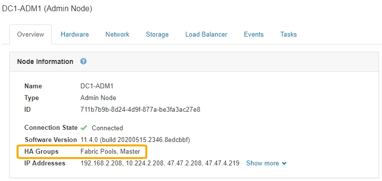

= Ver la ficha Descripción general
:allow-uri-read: 
:icons: font
:imagesdir: ../media/

[role="lead"]
La pestaña Overview proporciona información básica sobre cada nodo. También muestra todas las alertas que actualmente afectan al nodo.

La pestaña Overview se muestra para todos los nodos.

== Información del nodo

En la sección Información del nodo de la ficha Descripción general se muestra información básica sobre el nodo de cuadrícula.

image::../media/nodes_page_overview_tab.png[Pestaña Nodes Page Overview]

La información general de un nodo incluye lo siguiente:

* *Nombre*: Nombre de host asignado al nodo y mostrado en el Administrador de cuadrícula.
* *Tipo*: Tipo de nodo -- nodo de administración, nodo de almacenamiento, nodo de puerta de enlace o nodo de archivado.
* *ID*: Identificador único del nodo, que también se conoce como UUID.
* *Estado de conexión*: Uno de los tres estados. Se muestra el icono del estado más grave.
+
** *No conectado - Desconocido* image:../media/icon_alarm_blue_unknown.png["icono de signo de interrogación azul"]: El nodo no está conectado a la cuadrícula por una razón desconocida. Por ejemplo, se ha perdido la conexión de red entre los nodos o se ha apagado el suministro eléctrico. La alerta *no se puede comunicar con el nodo* también puede activarse. Es posible que otras alertas estén activas también. Esta situación requiere atención inmediata.
+

NOTE: Es posible que un nodo aparezca como desconocido durante las operaciones de apagado gestionadas. Puede ignorar el estado Desconocido en estos casos.

** *No conectado - administrativamente abajo* image:../media/icon_alarm_gray_administratively_down.png["icono de questionmark gris"]: El nodo no está conectado a la cuadrícula por un motivo esperado. Por ejemplo, el nodo o los servicios del nodo se han apagado correctamente, el nodo se está reiniciando o se está actualizando el software. Una o más alertas también pueden estar activas.
** *Conectado* image:../media/icon_alert_green_checkmark.png["marca de verificación verde de alerta de icono"]: El nodo está conectado a la cuadrícula.

* *Versión de software*: La versión de StorageGRID instalada en el nodo.
* *Grupos de alta disponibilidad*: Sólo para nodos de nodo de administración y de puerta de enlace. Se muestra si se incluye una interfaz de red en el nodo en un grupo de alta disponibilidad y si dicha interfaz es el Master o el Backup.
+

* *Direcciones IP*: Las direcciones IP del nodo. Haga clic en *Mostrar más* para ver las direcciones IPv4 e IPv6 del nodo y las asignaciones de interfaz:
+
** Eth0: Red de cuadrícula
** Eth1: Red de administración
** Eth2: Red de cliente

== Alertas

La sección Alertas de la ficha Descripción general enumera todas las alertas que afectan actualmente a este nodo que no se han silenciado. Haga clic en el nombre de la alerta para ver más detalles y las acciones recomendadas.

image::../media/nodes_page_alerts_table.png[Tabla de alertas de página nodos]

.Información relacionada
link:monitoring-node-connection-states.html["Supervisar los estados de conexión de los nodos"]

link:viewing-current-alerts.html["Ver las alertas actuales"]

link:viewing-specific-alert.html["Ver una alerta específica"]
