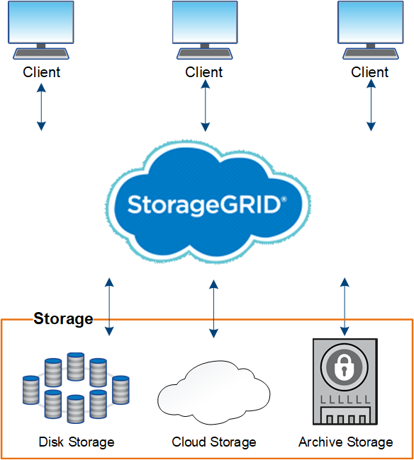

= Acerca de StorageGRID
:allow-uri-read: 
:icons: font
:imagesdir: ../media/

[role="lead"]
StorageGRID de NetApp es una solución de almacenamiento basada en cloud definida por software compatible con las API de objetos estándares del sector, incluidas la API de Amazon simple Storage Service (S3) y la API de OpenStack Swift.

StorageGRID proporciona almacenamiento seguro y duradero para datos no estructurados a escala. Las políticas integradas de gestión del ciclo de vida basadas en metadatos optimizan la ubicación de los datos a lo largo de toda su vida. El contenido se sitúa en la ubicación adecuada, en el momento justo y en el nivel de almacenamiento adecuado para reducir los costes.

StorageGRID se compone de nodos heterogéneos, redundantes y distribuidos geográficamente, que se pueden integrar con las aplicaciones de cliente existentes y de próxima generación.

Algunas de las ventajas del sistema StorageGRID son:

* Escalable de forma masiva y fácil de usar un repositorio de datos distribuido geográficamente para datos no estructurados.
* Protocolos de almacenamiento de objetos estándar:
+
** Simple Storage Service (S3) de Amazon Web Services
** OpenStack Swift

* Habilitado para el cloud híbrido. La gestión del ciclo de vida de la información (ILM) basada en políticas almacena objetos en clouds públicos, incluidos Amazon Web Services (AWS) y Microsoft Azure. Los servicios de la plataforma StorageGRID permiten la replicación de contenido, la notificación de eventos y la búsqueda de metadatos en clouds públicos.
* Protección de datos flexible que garantiza la durabilidad y la disponibilidad. Se pueden proteger los datos mediante replicación y códigos de borrado por capas. La verificación de datos en reposo y en tránsito garantiza la integridad a largo plazo.
* Gestión dinámica del ciclo de vida de los datos para ayudar a gestionar los costes de almacenamiento. Se pueden crear reglas de ILM que gestionen el ciclo de vida de los datos en el nivel de los objetos y personalicen la ubicación de los datos, la durabilidad, el rendimiento, el coste y el tiempo de retención. La cinta está disponible como nivel de archivado integrado.
* Alta disponibilidad del almacenamiento de datos y algunas funciones de gestión, con equilibrio de carga integrado para optimizar la carga de datos en todos los recursos de StorageGRID.
* Compatibilidad con varias cuentas de inquilino de almacenamiento para segregar los objetos almacenados en su sistema por diferentes entidades.
* Numerosas herramientas para supervisar el estado del sistema StorageGRID, incluidas un completo sistema de alertas, un panel gráfico y Estados detallados para todos los nodos y sitios.
* Soporte para puesta en marcha basada en software o hardware. Puede implementar StorageGRID en cualquiera de los siguientes elementos:
+
** Equipos virtuales que se ejecutan en VMware.
** Contenedores Docker en hosts Linux.
** Dispositivos a medida StorageGRID. Los dispositivos de almacenamiento proporcionan almacenamiento de objetos. Los dispositivos de servicios proporcionan servicios de administración de grid y equilibrio de carga.

* Cumplir con los requisitos de almacenamiento pertinentes de estas normativas:
+
** Comisión de valores y Bolsa (SEC) en 17 CFR, sección 240.17a-4(f), que regula a los miembros de bolsa, corredores o distribuidores.
** Ley de la Autoridad reguladora de la Industria financiera (FINRA), regla 4511(c), que desafía el formato y los requisitos de medios de la normativa SEC 17a-4(f).
** Commodity Futures Trading Commission (CFTC) en la regulación 17 CFR, sección 1.31(c)-(d), que regula el comercio de futuros de materias primas.

* Operaciones de mantenimiento y actualización no disruptivas. Mantenga el acceso al contenido durante los procedimientos de actualización, ampliación, retirada y mantenimiento.
* Gestión de identidades federada. Se integra con Active Directory, OpenLDAP u Oracle Directory Service para la autenticación de usuarios. Admite el inicio de sesión único (SSO) con el estándar Security Assertion Markup Language 2.0 (SAML 2.0) para intercambiar datos de autenticación y autorización entre StorageGRID y Active Directory Federation Services (AD FS).

.Información relacionada
link:hybrid-clouds-with-storagegrid.html["Clouds híbridos con StorageGRID"]

link:storagegrid-architecture-and-network-topology.html["Arquitectura de StorageGRID y topología de red"]

link:controlling-storagegrid-access.html["Control del acceso a StorageGRID"]

link:managing-tenants-and-client-connections.html["Gestión de inquilinos y conexiones de clientes"]

link:using-information-lifecycle-management.html["Usar la gestión del ciclo de vida de la información"]

link:monitoring-storagegrid-operations.html["Supervisar las operaciones de StorageGRID"]

link:configuring-network-settings.html["Configurar los ajustes de red"]

link:performing-maintenance-procedures.html["Realizar procedimientos de mantenimiento"]
