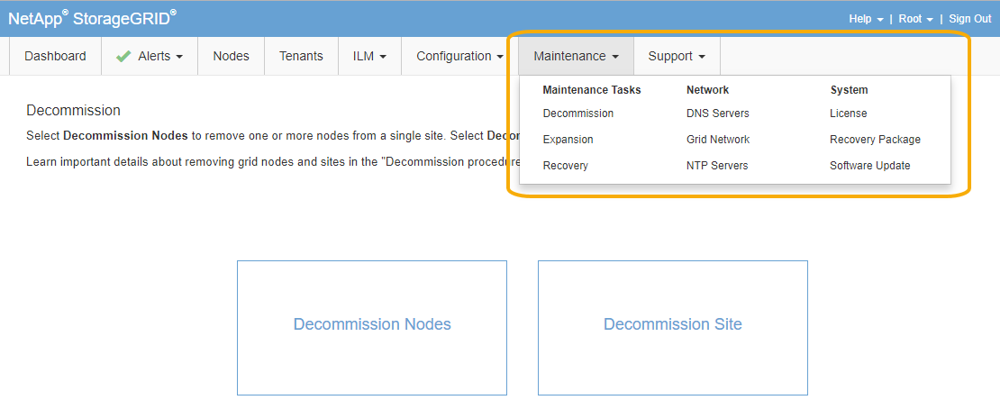

= Exploración de Grid Manager
:allow-uri-read: 
:icons: font
:imagesdir: ../media/

[role="lead"]
Grid Manager es una interfaz gráfica basada en navegador que permite configurar, administrar y supervisar el sistema StorageGRID.

Cuando inicia sesión en Grid Manager, se conecta a un nodo de administración. Cada sistema StorageGRID incluye un nodo de administrador primario y cualquier número de nodos de administrador que no son primarios. Puede conectarse a cualquier nodo de administrador y cada nodo de administrador muestra una vista similar del sistema StorageGRID.

Puede acceder a Grid Manager mediante un explorador Web compatible.

== Requisitos del navegador web

Debe utilizar un navegador web compatible.

[cols="1a,1a"]
|===
| Navegador Web | Versión mínima admitida 

 a| 
Google Chrome
 a| 
87

 a| 
Microsoft Edge
 a| 
87

 a| 
Mozilla Firefox
 a| 
84

|===
Debe establecer la ventana del navegador en un ancho recomendado.

[cols="1a,1a"]
|===
| Ancho del navegador | Píxeles 

 a| 
Mínimo
 a| 
1024

 a| 
Óptimo
 a| 
1280

|===

== Consola de Grid Manager

Cuando inicie sesión por primera vez en Grid Manager, puede utilizar el panel para supervisar las actividades del sistema de un vistazo.

La consola incluye información resumida sobre el estado del sistema, el uso del almacenamiento, los procesos del ILM y las operaciones de S3 y Swift.

image::../media/grid_manager_dashboard.png[De Grid Manager]

Para obtener una explicación de la información de cada panel, haga clic en el icono de ayuda image:../media/icon_nms_question.gif["icono de signo de interrogación"] para ese panel.

.Información relacionada
link:../monitor/index.html["Solución de problemas de  monitor"]

== Menú Alertas

El menú Alertas proporciona una interfaz fácil de usar para detectar, evaluar y resolver problemas que pueden producirse durante el funcionamiento de StorageGRID.

image::../media/alerts_menu.png[Menú Alertas]

Desde el menú Alertas, puede hacer lo siguiente:

* Revisar las alertas actuales
* Revisar las alertas resueltas
* Configure silencios para suprimir notificaciones de alerta
* Configure el servidor de correo electrónico para las notificaciones de alertas
* Defina reglas de alerta para condiciones que activen alertas

.Información relacionada
link:monitoring-and-managing-alerts.html["Supervisión y gestión de alertas"]

link:../monitor/index.html["Solución de problemas de  monitor"]

== Nodos

La página nodos muestra información sobre la cuadrícula completa, cada sitio de la cuadrícula y cada nodo de un sitio.

La página de inicio de los nodos muestra métricas combinadas para toda la cuadrícula. Para ver la información de un sitio o nodo en particular, haga clic en el enlace correspondiente de la izquierda.

image::../media/nodes_menu.png[página principal de nodos]

.Información relacionada
link:viewing-nodes-page.html["Ver la página Nodes"]

link:../monitor/index.html["Solución de problemas de  monitor"]

== Página Cuentas de inquilino

La página Cuentas de inquilino permite crear y supervisar las cuentas de inquilino de almacenamiento para el sistema StorageGRID. Debe crear al menos una cuenta de inquilino para especificar quién puede almacenar y recuperar objetos y qué funcionalidad está disponible para ellos.

La página Cuentas de inquilino también proporciona los detalles de uso de cada inquilino, incluida la cantidad de almacenamiento utilizado y el número de objetos. Si establece una cuota cuando creó el arrendatario, puede ver la cantidad de esa cuota que se ha utilizado.

image::../media/tenants_menu_and_page.png[Menú y página de arrendatarios]

.Información relacionada
link:managing-tenants-and-client-connections.html["Gestión de inquilinos y conexiones de clientes"]

link:../admin/index.html["Administre StorageGRID"]

link:../tenant/index.html["Usar una cuenta de inquilino"]

== Menú ILM

El menú ILM permite configurar las reglas y las políticas de gestión del ciclo de vida de la información (ILM) que rigen la durabilidad y la disponibilidad de los datos. También puede introducir un identificador de objeto para ver los metadatos de ese objeto.

image::../media/ilm_menu_and_page.png[Menú y página de ILM]

.Información relacionada
link:using-information-lifecycle-management.html["Usar la gestión del ciclo de vida de la información"]

link:../ilm/index.html["Gestión de objetos con ILM"]

== Menú de configuración

El menú Configuración permite especificar los ajustes de red, los ajustes del sistema, las opciones de supervisión y las opciones de control de acceso.

image::../media/configuration_menu.png[Menú de configuración]

.Información relacionada
link:configuring-network-settings.html["Configurar los ajustes de red"]

link:managing-tenants-and-client-connections.html["Gestión de inquilinos y conexiones de clientes"]

link:reviewing-audit-messages.html["Revisión de mensajes de auditoría"]

link:controlling-storagegrid-access.html["Control del acceso a StorageGRID"]

link:../admin/index.html["Administre StorageGRID"]

link:../monitor/index.html["Solución de problemas de  monitor"]

link:../audit/index.html["Revisar los registros de auditoría"]

== Menú de mantenimiento

El menú Mantenimiento le permite realizar tareas de mantenimiento, tareas de red y tareas del sistema.

=== Tareas de mantenimiento

Las tareas de mantenimiento incluyen:

* Retirada de operaciones para eliminar sitios y nodos de grid no utilizados.
* Operaciones de ampliación para añadir nuevos sitios y nodos de grid.
* Operaciones de recuperación para reemplazar un nodo con fallos y restaurar datos.

=== Red

Las tareas de red que se pueden realizar en el menú Mantenimiento incluyen:

* Edición de información sobre servidores DNS.
* Configurar las subredes utilizadas en la red de cuadrícula.
* Editar información sobre los servidores NTP.

=== Sistema

Las tareas del sistema que se pueden realizar en el menú Mantenimiento son:

* Consulta de detalles de la licencia de StorageGRID actual o carga de una nueva licencia.
* Generación de un paquete de recuperación.
* Realizar actualizaciones del software StorageGRID, incluidas actualizaciones de software, correcciones urgentes y actualizaciones del software de sistema operativo SANtricity en dispositivos seleccionados.

.Información relacionada
link:performing-maintenance-procedures.html["Realizar procedimientos de mantenimiento"]

link:downloading-recovery-package.html["Descarga del paquete de recuperación"]

link:../expand/index.html["Amplíe su grid"]

link:../upgrade/index.html["Actualizar el software de"]

link:../maintain/index.html["Mantener  recuperar"]

link:../sg6000/index.html["Dispositivos de almacenamiento SG6000"]

link:../sg5700/index.html["Dispositivos de almacenamiento SG5700"]

link:../sg5600/index.html["Dispositivos de almacenamiento SG5600"]

== Menú de soporte

El menú Soporte ofrece opciones que ayudan al soporte técnico a analizar y solucionar problemas del sistema. Hay dos partes en el menú Soporte: Herramientas y alarmas (heredadas).

image::../media/support_menu.png[Menú de soporte]

=== Herramientas

En la sección Herramientas del menú Soporte, puede:

* Habilite AutoSupport.
* Realice un conjunto de comprobaciones de diagnóstico en el estado actual de la cuadrícula.
* Acceda al árbol de topología de cuadrícula para ver información detallada acerca de los nodos de la cuadrícula, los servicios y los atributos.
* Recuperar los archivos de registro y los datos del sistema.
* Revise las métricas y los gráficos detallados.
+

IMPORTANT: Las herramientas disponibles en la opción * Metrics* están diseñadas para su uso por el soporte técnico. Algunas funciones y elementos de menú de estas herramientas no son intencionalmente funcionales.

=== Alarmas (heredadas)

En la sección Alarmas (heredadas) del menú Soporte, puede revisar las alarmas actuales, históricas y globales, así como configurar notificaciones por correo electrónico para alarmas antiguas y AutoSupport.

.Información relacionada
link:storagegrid-architecture-and-network-topology.html["Arquitectura de StorageGRID y topología de red"]

link:storagegrid-attributes.html["Atributos de la StorageGRID"]

link:using-storagegrid-support-options.html["Usar las opciones de soporte de StorageGRID"]

link:../admin/index.html["Administre StorageGRID"]

link:../monitor/index.html["Solución de problemas de  monitor"]

== Menú de ayuda

La opción Ayuda proporciona acceso al centro de documentación de StorageGRID para la versión actual y a la documentación de API. También puede determinar qué versión de StorageGRID está instalada actualmente.

image::../media/help_menu.png[Menú Ayuda]

.Información relacionada
link:../admin/index.html["Administre StorageGRID"]
