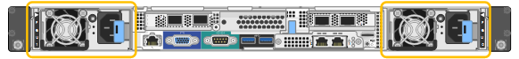

= Sustitución de una fuente de alimentación en el dispositivo de servicios
:allow-uri-read: 
:icons: font
:imagesdir: ../media/

[role="lead"]
El dispositivo de servicios tiene dos fuentes de alimentación para redundancia. Si una de las fuentes de alimentación falla, debe reemplazarla por Lo antes posible. para garantizar que el dispositivo tenga alimentación redundante.

.Lo que necesitará
* Ha desembalado la unidad de suministro de alimentación de repuesto.
* Ha localizado físicamente el dispositivo en el que va a reemplazar el suministro de alimentación en el centro de datos.
+
link:locating-controller-in-data-center.html["Ubicar la controladora en un centro de datos"]

* Puede confirmar que la otra fuente de alimentación está instalada y en funcionamiento.

.Acerca de esta tarea
La figura muestra las dos unidades de alimentación del SG100, a las que se puede acceder desde la parte posterior del aparato.

NOTE: Las fuentes de alimentación del SG1000 son idénticas.

.Pasos
. Desconecte el cable de alimentación de la fuente de alimentación.
. Levante la palanca de leva.
+
image::../media/sg6000_cn_lift_cam_handle_psu.gif[Elevación del mango de leva para retirar la fuente de alimentación SG1000]

. Presione el pestillo azul y saque la fuente de alimentación.
+
image::../media/sg6000_cn_remove_power_supply.gif[Extracción de una fuente de alimentación SG1000]

. Inserte la fuente de alimentación de repuesto en el chasis.
+
Asegúrese de que el pestillo azul está en el lado derecho cuando deslice la unidad hacia adentro.

+
image::../media/sg6000_cn_insert_power_supply.gif[Alimentación deslizante en SG1000]

. Empuje la palanca de leva hacia abajo para fijar la fuente de alimentación.
. Conecte el cable de alimentación a la fuente de alimentación y asegúrese de que el LED verde se enciende.

