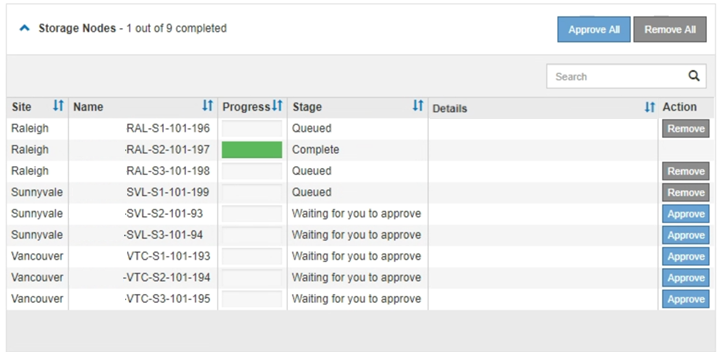

= Actualización del sistema operativo SANtricity en las controladoras de almacenamiento mediante Grid Manager
:allow-uri-read: 
:icons: font
:imagesdir: ../media/

[role="lead"]
Utilice el Administrador de grid para aplicar una actualización del sistema operativo SANtricity.

.Lo que necesitará
* Ha consultado con la herramienta de matriz de interoperabilidad (IMT) de NetApp para confirmar que la versión del sistema operativo SANtricity que utiliza para la actualización es compatible con su dispositivo.
* Debe tener el permiso de mantenimiento.
* Debe iniciar sesión en Grid Manager mediante un explorador compatible.
* Debe tener la clave de acceso de aprovisionamiento.
* Debe tener acceso a la página de descargas de NetApp para SANtricity OS.

.Acerca de esta tarea
No puede realizar otras actualizaciones de software (actualización de software StorageGRID o revisión) hasta que haya completado el proceso de actualización de sistema operativo SANtricity. Si intenta iniciar una revisión o una actualización de software de StorageGRID antes de que haya finalizado el proceso de actualización de SANtricity OS, se le redirigirá a la página de actualización de SANtricity OS.

No se completará el procedimiento hasta que la actualización del sistema operativo SANtricity se haya aplicado correctamente a todos los nodos aplicables. Es posible que tardar más de 30 minutos cargar el sistema operativo SANtricity en cada nodo y que se deban reiniciar cada dispositivo de almacenamiento StorageGRID hasta 90 minutos.

CAUTION: Los siguientes pasos sólo son aplicables cuando se utiliza Grid Manager para realizar la actualización.

NOTE: Este procedimiento actualizará automáticamente la NVSRAM a la versión más reciente asociada con la actualización del sistema operativo SANtricity. No es necesario aplicar un archivo de actualización de NVSRAM aparte.

.Pasos
. Desde un portátil de servicio, descargue el nuevo archivo de SO SANtricity del sitio de soporte de NetApp.
+
Asegúrese de elegir la versión de sistema operativo SANtricity para la controladora de almacenamiento E2700.

. Inicie sesión en Grid Manager con un navegador compatible.
. Seleccione *Mantenimiento*. A continuación, en la sección sistema del menú, seleccione *actualización de software*.
+
Aparece la página actualización de software.

+
image::../media/software_update_landing.png[Página de destino de la actualización del software]

. Haga clic en *SANtricity OS*.
+
Se muestra la página SANtricity OS.

+
image::../media/santricity_os_upgrade_first.png[Captura de pantalla que muestra la página StorageGRID First SANtricity OS]

. Seleccione el archivo de actualización del sistema operativo SANtricity que descargó del sitio de soporte de NetApp.
+
.. Haga clic en *examinar*.
.. Localice y seleccione el archivo.
.. Haga clic en *Abrir*.
+
El archivo se carga y se valida. Cuando se realiza el proceso de validación, el nombre del archivo se muestra en el campo Detalles.

+

NOTE: No cambie el nombre del archivo ya que forma parte del proceso de verificación.

+
image::../media/santricity_upgrade_os_file_validated.png[Archivo válido de actualización de sistema operativo SANtricity]

. Introduzca la clave de acceso de aprovisionamiento.
+
El botón *Iniciar* está activado.

+
image::../media/santricity_start_button.png[Captura de pantalla que muestra la página StorageGRID First SANtricity OS]

. Haga clic en *Inicio*.
+
Aparece un cuadro de advertencia que indica que es posible que se pierda temporalmente la conexión del explorador como se reinician los servicios de los nodos actualizados.

+
image::../media/santricity_upgrade_warning.png[la captura de pantalla que muestra la conexión se perderá temporalmente]

. Haga clic en *Aceptar* para almacenar el archivo de actualización de SANtricity OS en el nodo de administración principal.
+
Cuando se inicia la actualización del sistema operativo SANtricity:

+
.. Se ejecuta la comprobación del estado. Este proceso comprueba que ningún nodo tenga el estado de necesita atención.
+

NOTE: Si se informa de algún error, solucione y vuelva a hacer clic en *Iniciar*.

.. Se muestra la tabla progreso de actualización de sistema operativo SANtricity. En esta tabla se muestran todos los nodos de almacenamiento del grid y la fase actual de la actualización de cada nodo.
+

NOTE: La tabla muestra todos los nodos de almacenamiento, incluidos los nodos de almacenamiento basados en software. Debe aprobar la actualización para todos los nodos de almacenamiento, aunque una actualización de SO SANtricity no tenga efecto en los nodos de almacenamiento basados en software. El mensaje de actualización devuelto para los nodos de almacenamiento basados en software es «"la actualización del SO SANtricity no es aplicable a este nodo».

+
image::../media/santricity_upgrade_progress_table.png[Captura de pantalla que muestra la parte del progreso de la actualización del sistema operativo SANtricity de la página actualización del sistema operativo SANtricity]

. Opcionalmente, ordene la lista de nodos en orden ascendente o descendente por *Sitio*, *Nombre*, *progreso*, *etapa* o *Detalles*. O bien, introduzca un término en el cuadro *Buscar* para buscar nodos específicos.
+
Puede desplazarse por la lista de nodos utilizando las flechas izquierda y derecha de la esquina inferior derecha de la sección.

. Apruebe los nodos de cuadrícula que está listo para agregar a la cola de actualización. Los nodos aprobados del mismo tipo se actualizan de uno en uno.
+

IMPORTANT: No apruebe la actualización de SANtricity OS para un nodo de almacenamiento de dispositivos a menos que esté seguro de que el nodo esté listo para detenerse y reiniciarse.cuando la actualización de SANtricity OS se ha aprobado en un nodo, los servicios de ese nodo se han detenido. Más tarde, cuando el nodo se actualiza, el nodo del dispositivo se reinicia. Estas operaciones pueden provocar interrupciones del servicio en los clientes que se comunican con el nodo.

+
** Haga clic en cualquiera de los botones *aprobar todo* para agregar todos los nodos de almacenamiento a la cola de actualización de SANtricity OS.
+

NOTE: Si el orden en el que se actualizan los nodos es importante, apruebe los nodos o grupos de nodos de uno en uno y espere a que la actualización se complete en cada nodo antes de aprobar los siguientes nodos.

** Haga clic en uno o más botones *aprobar* para agregar uno o más nodos a la cola de actualización de SANtricity OS.
+

NOTE: Puede retrasar la aplicación de una actualización de SANtricity OS a un nodo, pero el proceso de actualización de SANtricity OS no se completará hasta que apruebe la actualización de SANtricity OS en todos los nodos de almacenamiento enumerados.

+
Después de hacer clic en *aprobar*, el proceso de actualización determina si se puede actualizar el nodo. Si se puede actualizar un nodo, se agrega a la cola de actualización. +

+
En algunos nodos, el archivo de actualización seleccionado no se aplica de forma intencional, y se puede completar el proceso de actualización sin actualizar estos nodos específicos. Para los nodos que no se actualizan intencionalmente, el proceso mostrará la fase de completado con uno de los siguientes mensajes en la columna Detalles: +

+
*** El nodo de almacenamiento ya se actualizó.
*** La actualización de SANtricity OS no es aplicable a este nodo.
*** El archivo del sistema operativo SANtricity no es compatible con este nodo.

+
El mensaje «'la actualización del sistema operativo SANtricity no es aplicable a este nodo» indica que el nodo no tiene una controladora de almacenamiento que pueda gestionar el sistema StorageGRID. Este mensaje aparecerá para nodos de almacenamiento que no sean del dispositivo. Puede completar el proceso de actualización de SANtricity OS sin actualizar el nodo y mostrar este mensaje. + el mensaje "'el archivo de SANtricity OS no es compatible con este nodo'" indica que el nodo requiere un archivo de SANtricity OS diferente al que intenta instalar el proceso. Después de completar la actualización actual del sistema operativo SANtricity, descargue el sistema operativo SANtricity adecuado para el nodo y repita el proceso de actualización.

. Si necesita eliminar un nodo o todos los nodos de la cola de actualización de SANtricity OS, haga clic en *Quitar* o en *Quitar todo*.
+
Como se muestra en el ejemplo, cuando el escenario progresa más allá de la cola, el botón *Quitar* está oculto y ya no puede quitar el nodo del proceso de actualización de SANtricity OS.

+

. Espere mientras la actualización del SO SANtricity se aplica a cada nodo de grid aprobado.
+

IMPORTANT: Si algún nodo muestra una etapa de error mientras se aplica la actualización del sistema operativo SANtricity, se produjo un error en la actualización para ese nodo. Es posible que el dispositivo deba colocarse en modo de mantenimiento para recuperarse del error. Póngase en contacto con el soporte técnico antes de continuar.

+
Si el firmware del nodo es demasiado antiguo para actualizarse con Grid Manager, el nodo muestra una etapa de error con los detalles: "'debe utilizar el modo de mantenimiento para actualizar SANtricity OS en este nodo. Consulte las instrucciones de instalación y mantenimiento del aparato. Tras la actualización, puede utilizar esta utilidad para futuras actualizaciones». Para resolver el error, haga lo siguiente:

+
.. Utilice el modo de mantenimiento para actualizar SANtricity OS en el nodo que muestre una etapa de error.
.. Utilice Grid Manager para reiniciar y completar la actualización del sistema operativo SANtricity.
+
Una vez completada la actualización de SANtricity OS en todos los nodos aprobados, la tabla de progreso de la actualización de SANtricity OS se cierra y un banner verde muestra la fecha y la hora en que se completó la actualización de SANtricity OS.

+
image::../media/santricity_upgrade_finish_banner.png[Captura de pantalla de la página de actualización de SANtricity OS una vez completada la actualización]

. Repita este procedimiento de actualización para todos los nodos con una etapa de finalización que requieran un archivo de actualización de sistema operativo SANtricity diferente.
+

NOTE: Para cualquier nodo con el estado necesita atención, utilice el modo de mantenimiento para realizar la actualización.

.Información relacionada
link:upgrading-santricity-os-on-e2700-controller-using-maintenance-mode.html["Actualizar el sistema operativo SANtricity en la controladora E2700 mediante modo de mantenimiento"]
