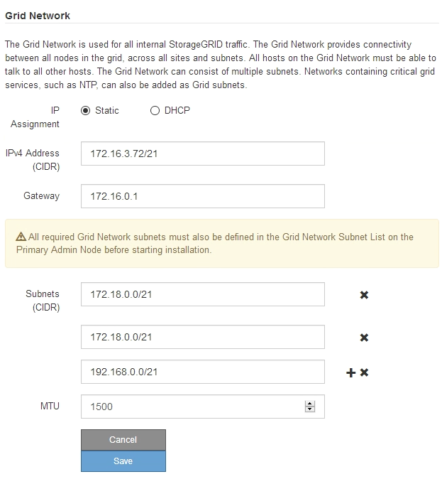

= Cambiar el valor de MTU
:allow-uri-read: 
:icons: font
:imagesdir: ../media/

[role="lead"]
Puede cambiar la configuración de MTU que asigne al configurar las direcciones IP para el nodo del dispositivo.

.Lo que necesitará
El aparato se ha puesto en modo de mantenimiento.

link:placing-appliance-into-maintenance-mode.html["Colocar un dispositivo en modo de mantenimiento"]

.Pasos
. En el instalador del dispositivo StorageGRID, seleccione *Configurar redes* > *Configuración IP*.
. Realice los cambios deseados en la configuración de MTU para la red de grid, la red de administración y la red de cliente.
+

+

IMPORTANT: El valor de MTU de la red debe coincidir con el valor configurado en el puerto del switch al que está conectado el nodo. De lo contrario, pueden ocurrir problemas de rendimiento de red o pérdida de paquetes.

+

IMPORTANT: Para obtener el mejor rendimiento de red, todos los nodos deben configurarse con valores MTU similares en sus interfaces de Grid Network. La alerta *Red de cuadrícula MTU* se activa si hay una diferencia significativa en la configuración de MTU para la Red de cuadrícula en nodos individuales. Los valores de MTU no tienen que ser iguales para todos los tipos de red.

. Cuando esté satisfecho con los ajustes, seleccione *Guardar*.
. Reiniciar el nodo. En el instalador del dispositivo StorageGRID, seleccione *Avanzado* > *Reiniciar controlador* y, a continuación, seleccione una de estas opciones:
+
** Seleccione *Reiniciar en StorageGRID* para reiniciar el controlador con el nodo que vuelve a unir la cuadrícula. Seleccione esta opción si hizo trabajo en modo de mantenimiento y está listo para devolver el nodo a su funcionamiento normal.
** Seleccione *Reiniciar en el modo de mantenimiento* para reiniciar el controlador con el nodo restante en modo de mantenimiento. Seleccione esta opción si hay otras operaciones de mantenimiento que debe realizar en el nodo antes de volver a unir la cuadrícula.image:../media/reboot_controller_from_maintenance_mode.png["Reinicie la controladora en modo de mantenimiento"]
+
El dispositivo puede tardar hasta 20 minutos en reiniciarse y volver a unirse a la cuadrícula. Para confirmar que el reinicio ha finalizado y que el nodo ha vuelto a unirse a la cuadrícula, vuelva a Grid Manager. La ficha *Nodes* debería mostrar un estado normal image:../media/icon_alert_green_checkmark.png["marca de verificación verde de alerta de icono"] para el nodo del dispositivo, que indica que no hay alertas activas y el nodo está conectado al grid.

+
image::../media/node_rejoin_grid_confirmation.png[El nodo del dispositivo se ha vuelto a unir a la cuadrícula]

.Información relacionada
link:../admin/index.html["Administre StorageGRID"]
