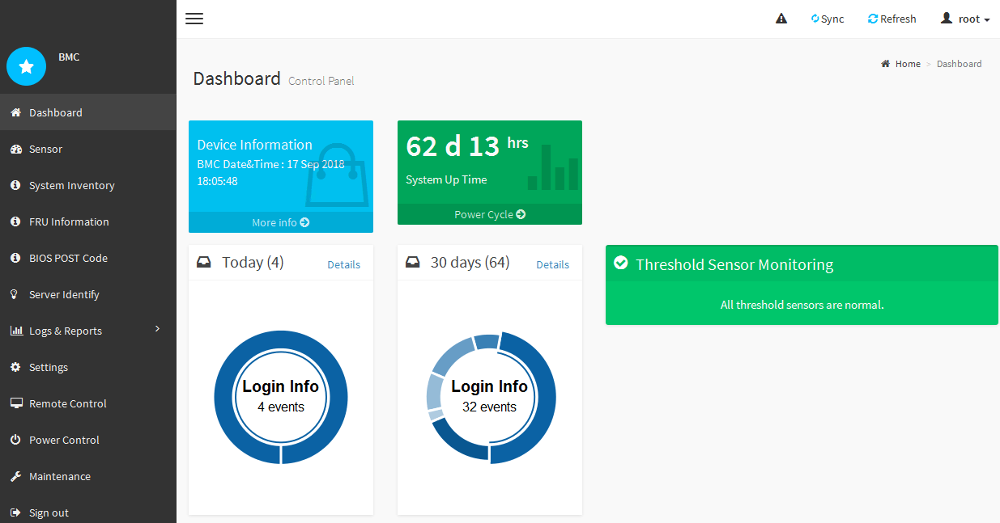

= Acceso a la interfaz del BMC
:allow-uri-read: 
:icons: font
:imagesdir: ../media/

[role="lead"]
Puede acceder a la interfaz del BMC en el controlador SG6000-CN utilizando la dirección DHCP o IP estática para el puerto de administración del BMC.

.Lo que necesitará
* El puerto de administración de BMC del controlador SG6000-CN está conectado a la red de administración que se va a utilizar.
+
image::../media/sg6000_cn_bmc_management_port.gif[Puerto de gestión de BMC en el controlador SG6000-CN]

* El cliente de gestión usa un navegador web compatible.

.Pasos
. Introduzca la dirección URL de la interfaz del BMC: +
`*https://_BMC_Port_IP_*`
+
Para `_BMC_Port_IP_`, Utilice la dirección IP estática o DHCP para el puerto de administración del BMC.

+
Aparece la página de inicio de sesión de BMC.

. Introduzca el nombre de usuario raíz y la contraseña, utilizando la contraseña que estableció al cambiar la contraseña raíz predeterminada: +
`*root*` +
`*_password_*`
+
image::../media/bmc_signin_page.gif[Página de inicio de sesión de BMC]

. Seleccione *Iniciar sesión*.
+
Aparece el panel BMC.

+

. Opcionalmente, cree usuarios adicionales seleccionando *Ajustes* *Gestión de usuarios* y haciendo clic en cualquier usuario "desactivado".
+

NOTE: Cuando los usuarios inician sesión por primera vez, es posible que se les pida que cambien su contraseña para aumentar la seguridad.

.Información relacionada
link:changing-root-password-for-bmc-interface-sg6000.html["Cambiar la contraseña de root para la interfaz de BMC"]
