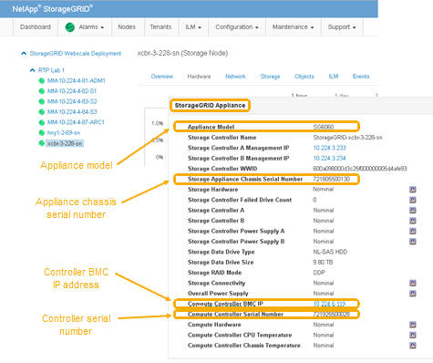

= Comprobar el HBA de Fibre Channel que se va a reemplazar
:allow-uri-read: 
:icons: font
:imagesdir: ../media/

[role="lead"]
Si no está seguro del adaptador de bus de host (HBA) Fibre Channel que debe sustituirse, complete este procedimiento para identificarlo.

.Lo que necesitará
* Dispone del número de serie del dispositivo de almacenamiento o del controlador SG6000-CN en los que es necesario sustituir el HBA Fibre Channel.
+

NOTE: Si el número de serie del dispositivo de almacenamiento que contiene el HBA Fibre Channel que va a sustituir comienza por la letra Q, no aparecerá en el Grid Manager. Debe comprobar las etiquetas adjuntas a la parte frontal de cada controlador SG6000-CN del centro de datos hasta que encuentre una coincidencia.

* Debe iniciar sesión en Grid Manager mediante un explorador compatible.

.Pasos
. En Grid Manager, seleccione *Nodes*.
. En la vista de árbol de la página Nodes, seleccione un dispositivo Storage Node.
. Seleccione la ficha *hardware*.
+
Consulte el número de serie del chasis del dispositivo de almacenamiento y el número de serie del controlador de computación en la sección StorageGRID Appliance para ver si uno de estos números de serie coincide con el número de serie del dispositivo de almacenamiento en el que va a reemplazar el HBA Fibre Channel. Si coincide alguno de los números de serie, ha encontrado el dispositivo correcto.

+

+
** Si no se muestra la sección dispositivo StorageGRID, el nodo seleccionado no es un dispositivo StorageGRID. Seleccione un nodo diferente en la vista de árbol.
** Si el modelo de dispositivo no es SG6060, seleccione un nodo diferente de la vista de árbol.
** Si los números de serie no coinciden, seleccione un nodo diferente en la vista de árbol.

. Después de ubicar el nodo donde se debe reemplazar el adaptador de bus de host de Fibre Channel, escriba la dirección IP de BMC de la controladora de computación que aparece en la sección StorageGRID Appliance.
+
Puede usar esta dirección IP para encender el LED de identificación de controladora de computación, para ayudarle a localizar el dispositivo en el centro de datos.

+
link:turning-controller-identify-led-on-and-off.html["Encender y apagar el LED de identificación de la controladora"]

.Información relacionada
link:removing-fibre-channel-hba.html["Retire el adaptador de bus de host de Fibre Channel"]
