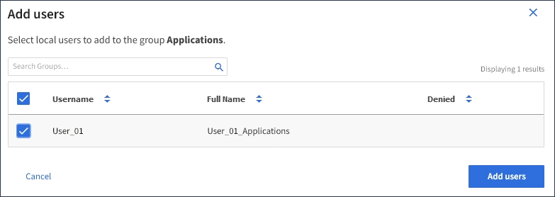

= Agregar usuarios a un grupo local
:allow-uri-read: 
:icons: font
:imagesdir: ../media/

[role="lead"]
Puede agregar usuarios a un grupo local según sea necesario.

.Lo que necesitará
* Debe iniciar sesión en el Administrador de inquilinos con un explorador compatible.
* Debe pertenecer a un grupo de usuarios que tenga el permiso acceso raíz.

.Pasos
. Seleccione *ADMINISTRACIÓN de ACCESO* > *grupos*.
. Seleccione el nombre del grupo local al que desea añadir usuarios.
+
También puede seleccionar *acciones* > *Ver detalles del grupo*.

+
Aparece la página de detalles del grupo.

+
image::../media/tenant_group_details.png[Ver detalles del grupo]

. Seleccione *gestionar usuarios* y, a continuación, seleccione *Agregar usuarios*.
+
image::../media/manage_users.png[Gestionar usuarios]

. Seleccione los usuarios que desea agregar al grupo y, a continuación, seleccione *Agregar usuarios*.
+

+
Aparecerá un mensaje de confirmación en la esquina superior derecha de la página. Los cambios pueden tardar hasta 15 minutos en surtir efecto debido al almacenamiento en caché.

