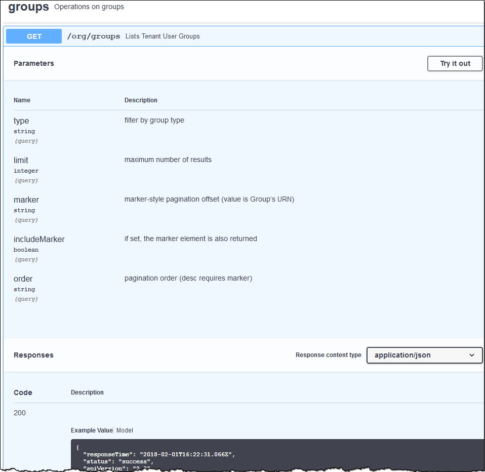

= API de gestión de inquilinos
:allow-uri-read: 
:icons: font
:imagesdir: ../media/

[role="lead"]
Puede realizar tareas de administración del sistema mediante la API REST de gestión de inquilinos en lugar de la interfaz de usuario de inquilino Manager. Por ejemplo, se recomienda utilizar la API para automatizar operaciones o crear varias entidades, como los usuarios, más rápidamente.

La API de gestión de inquilinos utiliza la plataforma API de código abierto de Swagger. Swagger proporciona una interfaz de usuario intuitiva que permite a los desarrolladores y no desarrolladores interactuar con la API. La interfaz de usuario de Swagger proporciona detalles y documentación completos para cada operación de API.

Para acceder a la documentación de Swagger para la API de gestión de inquilinos:

.Pasos
. Inicie sesión en el Administrador de inquilinos.
. Seleccione *Ayuda* > *Documentación de API* en el encabezado Administrador de inquilinos.

== Operaciones de API

La API de gestión de inquilinos organiza las operaciones de API disponibles en las siguientes secciones:

* *Cuenta* -- Operaciones en la cuenta de arrendatario actual, incluyendo la obtención de información de uso de almacenamiento.
* *Auth* -- Operaciones para realizar la autenticación de sesión de usuario.
+
La API de administración de arrendatarios admite el esquema de autenticación de token Bearer. Para el inicio de sesión de un inquilino, debe proporcionar un nombre de usuario, una contraseña y un ID de cuenta en el cuerpo JSON de la solicitud de autenticación (es decir, `POST /api/v3/authorize`). Si el usuario se autentica correctamente, se devuelve un token de seguridad. Este token se debe proporcionar en el encabezado de las posteriores solicitudes de API ("autorización: Token del portador").

+
Consulte «"Protección contra la falsificación de solicitudes entre sitios"» para obtener información sobre la mejora de la seguridad de la autenticación.

+

NOTE: Si está habilitado el inicio de sesión único (SSO) para el sistema StorageGRID, debe realizar diferentes pasos para la autenticación. Consulte «"autenticación en la API si está activado el inicio de sesión único" en las instrucciones para administrar StorageGRID.

* *Config* -- Operaciones relacionadas con la versión del producto y las versiones de la API de Gestión de arrendatarios. Puede mostrar la versión de la versión del producto y las versiones principales de la API que admite esa versión.
* *Containers* -- Operaciones en bloques de S3 o contenedores Swift, como se indica a continuación:
+
[cols="1a,3a"]
|===
| Protocolo | Permiso lo permite 

 a| 
S3
 a| 
** Creación de cucharones que cumplen las normativas y no cumplen las normativas
** Modificación de la configuración de conformidad heredada
** Configurar el control de coherencia para las operaciones realizadas en objetos
** Creación, actualización y eliminación de la configuración de CORS de un bloque
** Habilitar y deshabilitar las actualizaciones de la última hora de acceso para los objetos
** Gestionar la configuración de los servicios de plataforma, incluida la replicación de CloudMirror, las notificaciones y la integración de búsqueda (metadatos-notification)
** Eliminación de cucharones vacíos

 a| 
Swift
 a| 
Configurar el nivel de coherencia utilizado para contenedores

|===
* *Características desactivadas* -- Operaciones para ver las funciones que podrían haberse desactivado.
* *Endpoints* -- Operaciones para administrar un punto final. Los extremos permiten que un bloque de S3 use un servicio externo para la replicación de CloudMirror de StorageGRID, notificaciones o integración de búsqueda.
* *Grupos* -- Operaciones para administrar grupos de inquilinos locales y recuperar grupos de inquilinos federados de un origen de identidades externo.
* *Identity-source* -- Operaciones para configurar un origen de identidad externo y sincronizar manualmente la información del grupo federado y del usuario.
* *Regiones* -- Operaciones para determinar qué regiones se han configurado para el sistema StorageGRID.
* *s3* -- Operaciones para administrar claves de acceso S3 para usuarios inquilinos.
* *s3-object-lock* -- Operaciones para determinar cómo se configura el bloqueo global de objetos (cumplimiento) de S3 para el sistema StorageGRID.
* *Usuarios* -- Operaciones para ver y administrar usuarios de arrendatarios.

== Detalles de la operación

Al expandir cada operación de API, puede ver su acción HTTP, su URL de extremo, una lista de cualquier parámetro requerido o opcional, un ejemplo del cuerpo de la solicitud (cuando sea necesario) y las posibles respuestas.

== Emitir solicitudes API

IMPORTANT: Cualquier operación de API que realice mediante la página web de documentos de API es una operación en directo. Tenga cuidado de no crear, actualizar o eliminar datos de configuración u otros datos por error.

.Pasos
. Haga clic en la acción HTTP para ver los detalles de la solicitud.
. Determine si la solicitud requiere parámetros adicionales, como un ID de grupo o de usuario. A continuación, obtenga estos valores. Es posible que primero deba emitir una solicitud de API diferente para obtener la información que necesita.
. Determine si necesita modificar el cuerpo de solicitud de ejemplo. Si es así, puede hacer clic en *Modelo* para conocer los requisitos de cada campo.
. Haga clic en *probar*.
. Proporcione los parámetros necesarios o modifique el cuerpo de la solicitud según sea necesario.
. Haga clic en *Ejecutar*.
. Revise el código de respuesta para determinar si la solicitud se ha realizado correctamente.

.Información relacionada
link:protecting-against-cross-site-request-forgery-csrf.html["Protección contra falsificación de solicitudes entre sitios (CSRF)"]

link:../admin/index.html["Administre StorageGRID"]
