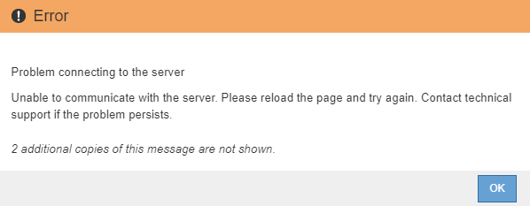

= Iniciando la actualización
:allow-uri-read: 
:icons: font
:imagesdir: ../media/

[role="lead"]
Cuando esté listo para realizar la actualización, seleccione el archivo descargado e introduzca la clave de acceso de aprovisionamiento. Como opción, puede ejecutar las comprobaciones previas de la actualización antes de realizar la actualización real.

.Lo que necesitará
Ha revisado todas las consideraciones y completado todos los pasos de link:upgrade-planning-and-preparation.html["Planificación y preparación de la actualización"].

.Pasos
. Inicie sesión en Grid Manager con un navegador compatible.
. Seleccione *Mantenimiento* > *sistema* > *actualización de software*.
+
Aparece la página actualización de software.

. Seleccione *StorageGRID Upgrade*.
+
Aparece la página StorageGRID Upgrade (actualización de) y muestra la fecha y hora de la actualización que se completó más recientemente, a menos que se haya reiniciado el nodo de administrador principal o se haya reiniciado la API de gestión desde que se realizó la actualización.

. Seleccione la `.upgrade` archivo descargado.
+
.. Seleccione *examinar*.
.. Localice y seleccione el archivo: `NetApp_StorageGRID_version_Software_uniqueID.upgrade`
.. Seleccione *Abrir*.
+
El archivo se carga y se valida. Cuando se realiza el proceso de validación, aparece una Marca de verificación verde junto al nombre del archivo de actualización.

. Introduzca la clave de acceso de aprovisionamiento en el cuadro de texto.
+
Los botones *Ejecutar comprobaciones previas* y *Iniciar actualización* se activan.

+
image::../media/storagegrid_upgrade_buttons_enabled.png[Botones de actualización de StorageGRID habilitados]

. Si desea validar el estado del sistema antes de iniciar la actualización real, seleccione *Ejecutar comprobaciones previas*. A continuación, resuelva los errores de las comprobaciones previas notificados.
+

IMPORTANT: Si ha abierto algún puerto de firewall personalizado, se le notificará durante la validación de las comprobaciones previas. Debe comunicarse con el soporte técnico antes de continuar con la actualización.

+

NOTE: Las mismas comprobaciones previas se realizan al seleccionar *Iniciar actualización*. Seleccionar *Ejecutar comprobaciones previas* le permite detectar y resolver problemas antes de iniciar la actualización.

. Cuando esté listo para realizar la actualización, seleccione *Iniciar actualización*.
+
Aparece una advertencia para recordarle que la conexión del explorador se perderá cuando se reinicie el nodo de administración principal. Cuando el nodo de administrador principal vuelva a estar disponible, debe borrar la caché del navegador web y volver a cargar la página Software Upgrade.

+
image::../media/software_upgrade_connection_will_be_lost.png[Se perderá la conexión de actualización de software]

. Seleccione *Aceptar* para confirmar la advertencia e iniciar el proceso de actualización.
+
Cuando comience la actualización:

+
.. Se ejecutan las comprobaciones previas de actualizaciones.
+

NOTE: Si se notifica algún error de las comprobaciones previas, solucione y seleccione *Iniciar actualización* de nuevo.

.. El nodo de administrador principal se actualiza, lo cual incluye detener los servicios, actualizar el software y reiniciar los servicios. No podrá acceder a Grid Manager mientras se esté actualizando el nodo de administración principal. Además, los registros de auditoría no estarán disponibles. Esta actualización puede llevar hasta 30 minutos.
+

NOTE: Mientras se actualiza el nodo de administrador principal, se muestran varias copias de los siguientes mensajes de error, que puede ignorar.

+

+
image::../media/software_upgrade_503_error.png[Error de actualización de software 503]

+
image::../media/software_upgrade_400_error.png[Error de actualización de software 400]

. Una vez que se haya actualizado el nodo de administración principal, borre la memoria caché del navegador web, vuelva a iniciar sesión y vuelva a cargar la página Software Upgrade.
+
Para obtener instrucciones, consulte la documentación de su navegador web.

+

IMPORTANT: Debe borrar el caché del explorador Web para eliminar los recursos obsoletos utilizados por la versión anterior del software.

.Información relacionada
link:upgrade-planning-and-preparation.html["Planificación y preparación de la actualización"]
