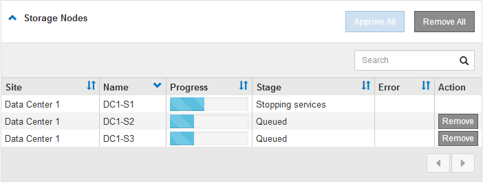

= Actualizar nodos de grid y completar la actualización
:allow-uri-read: 
:icons: font
:imagesdir: ../media/

[role="lead"]
Una vez que se haya actualizado el nodo de administrador principal, es necesario actualizar los demás nodos de grid del sistema StorageGRID. Puede personalizar la secuencia de actualización si selecciona actualizar nodos de grid individuales, grupos de nodos de grid o todos los nodos de grid.

.Pasos
. Revise la sección progreso de la actualización en la página actualización de software, que proporciona información acerca de cada tarea de actualización importante.
+
.. *Iniciar servicio de actualización* es la primera tarea de actualización. Durante esta tarea, el archivo de software se distribuye a los nodos de grid y se inicia el servicio de actualización.
.. Una vez completada la tarea *Iniciar servicio de actualización*, se inicia la tarea *Actualizar nodos de cuadrícula*.
.. Mientras la tarea *Actualizar nodos de cuadrícula* está en curso, aparece la tabla Estado del nodo de cuadrícula y muestra la fase de actualización de cada nodo de cuadrícula del sistema.

. Una vez que los nodos de cuadrícula aparezcan en la tabla Grid Node Status, pero antes de aprobar los nodos de cuadrícula, descargue una nueva copia del paquete de recuperación.
+

IMPORTANT: Debe descargar una nueva copia del archivo Recovery Package después de actualizar la versión de software en el nodo de administración principal. El archivo de paquete de recuperación permite restaurar el sistema si se produce un fallo.

. Revise la información de la tabla Estado del nodo de cuadrícula. Los nodos de grid se organizan en secciones por tipo: Nodos de administrador, nodos de puerta de enlace de API, nodos de almacenamiento y nodos de archivado.
+
image::../media/software_upgrade_start_grid_node_status.gif[Captura de pantalla de los nodos Grid de actualización después de finalizar el nodo de administración]

+
Un nodo de cuadrícula puede estar en una de estas fases cuando aparece por primera vez esta página:

+
** Done (solo nodo de administración principal)
** Preparando actualización
** Descarga de software en cola
** Descarga
** Esperando a que usted apruebe

. Apruebe los nodos de cuadrícula que está listo para agregar a la cola de actualización. Los nodos aprobados del mismo tipo se actualizan de uno en uno.
+
Si el orden en el que se actualizan los nodos es importante, apruebe los nodos o grupos de nodos de uno en uno y espere a que la actualización se complete en cada nodo antes de aprobar el siguiente nodo o grupo de nodos.

+

IMPORTANT: Cuando la actualización se inicia en un nodo de grid, los servicios de ese nodo se detienen. Más tarde, el nodo de grid se reinicia. Estas operaciones pueden provocar interrupciones del servicio en los clientes que se comunican con el nodo. No apruebe la actualización de un nodo a menos que esté seguro de que el nodo esté listo para detenerse y reiniciar.

+
** Seleccione uno o más botones *aprobar* para agregar uno o más nodos individuales a la cola de actualización.
** Seleccione el botón *aprobar todo* de cada sección para agregar todos los nodos del mismo tipo a la cola de actualización.
** Seleccione el botón * aprobar todo* de nivel superior para agregar todos los nodos de la cuadrícula a la cola de actualización.

. Si necesita eliminar un nodo o todos los nodos de la cola de actualización, seleccione *Quitar* o *Quitar todo*.
+
Como se muestra en el ejemplo, cuando el escenario alcanza *Servicios de parada*, el botón *Quitar* está oculto y ya no puede quitar el nodo.

+

. Espere a que cada nodo avance por las etapas de actualización, que incluyen Queued, servicios de detención, contenedor, limpieza de imágenes Docker, actualización de paquetes de sistemas operativos base, reinicio y servicios de inicio.
+

NOTE: Cuando un nodo de dispositivo alcanza la fase actualizando paquetes de sistema operativo base, el software StorageGRID Appliance Installer del dispositivo se actualiza. Este proceso automatizado garantiza que la versión del instalador de dispositivos StorageGRID permanezca sincronizada con la versión del software StorageGRID.

+
Una vez que se han actualizado todos los nodos de cuadrícula, la tarea *Actualizar nodos de cuadrícula* se muestra como completada. Las tareas de actualización restantes se realizan automáticamente y en segundo plano.

. Tan pronto como la tarea *Activar características* esté completa (lo que se produce rápidamente), puede empezar a utilizar las nuevas características en la versión actualizada de StorageGRID.
+
Por ejemplo, si actualiza a StorageGRID 11.5, ahora puede habilitar el bloqueo de objetos S3, configurar un servidor de gestión de claves o aumentar la configuración de espacio reservado de metadatos.

+
link:increasing-metadata-reserved-space-setting.html["Aumento de la configuración de espacio reservado de metadatos"]

. Supervise periódicamente el progreso de la tarea *base de datos de actualización*.
+
Durante esta tarea, la base de datos de Cassandra se actualiza en cada nodo de almacenamiento.

+

NOTE: La tarea *Actualizar base de datos* puede tardar días en completarse. Cuando se ejecuta esta tarea en segundo plano, puede aplicar revisiones o recuperar nodos. Sin embargo, debe esperar a que se complete la tarea *pasos de actualización final* antes de realizar un procedimiento de expansión o retirada.

+
Puede revisar el gráfico para supervisar el progreso de cada nodo de almacenamiento.

+
image::../media/software_upgrade_upgrade_database.png[Base de datos de actualización de software]

. Una vez completada la tarea *Actualizar base de datos*, espere unos minutos hasta que finalice la tarea *pasos de actualización final*.
+
image::../media/software_upgrade_final_upgrade_steps.png[Pasos finales de la actualización]

+
Una vez completada la tarea de pasos de actualización final, la actualización se realiza.

. Confirme que la actualización se completó correctamente.
+
.. Inicie sesión en Grid Manager con un navegador compatible.
.. Seleccione *Ayuda* > *Acerca de*.
.. Confirme que la versión que se muestra es lo que esperaría.
.. Seleccione *Mantenimiento* > *sistema* > *actualización de software*. A continuación, seleccione *actualización de StorageGRID*.
.. Confirme que el banner verde muestra que la actualización del software se completó en la fecha y la hora esperada.
+
image::../media/software_upgrade_done.png[Actualización de software realizada]

. Compruebe que las operaciones de grid se han vuelto a la normalidad:
+
.. Compruebe que los servicios funcionan con normalidad y que no hay alertas inesperadas.
.. Confirmar que las conexiones de los clientes con el sistema StorageGRID funcionan tal como se espera.

. Consulte la página de descargas de NetApp para ver StorageGRID si tiene alguna revisión disponible para la versión de StorageGRID que acaba de instalar.
+
https://mysupport.netapp.com/site/products/all/details/storagegrid/downloads-tab["Descargas de NetApp: StorageGRID"^]

+
En StorageGRID 11.5._x.y_ número de versión:

+
** La versión principal tiene un valor _x_ de 0 (11.5.0).
** Una versión secundaria, si está disponible, tiene un valor _x_ distinto de 0 (por ejemplo, 11.5.1).
** Una revisión, si está disponible, tiene un valor _y_ (por ejemplo, 11.5.0.1).

. Si está disponible, descargue y aplique la revisión más reciente para su versión de StorageGRID.
+
Consulte las instrucciones de recuperación y mantenimiento para obtener información sobre la aplicación de correcciones urgentes.

.Información relacionada
link:downloading-recovery-package.html["Descarga del paquete de recuperación"]

link:../maintain/index.html["Mantener  recuperar"]
